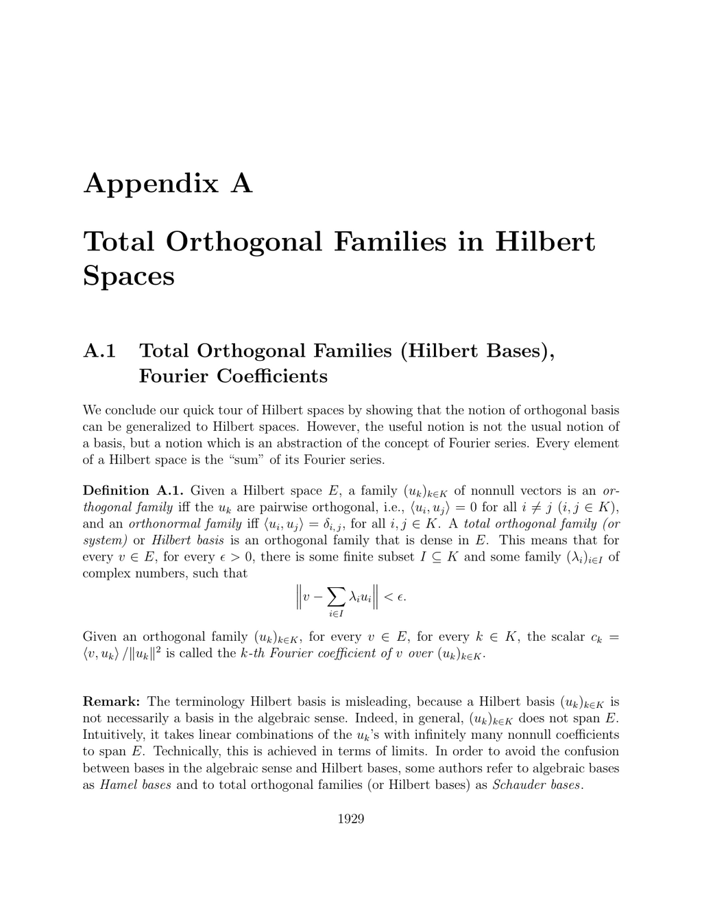

- **A.1 Total Orthogonal Families (Hilbert Bases), Fourier Coefficients**
  - **Definition of orthogonal, orthonormal, and total orthogonal families**
    - Orthogonal families consist of pairwise orthogonal nonnull vectors in a Hilbert space.
    - Total orthogonal families, or Hilbert bases, are orthogonal families dense in the Hilbert space.
    - Fourier coefficients of vectors with respect to orthogonal families are defined and key.
    - See [Hilbert Spaces Theory](https://en.wikipedia.org/wiki/Hilbert_space) for background.
  - **Summability and Cauchy families of vector families**
    - Summability of vector families is defined by approximations via finite subsets in norm.
    - Families in a complete normed space are summable if and only if they are Cauchy families.
    - Summability ensures the sum is independent of the order on the index set.
    - Refer to Dixmier [52] for detailed treatment of summability.
  - **Proposition A.1 on summability equivalence and summation of nonnegative reals**
    - Summability and the Cauchy condition are equivalent in complete normed spaces.
    - Nonnegative real families bounded uniformly over finite sums are summable.
    - The sum equals the least upper bound of all finite partial sums.
  - **Properties and convergence of Fourier series in Hilbert spaces (Proposition A.2)**
    - Fourier coefficients satisfy a version of Bessel's inequality ensuring square summability.
    - The Fourier series converges to the orthogonal projection of the vector onto the closed span.
    - At most countably many Fourier coefficients are nonzero in any orthogonal family.
    - The partial Fourier sums approximate vectors in the Hilbert space.
    - See [Bessel's inequality](https://en.wikipedia.org/wiki/Bessel%27s_inequality) for related concepts.

- **A.2 The Hilbert Space `2(K)` and the Riesz-Fischer Theorem**
  - **Definition and properties of the space `2(K)`**
    - `2(K)` consists of all sequences indexed by K with square-summable complex entries.
    - When K is finite, `2(K)` is isomorphic to Cⁿ; for K = N, it coincides with the classical `2` space.
    - The Hermitian inner product on `2(K)` sums the products of corresponding sequence elements.
  - **Density of finitely supported sequences in `2(K)`**
    - Sequences with only finitely many nonzero terms form a dense subspace in `2(K)`.
    - This property facilitates approximations and construction of Hilbert space elements.
    - Further details and proofs can be found in related functional analysis texts, e.g., [Riesz-Fischer Theorem](https://en.wikipedia.org/wiki/Riesz%E2%80%93Fischer_theorem).
