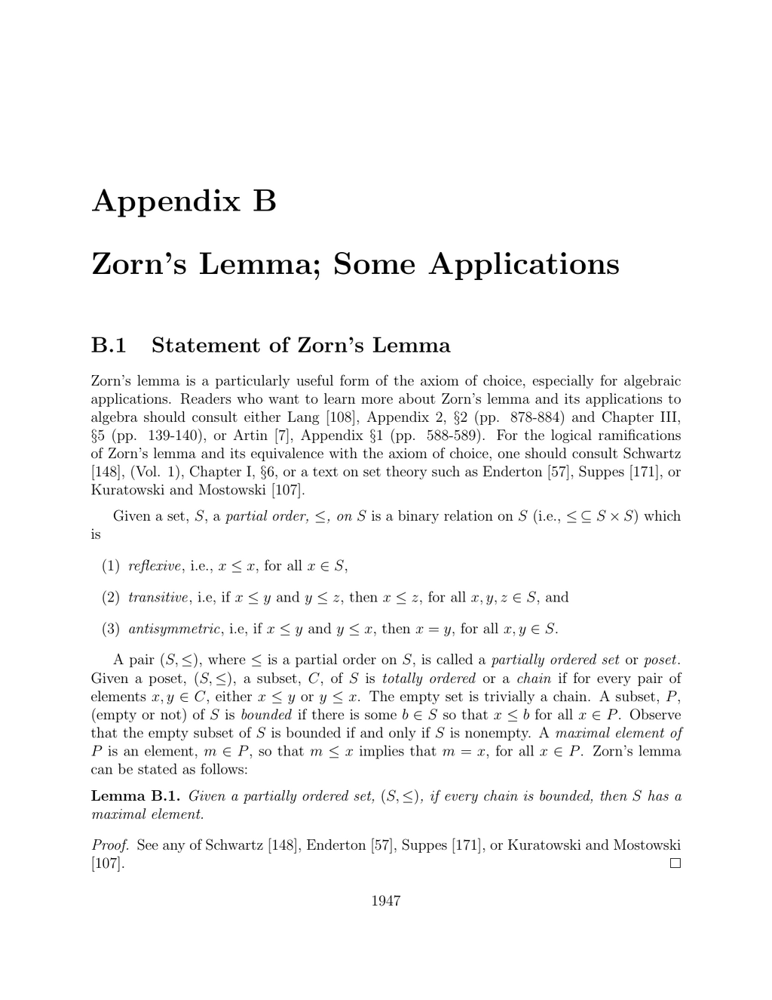

- **B.1 Statement of Zorn’s Lemma**
  - Zorn’s lemma states that a partially ordered set in which every chain is bounded has a maximal element.
  - A partial order is reflexive, transitive, and antisymmetric on a set.
  - Chains are totally ordered subsets, and an inductive poset is one in which every chain is bounded.
  - The lemma’s logical foundation and equivalence with the axiom of choice are discussed in sources such as [Enderton](https://link.springer.com/book/10.1007/978-1-4757-0662-1) and [Schwartz](https://link.springer.com/book/10.1007/978-1-4612-3575-1).
  
- **B.2 Proof of the Existence of a Basis in a Vector Space**
  - The theorem asserts the existence of a basis for any vector space generated by a family S, extending any linearly independent subfamily L.
  - The set of linearly independent families containing L and contained in S is inductive.
  - Zorn’s lemma guarantees a maximal linearly independent family, which must be a basis generating the whole space.
  - The construction avoids dependency by finite support arguments and uses Lemma 3.6 for extending linearly independent families.
  - Readers can consult Lang [108] and Artin [7] for algebraic applications of such proofs.

- **B.3 Existence of Maximal Ideals Containing a Given Proper Ideal**
  - The theorem states that every proper ideal in a commutative ring with identity is contained in a maximal ideal.
  - The set of proper ideals containing a given proper ideal is nonempty and inductive.
  - Union of a chain of such ideals is a proper ideal and serves as an upper bound.
  - Zorn’s lemma then guarantees the existence of a maximal ideal containing the original ideal.
  - For further understanding, refer to Artin [7] and Lang [108] on ideal theory and maximal ideals.
