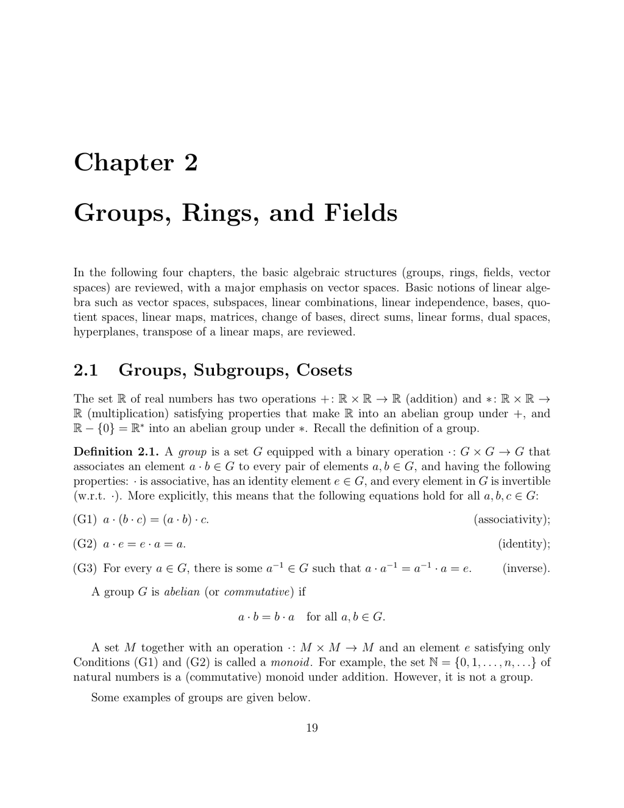

- **Groups, Rings, and Fields**
  - **Groups, Subgroups, Cosets**
    - Groups are sets with an associative binary operation, an identity element, and invertible elements; abelian groups satisfy commutativity.
    - Examples include integers under addition, rational numbers, permutation groups, matrix groups like GL(n, R), and quotient groups such as Z/pZ.
    - Subgroups satisfy presence of identity, closure under multiplication, and inverses; cosets partition groups and relate to equivalence relations.
    - Normal subgroups are invariant under conjugation, enabling quotient groups with well-defined multiplication.
    - Group homomorphisms preserve structure, with kernels forming normal subgroups; the First Isomorphism Theorem relates quotient groups and images.
    - Further reading: [Abstract Algebra by Dummit and Foote](https://www.amazon.com/Abstract-Algebra-David-Dummit/dp/0471433349)
  - **Cyclic Groups**
    - Cyclic groups are generated by a single element and are isomorphic either to the integers Z or to the finite cyclic group Z/nZ.
    - Subgroups of Z are precisely nZ for some n, and cyclic groups correspond to quotients of Z by such subgroups.
    - The group of units (invertible elements) in Z/nZ consists of residue classes coprime to n, forming the group (Z/nZ)*.
    - The Euler totient function ϕ(n) counts elements in (Z/nZ)*.
    - Further reading: [Cyclic Groups - Wikipedia](https://en.wikipedia.org/wiki/Cyclic_group)
  - **Rings and Fields**
    - A ring is a set with two operations (addition and multiplication), where addition forms an abelian group, multiplication is associative with identity, and multiplication distributes over addition.
    - Integral domains are commutative rings with no zero divisors and nontrivial identity elements.
    - Ring homomorphisms preserve operations and identities; kernels of ring homomorphisms are ideals, enabling quotient rings.
    - A field is a commutative ring in which every nonzero element is multiplicatively invertible; fields have characteristic 0 or prime characteristic.
    - Field homomorphisms are injective, making images subfields; examples include Q, R, C, finite fields Z/pZ (p prime), and extensions like Q(√d).
    - Algebraically closed fields contain roots of all polynomials; examples include C as the closure of R.
    - Further reading: [A First Course in Abstract Algebra by John B. Fraleigh](https://www.amazon.com/First-Course-Abstract-Algebra-7th/dp/0201763907)
