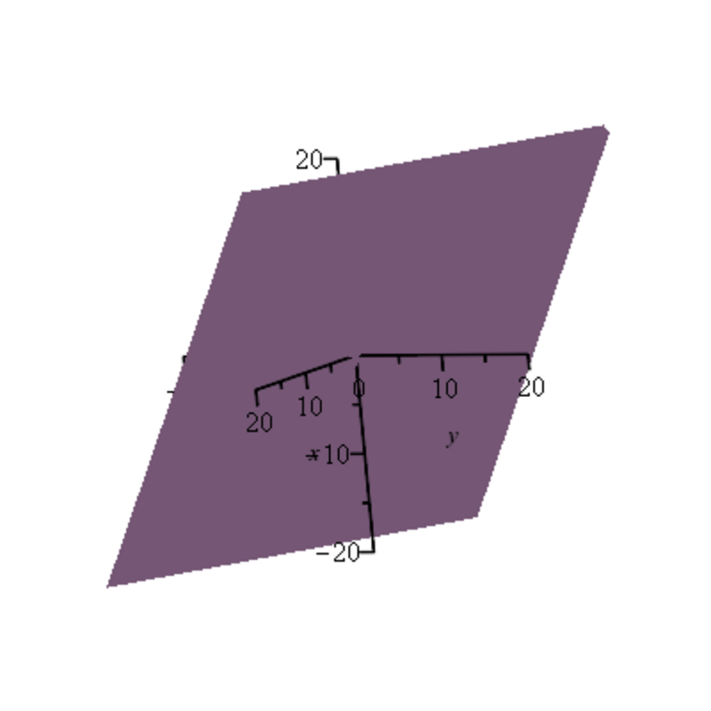

- **3.1 Motivations: Linear Combinations, Linear Independence and Rank**
  - The section illustrates solving linear systems using vectors and linear combinations.
  - Linear independence ensures unique representation of vectors and unique solutions to systems.
  - Determinants and matrix decompositions (LU, QR, SVD) assess linear independence and system solvability.
  - Rank and invertibility of square matrices are connected to linear independence and determinants.
  - Matrix operations, inner products, norms, and orthogonal matrices are introduced with geometric interpretations.
  - Reference for more: [Linear Algebra Done Right](https://linear.axler.net/).

- **3.2 Vector Spaces**
  - Vector spaces are sets with addition and scalar multiplication over a field satisfying axioms (V0)-(V4).
  - Important properties include existence of zero vector, inverses, and scalar distributions.
  - Examples cover fields, Euclidean spaces, polynomials, matrices, continuous functions, and function spaces.
  - The field itself forms a vector space over itself.
  - For further study: [Introduction to Linear Algebra](https://math.mit.edu/~gs/linearalgebra/).

- **3.3 Indexed Families; the Sum Notation**
  - Introduces sequences and indexed families as functions from index sets to elements, emphasizing uniqueness.
  - Formalizes sums indexed by finite sets where the binary operation is associative and commutative.
  - Proves sums over finite indexed families are well-defined, independent of order or grouping.
  - Differentiates indexed families from multisets by uniqueness of indexing.
  - See also: [Set Theory and Beyond](https://math.stackexchange.com/questions/).

- **3.4 Linear Independence, Subspaces**
  - Defines linear combinations and linear independence for families with finite support.
  - Clarifies that linear dependence means some vector is a combination of others or is zero.
  - Defines subspaces as nonempty subsets closed under vector addition and scalar multiplication.
  - Intersection of subspaces and generated subspaces are themselves subspaces.
  - Recommended reading: [Linear Algebra and Its Applications](https://math.berkeley.edu/~arash/linear_algebra.pdf).

- **3.5 Bases of a Vector Space**
  - A basis is a linearly independent family spanning a vector space; every vector has a unique coordinate representation.
  - Extends finite bases to infinite dimension using finite support for linear combinations.
  - Establishes existence of bases for vector spaces and maximal/minimal characterizations.
  - States Steinitz replacement lemma relating independence and generating sets.
  - Proves all bases have same cardinality, defining dimension.
  - Refer to: [Vector Spaces and Bases](https://math.stackexchange.com/questions/).

- **3.6 Matrices**
  - Defines matrices as families of scalars indexed by rows and columns.
  - Matrix addition, scalar multiplication, and matrix multiplication (via sums of products of rows and columns) are defined.
  - Introduces transpose, identity matrix, and inverse matrix definitions with properties.
  - Shows matrices form a vector space and a ring with noncommutative multiplication.
  - Common examples highlight noncommutativity and zero divisors.
  - Consult: [Matrix Analysis](https://math.mit.edu/~goemans/18438S17/matrix-notes.pdf).

- **3.7 Linear Maps**
  - Defines linear maps as functions between vector spaces preserving addition and scalar multiplication.
  - Introduces kernel and image as subspaces; injectivity linked to trivial kernel.
  - Shows linear maps transform linear combinations consistently.
  - Establishes correspondence between linear maps and images of basis elements.
  - Defines isomorphisms and their inverses; establishes vector spaces of linear maps.
  - Highlights Hom(E, F) as vector spaces and End(E) as rings with composition.
  - Further reading: [Linear Transformations](https://math.stackexchange.com/questions/).

- **3.8 Quotient Spaces**
  - Defines an equivalence relation induced by a subspace on a vector space.
  - Proves addition and scalar multiplication are compatible with equivalence classes.
  - Constructs quotient vector spaces as equivalence classes with induced operations.
  - Defines natural projection map from a vector space onto its quotient.
  - Notes isomorphism between image of linear map and quotient by kernel (first isomorphism theorem).
  - Suggested resource: [Quotient Vector Spaces](https://en.wikipedia.org/wiki/Quotient_vector_space).
