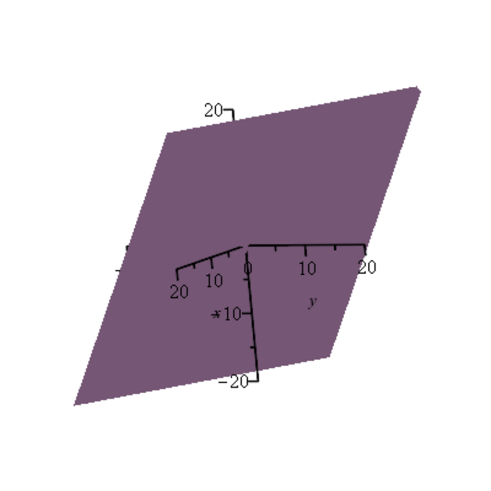

- **3.1 Motivations: Linear Combinations, Linear Independence and Rank**
  - Presents linear systems and the equivalence between solving Ax = b and expressing b as a linear combination of column vectors.
  - Defines vector addition and scalar multiplication in Rn×1, emphasizing column vectors.
  - Discusses linear independence characterized by a nonzero determinant and the uniqueness of solutions.
  - Explores cases of unique solutions, no solutions, and infinite solutions, with geometric interpretations as plane intersections.
  - Introduces matrix operations, inner products, and matrix decompositions such as LU, QR, and SVD for solving systems.
  - References applications like ridge regression, lasso, principal component analysis, and data compression.
  - Suggests further study in numerical linear algebra and optimization, e.g., [Numerical Linear Algebra, Trefethen & Bau](https://epubs.siam.org/doi/book/10.1137/1.9780898719604).

- **3.2 Vector Spaces**
  - Defines vector spaces over a field K with axioms for vector addition and scalar multiplication.
  - Details consequences of vector space axioms, including properties of the zero vector and scalar multiplication.
  - Lists examples of vector spaces including Rn, spaces of polynomials, matrices, continuous functions, and function spaces.
  - Notes the necessity of axiom (V4) with a counterexample.
  - Recommends foundational algebra texts for in-depth study, e.g., [Introduction to Linear Algebra, Gilbert Strang](https://math.mit.edu/~gs/linearalgebra/).

- **3.3 Indexed Families; the Sum Notation**
  - Introduces the concept of indexed families as functions from index sets to a set A, generalizing sequences and sets.
  - Distinguishes between indexed families and multisets regarding order and multiplicity.
  - Defines sums over indexed families with associative and commutative binary operations.
  - Proves independence of sums from operation orderings and permutations via induction.
  - Recommends formal treatments in algebra texts such as [Algebra, Michael Artin](https://books.google.com/books?id=FZHvjN6LqR0C).

- **3.4 Linear Independence, Subspaces**
  - Defines linear combinations and linear independence for families (including infinite with finite support).
  - Characterizes linear dependence as existence of nontrivial linear relations.
  - Introduces subspaces as nonempty subsets closed under vector addition and scalar multiplication.
  - Proves intersections of subspaces are subspaces and spans of sets are the minimal subspace containing them.
  - Describes affine, positive (conic), and convex combinations relevant in optimization.
  - Suggests further reading on convex geometry, e.g., [Convex Optimization, Boyd & Vandenberghe](https://web.stanford.edu/~boyd/cvxbook/).

- **3.5 Bases of a Vector Space**
  - Defines spanning families, bases (spanning plus linear independence), and finitely generated spaces.
  - Proves every vector space has a basis (finite case proved, infinite requires Zorn’s lemma).
  - Gives equivalent characterizations of bases: maximal linearly independent or minimal spanning families.
  - States the replacement lemma (Steinitz exchange lemma) relating linear independence and generating sets.
  - Demonstrates all bases have the same cardinality defining dimension.
  - Provides uniqueness of linear combination coordinates with respect to a basis.
  - Introduces the vector space K(I) of finite support families as standard free vector space generated by I.
  - References detailed proofs in algebra literature, e.g., [Linear Algebra Done Right, Sheldon Axler](https://linear.axler.net/).

- **3.6 Matrices**
  - Defines m × n matrices over a field K as arrays or indexed families of scalars.
  - Introduces matrix addition, scalar multiplication, matrix multiplication, and transpose operations.
  - Describes identity matrices and elementary matrices Eij forming a basis of Mm,n (K).
  - Discusses properties of matrix multiplication including associativity, bilinearity, and noncommutativity.
  - Explains invertible (nonsingular) and singular matrices and uniqueness of inverses.
  - Notes that matrices form associative algebras and noncommutative rings with zero divisors.
  - Suggests [Matrix Analysis, Horn & Johnson](https://www.cambridge.org/core/books/matrix-analysis/7EC4896B49DD7991F4E009E3C440F6CB) for comprehensive study.

- **3.7 Linear Maps**
  - Defines linear maps (homomorphisms) between vector spaces preserving addition and scalar multiplication.
  - Proves that linear maps transform linear combinations accordingly.
  - Defines kernel and image, proving these are subspaces and characterizing injectivity by zero kernel.
  - States that given a basis of E and any family in F, there is a unique linear map sending basis vectors accordingly.
  - Shows injectivity coincides with image of basis being linearly independent; surjectivity with spanning image.
  - Introduces isomorphisms as invertible linear maps with two-sided inverse.
  - Describes the vector space Hom(E, F ), its operations, and composition forming a noncommutative ring.
  - Defines automorphisms and the general linear group GL(E).
  - References material on linear transformations in [Linear Algebra and Its Applications, David C. Lay](https://www.pearson.com/store/p/linear-algebra-and-its-applications/P100000553467/9780321982384).

- **3.8 Quotient Spaces**
  - Defines equivalence relation induced by subspace M of E and proves it is compatible with vector space operations.
  - Defines quotient space E/M as equivalence classes with induced operations, forming a vector space.
  - Introduces the natural projection map π : E → E/M as surjective linear map.
  - States isomorphism between image of a linear map and the quotient E/Ker f.
  - Suggests [Algebra, Serge Lang](https://link.springer.com/book/10.1007/978-1-4612-5350-1) for extended discussion on quotient spaces.

- **3.9 Linear Forms and the Dual Space**
  - Defines linear forms as elements of Hom(E, K) mapping vectors to the base field.
  - Introduces the dual space as the vector space of all linear forms on E.
  - Notes that every finite-dimensional vector space has a dual basis.
  - Refers to Chapter 11 for detailed treatment of dual spaces and duality theory.
  - For further study, see [Finite Dimensional Vector Spaces, Paul Halmos](https://www.amazon.com/Finite-Dimensional-Vector-Spaces-Paul/dp/0387900926).
