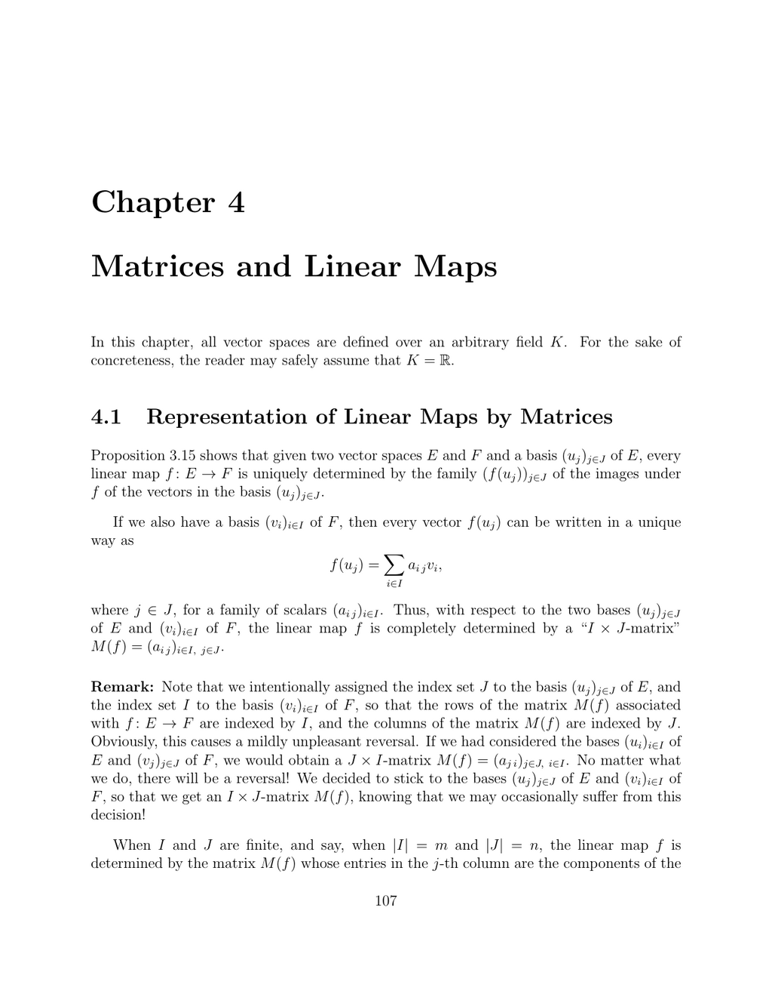

- **4.1 Representation of Linear Maps by Matrices**
  - Linear maps between finite-dimensional vector spaces are uniquely represented by matrices relative to chosen bases of domain and codomain.
  - The entries of the matrix correspond to coordinates of images of basis vectors under the linear map.
  - Composition of linear maps corresponds to matrix multiplication.
  - The section includes a concrete example using differentiation and integration on polynomial spaces.
  - See [Linear Algebra and Its Applications](https://www.sciencedirect.com/book/9780321982384/linear-algebra-and-its-applications) for foundational concepts.

- **4.2 Composition of Linear Maps and Matrix Multiplication**
  - Composition of linear maps is represented by the product of their associated matrices.
  - Matrices use the convention where the first map goes from E to F and the second from F to G, so composition f ◦ g corresponds to the product M(f)M(g).
  - Matrix multiplication is associative and bilinear.
  - The mapping from Hom(E,F) to matrices is an isomorphism of vector spaces respecting addition, scalar multiplication, and composition.
  - Consult [Matrix Analysis](https://press.princeton.edu/books/hardcover/9780691040017/matrix-analysis) by Horn and Johnson for deeper insight.

- **4.3 Change of Basis Matrix**
  - Change of basis matrices are invertible and represent the identity map with respect to different bases.
  - Coordinates of vectors transform via multiplication by the change of basis matrix or its inverse when changing bases.
  - The section discusses notation challenges and proposes naming conventions for clarity.
  - Concrete examples include change of basis in R² and polynomial spaces using Bernstein polynomials.
  - For more examples of basis changes, see [Introduction to Linear Algebra](https://math.mit.edu/~gs/linearalgebra/).

- **4.4 The Effect of a Change of Bases on Matrices**
  - The matrix of a linear map changes by conjugation under change of bases: M' = Q⁻¹ M P, with P and Q as change of basis matrices.
  - Similar matrices represent the same linear map with respect to different bases.
  - The section demonstrates the diagonalization of a matrix as a change of basis.
  - Change of basis matrices compose according to multiplication, preserving transformation consistency.
  - For understanding similarity and diagonalization, refer to [Matrix Computations](https://press.princeton.edu/books/hardcover/9780691130952/matrix-computations).

- **4.5 Summary**
  - Summarizes key concepts: matrix representation of linear maps, isomorphism of matrix representation, and change of basis effects.
  - Reinforces the interpretation of matrices as representations of linear maps, not intrinsic objects.
  - Encourages geometric thinking of linear maps beyond matrix computations.
  - Introduces foundational properties to support further applications and theory.
  - See [Linear Algebra Done Right](https://link.springer.com/book/10.1007/978-3-319-11080-2) for a conceptual approach.

- **4.6 Problems**
  - Provides exercises on proving linear independence and expressing vectors relative to different bases.
  - Reinforces understanding of coordinate transformation and matrix representations.
  - Encourages application of the chapter’s theory to explicit computations.
  - Serves as practice for change of basis and linear map representation concepts.
  - For additional problems, consider [Schaum's Outline of Linear Algebra](https://www.mhprofessional.com/9780071794566-usa-schaums-outline-of-linear-algebra-group).
