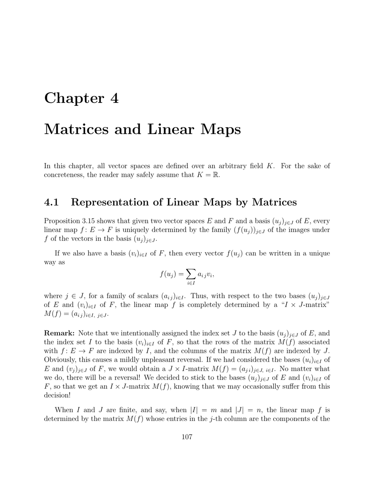

- **4.1 Representation of Linear Maps by Matrices**
  - Linear maps between finite-dimensional vector spaces are uniquely represented by matrices relative to chosen bases.
  - The matrix entries correspond to the components of image basis vectors expressed in the codomain basis.
  - Vector coordinates and matrix-vector multiplication correspond naturally to linear map action.
  - The derivative and integration operators on polynomial spaces illustrate concrete matrix representations.
  - For further reading, see [Linear Algebra Done Right](https://linear.ups.edu/).

- **4.2 Composition of Linear Maps and Matrix Multiplication**
  - Composition of linear maps corresponds precisely to matrix multiplication with respect to respective bases.
  - The entry in the product matrix is given by summing products of corresponding entries from factor matrices.
  - Matrix multiplication is associative and bilinear, induced by composition of linear maps.
  - The isomorphism between Hom-spaces and matrices is compatible with addition, scalar multiplication, and composition.
  - Consult [Matrix Analysis](https://www.cambridge.org/core/books/matrix-analysis/824F0193E5144AE07B8E44B2994607D1) for more on matrix operations.

- **4.3 Change of Basis Matrix**
  - A change of basis between two bases of a vector space is represented by an invertible matrix whose columns express new basis vectors in old coordinates.
  - The inverse of this matrix corresponds to the opposite change of basis.
  - Coordinate vectors transform contravariantly relative to the change of basis matrix.
  - Concrete examples include changes in R² and polynomial spaces with Bernstein polynomial bases.
  - See [Linear Algebra and Its Applications](https://www.pearson.com/us/higher-education/program/Lay-Linear-Algebra-and-Its-Applications-5th-Edition/PGM44427.html) for detailed examples.

- **4.4 The Effect of a Change of Bases on Matrices**
  - Changing the bases of domain and codomain transforms a linear map matrix by conjugation with the respective change of basis matrices.
  - Similar matrices represent the same linear map with respect to different bases and form an equivalence relation.
  - Matrix similarity corresponds to a change of basis in the underlying vector space.
  - Composition of change of basis matrices corresponds to multiplication in the reverse order.
  - Refer to [Matrix Theory](https://link.springer.com/book/10.1007/978-1-4612-5858-6) for insights on similarity transformations.

- **4.5 Summary**
  - The section summarizes matrix representation of linear maps, the isomorphism between Hom and matrix spaces, and the change of basis matrix concept.
  - Emphasis is placed on the fundamental role of linear maps as underlying geometric objects.
  - Understanding bases and their transformations is key to matrix representations.
  - For an overview, see [Introduction to Linear Algebra](https://math.mit.edu/~gs/linearalgebra/).
