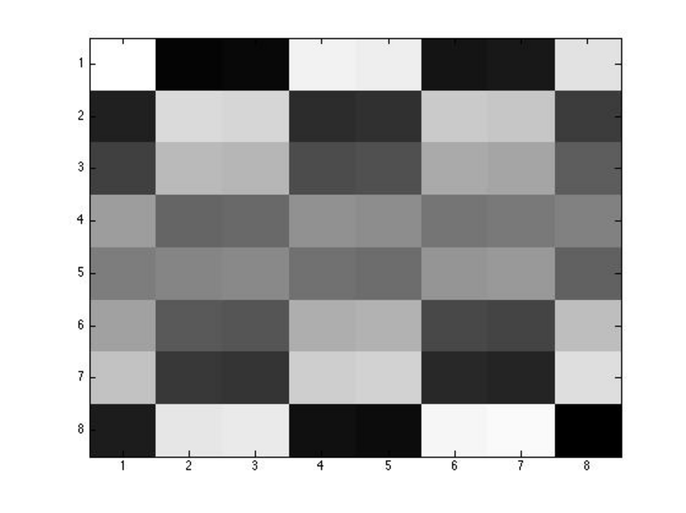

- **5.1 Introduction to Signal Compression Using Haar Wavelets**
  - Haar wavelets provide a method for compressing long audio and video signals into smaller ones while retaining perceptual quality.
  - The Haar basis vectors in ℝ⁴ are pairwise orthogonal and serve as a change of basis from the canonical basis.
  - Signal coefficients over the Haar basis can be computed via multiplication by the inverse Haar matrix.
  - Coefficients represent different signal features: overall average, coarse details, and finer localized differences.
  - Compression is achieved by zeroing small coefficients and reconstructing approximate signals using the Haar basis.
- **5.2 Haar Bases and Haar Matrices, Scaling Properties of Haar Wavelets**
  - Haar bases generalize to dimension 2ⁿ with basis vectors generated through scaling and shifting of a mother wavelet.
  - Definition of Haar wavelets involves piecewise constant functions over [0,1) corresponding to Haar basis vectors.
  - Transform and inverse transform algorithms based on averaging and differencing provide computational efficiency.
  - Examples illustrate conversion of vectors to Haar coefficients and reconstruction using these algorithms.
  - The wavelets are related to piecewise linear functions, making their interpretation intuitive in signal analysis.
- **5.3 Kronecker Product Construction of Haar Matrices**
  - Haar matrices can be constructed recursively using Kronecker products, explaining their orthogonality properties.
  - Matrices split into two halves with simple structures derived from identity matrices and elementary vectors.
  - The recursive relation for Wₙ involves Kronecker products with smaller Haar matrices and a fixed 2×2 matrix.
  - Kronecker product properties such as associativity and distributivity support this construction and proof of orthogonality.
  - This approach clarifies why fast iterative averaging/differencing algorithms for Haar transforms are correct.
- **5.4 Multiresolution Signal Analysis with Haar Bases**
  - Haar bases enable multiresolution analysis where low-index coefficients carry coarse information and high-index coefficients carry fine details.
  - This property allows efficient signal compression by zeroing small coefficients without significant perceived quality loss.
  - Practical example given with compression of a numeric signal and its Haar transform illustrating preservation of main features.
  - Haar wavelets find applications in audio signal compression allowing progressive representation.
  - Reference for further reading includes Stollnitz, Derose, and Salesin [166]; Strang and Nguyen [170].
- **5.5 Haar Transform for Digital Images**
  - Haar transform generalizes naturally to 2D matrices enabling image compression through row and column transforms.
  - Normalization of Haar matrices leads to orthogonal Haar transform matrices, improving numerical stability.
  - Algorithms using averaging and differencing can be used instead of explicit matrix multiplication for encoding and decoding.
  - Examples demonstrate Haar transform, compression by thresholding, and reconstruction on 8×8 image matrices.
  - Progressive image transmission is possible by sending coefficients in order of importance.
  - Matlab commands such as image(X) and imagesc(X) facilitate visualization of images and their Haar transforms.
- **5.6 Hadamard Matrices**
  - Hadamard matrices are square ±1 matrices with orthogonal columns, satisfying HᵀH = nIₙ.
  - Existence problem is open, but known necessary condition is n=1,2 or multiple of 4; Sylvester's construction produces 2ᵐ-dimensional Hadamard matrices.
  - The Sylvester–Hadamard matrices relate closely to Walsh functions, which form orthogonal bases on [0,1].
  - Applications include error-correcting codes (e.g., Mariner spacecraft transmission) and dimension reduction methods.
  - Subsampled randomized Hadamard transform (SRHT) matrices incorporate Hadamard matrices with random sign flips and sampling.
- **5.7 Summary**
  - Key concepts listed include Haar bases, Kronecker product, Hadamard matrices, and Walsh functions.
- **5.8 Problems**
  - Problem 5.1 involves proving reconstruction steps for a given Haar-related matrix W₃,₃.
  - The problem focuses on understanding how Haar matrices operate in signal reconstruction contexts.
