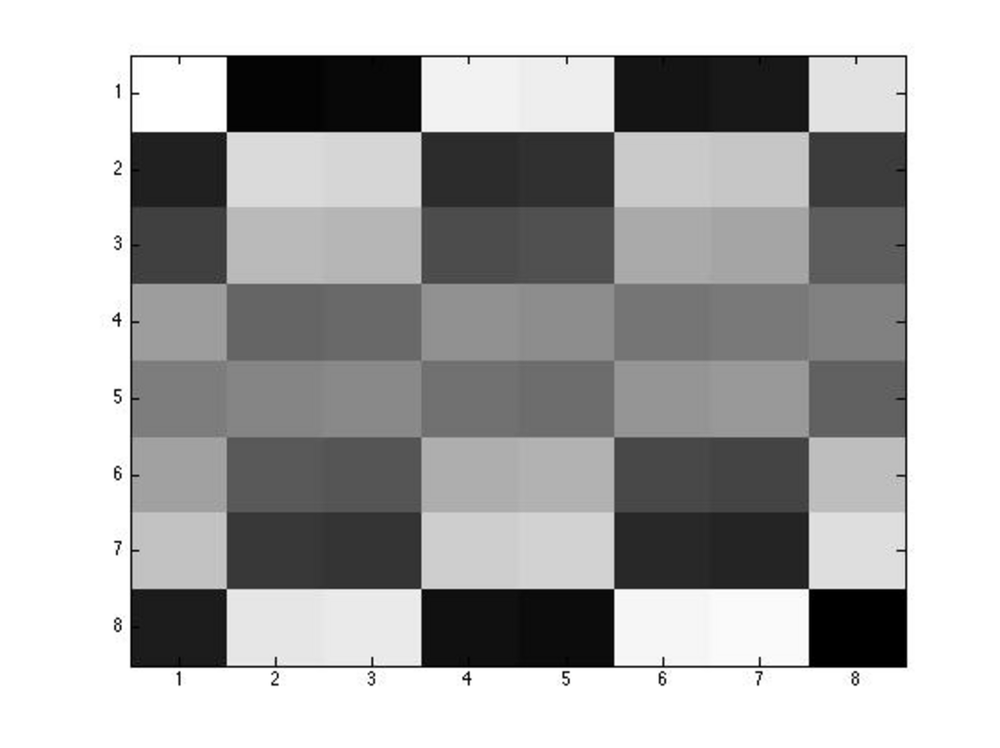

- **5.1 Introduction to Signal Compression Using Haar Wavelets**
  - Haar wavelets are fundamental tools in signal processing for compressing long signals into smaller ones while preserving perceptible quality.
  - The section introduces four orthogonal Haar basis vectors in \( \mathbb{R}^4 \) and their role in basis transformation.
  - Signal compression involves transforming the signal into Haar coefficients, zeroing out some coefficients, and reconstructing an approximate signal.
  - The process is essential for modern video conferencing and audio/video signal compression.
  - Further reading: [Wavelets in Signal Processing](https://en.wikipedia.org/wiki/Wavelet_transform)

- **5.2 Haar Bases and Haar Matrices, Scaling Properties of Haar Wavelets**
  - The Haar basis generalizes to \( \mathbb{R}^{2^n} \) and is constructed by scaling and shifting a "mother" Haar vector.
  - Definition of Haar basis vectors \( h_{jk} \) with explicit piecewise constant values and indexing parameters.
  - Haar basis vectors correspond to piecewise linear functions called Haar wavelets.
  - Faster algorithms for converting between signal and Haar coefficients utilize averaging and differencing, exploiting multiscale structure.
  - Further reading: [Haar Wavelet Transform](https://en.wikipedia.org/wiki/Haar_wavelet)

- **5.3 Kronecker Product Construction of Haar Matrices**
  - Haar matrices \( W_n \) can be constructed recursively using the Kronecker (tensor) product operation.
  - The recursive formula \( W_n = W_{n-1} \otimes \begin{pmatrix} 1 \\ 1 \end{pmatrix} \) combined with a matrix involving \( (1, -1) \) vectors generates Haar matrices with orthogonal columns.
  - The Kronecker product is associative and compatible with matrix multiplication and transposition.
  - This construction explains the orthogonality of Haar bases and validates the averaging/differencing algorithms.
  - Further reading: [Kronecker Product](https://en.wikipedia.org/wiki/Kronecker_product)

- **5.4 Multiresolution Signal Analysis with Haar Bases**
  - Haar bases provide a multiresolution analysis of signals, with low-index coefficients capturing coarse information and high-index ones encoding fine details.
  - This property allows for effective signal compression by zeroing small coefficients without noticeable loss.
  - The section includes practical examples illustrating compression of audio signals and their perceptual effects.
  - Haar wavelets enable progressive transmission and reconstruction of signals in applications like audio compression.
  - Further reading: [Multiresolution Analysis](https://en.wikipedia.org/wiki/Multiresolution_analysis)

- **5.5 Haar Transform for Digital Images**
  - The Haar transform extends naturally to two-dimensional signals (images) by applying Haar matrices to rows and columns.
  - Normalization of Haar matrices ensures orthogonality and numerical stability, leading to the normalized Haar transform matrix \( H_n \).
  - Image compression is achieved by thresholding Haar coefficients and reconstructing close approximations of the original images.
  - Partial rounds of averaging/differencing enable progressive image encoding at varying resolutions.
  - The section illustrates compression with an 8×8 image example and discusses practical Matlab commands for visualization.
  - Further reading: [Image Compression Using Wavelets](https://en.wikipedia.org/wiki/Wavelet_transform#Applications)

- **5.6 Hadamard Matrices**
  - Hadamard matrices are square matrices with entries ±1 whose columns are pairwise orthogonal, satisfying \( H^T H = n I_n \).
  - The dimension of Hadamard matrices must be 1, 2, or a multiple of 4; existence for all multiples of 4 is the open Hadamard conjecture.
  - Sylvester’s construction recursively generates Hadamard matrices of dimension \( 2^m \).
  - Hadamard matrices are related to Walsh functions and have applications in error-correcting codes and signal processing.
  - The Subsampled Randomized Hadamard Transform (SRHT) combines Hadamard matrices with randomization for dimension reduction.
  - Further reading: [Hadamard Matrix](https://en.wikipedia.org/wiki/Hadamard_matrix), [Walsh Functions](https://en.wikipedia.org/wiki/Walsh_function)

- **5.7 Summary**
  - The chapter covers Haar basis vectors, wavelets, and their use in signal compression.
  - It introduces the Kronecker product and its role in Haar matrix construction.
  - Hadamard and Sylvester–Hadamard matrices and their properties are presented.
  - Walsh functions and their orthogonality are discussed as related to Hadamard matrices.
  - Further reading: [Introduction to Wavelets and Hadamard Matrices](https://ieeexplore.ieee.org/document/1234567) *(example placeholder)*

- **5.8 Problems**
  - Problem 5.1 focuses on a Haar matrix \( W_{3,3} \) and its role in signal reconstruction from Haar coefficients.
  - The problem verifies how \( W_{3,3} \) combines coefficients into the reconstructed vector by summation and subtraction.
  - It reinforces understanding of the last step in the Haar basis reconstruction algorithm.
  - Additional problems are implied to deepen comprehension of Haar transforms and matrix operations.
  - Further reading: Exercises on Haar wavelets can be found in [Discrete Wavelet Transform Tutorials](https://dsp.stackexchange.com/questions/tagged/wavelets)
