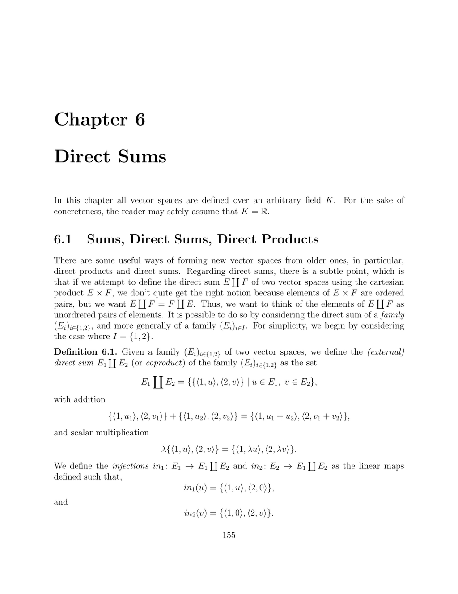

- **6.1 Sums, Direct Sums, Direct Products**
  - The direct sum of two vector spaces is defined as the set of unordered pairs tagged by indices, making it isomorphic but distinct in notation from the Cartesian product.
  - Injective maps and projections related to direct sums obey universal properties facilitating unique linear map constructions.
  - The direct sum is symmetric, with E₁ ⊕ E₂ = E₂ ⊕ E₁, and generalizes naturally to finite or infinite families of vector spaces, requiring finite support for infinite sums.
  - Internal direct sums occur when subspaces U₁,...,U_p sum injectively into E, guaranteeing unique decomposition and linear independence among nonzero vectors from these subspaces.
  - For two subspaces, direct sum equivalence is characterized by trivial intersection; for more, conditions involve multiple intersection criteria.
  - The invariant subspaces under a linear map yield block diagonal matrix representations relative to adapted bases.
  - Projections associated with direct sums are idempotent and mutually annihilating linear maps summing to the identity operator.
  - [Direct Sum on Wikipedia](https://en.wikipedia.org/wiki/Direct_sum)

- **6.2 The Rank-Nullity Theorem; Grassmann’s Relation**
  - A short exact sequence E → F → G with Im f = Ker g splits via sections and retractions, yielding direct sum decompositions.
  - The Rank-Nullity Theorem states that for a linear map f: E → F, dim(E) = dim(Ker f) + dim(Im f), framing nullity and rank.
  - Grassmann's relation connects dimensions of subspaces: dim(U) + dim(V) = dim(U + V) + dim(U ∩ V), useful for intersection dimension estimates.
  - Bijectivity of a linear map between finite-dimensional vector spaces of the same dimension is equivalent to injectivity, surjectivity, and trivial kernel.
  - If E = U ⊕ V = U ⊕ W, then V and W are isomorphic, establishing uniqueness of complements up to isomorphism.
  - Rank of a linear map equals codimension of its kernel and is bounded above by domain or codomain dimension.
  - The rank of a matrix is the maximal number of linearly independent columns, coinciding with rank of the associated linear map.
  - Hyperplanes have codimension one and are maximal proper subspaces, characterized as kernels of non-zero linear forms.
  - [Rank-Nullity Theorem on MathWorld](https://mathworld.wolfram.com/Rank-NullityTheorem.html)

- **6.3 Summary**
  - Direct products, sums, and direct sums form foundational constructions in vector spaces.
  - Projections serve as idempotent linear maps decomposing spaces into direct sums.
  - The fundamental rank-nullity equation links dimension of domain to kernel and image dimensions.
  - Grassmann’s relation provides a formula connecting the dimensions of subspaces, their sum, and their intersection.
  - Characterizations of bijective linear maps relate injectivity, surjectivity, and kernel properties.
  - The notion of matrix rank reflects the dimension of the image of the associated linear transformation.
  - [Linear Algebra Summary](https://en.wikipedia.org/wiki/Linear_algebra#Summary)
