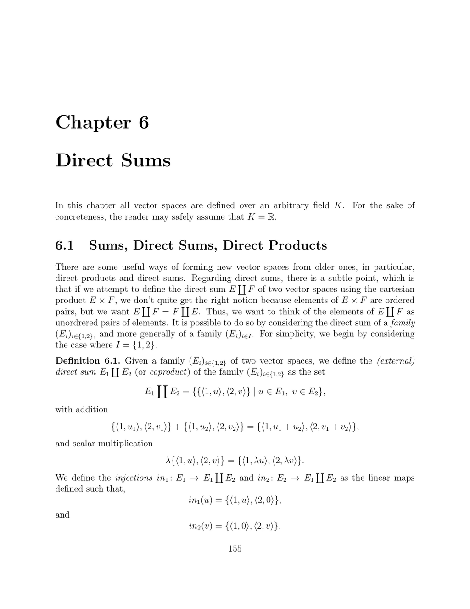

- **6.1 Sums, Direct Sums, Direct Products**
  - Defines external direct sums as sets of tagged, unordered pairs from given vector spaces to ensure commutativity.
  - Differentiates between direct sums and Cartesian products with an emphasis on structure and ordering.
  - Establishes bijections and linear isomorphisms relating sums and products of finite vector spaces.
  - Introduces injections and projections as linear maps fundamental to direct sum constructions.
  - Explores internal direct sums of subspaces in a vector space with definitions, uniqueness of decomposition, and linear independence conditions.
  - Discusses matrix block diagonalization in the context of invariant subspaces and direct sum decompositions.
  - Characterizes direct sums via kernels, intersections, and idempotent linear maps with propositions linking these concepts.
  - Extends definitions and properties of direct sums and products to arbitrary (possibly infinite) index sets with finite support conditions.
  - Includes examples such as symmetric and skew-symmetric matrix decompositions, with references to Lie algebras.
  - References for further reading: [Direct Sum - Wikipedia](https://en.wikipedia.org/wiki/Direct_sum)

- **6.2 The Rank-Nullity Theorem; Grassmann’s Relation**
  - Presents split exact sequences and shows isomorphisms arising from injective and surjective linear maps with matching images and kernels.
  - Proves the Rank-Nullity Theorem stating that any vector space is isomorphic to the direct sum of the kernel and image of a linear map.
  - Introduces Grassmann’s relation expressing dimension formulas relating sums and intersections of subspaces.
  - Applies Grassmann’s relation to subspace dimension inequalities, including hyperplanes and intersections in finite-dimensional spaces.
  - Provides characterizations of bijective linear maps using dimension and kernel conditions.
  - Establishes isomorphism of complements arising from direct sum decompositions.
  - Discusses rank properties and codimension relations for linear maps and matrices.
  - Defines rank of a matrix as the maximum number of linearly independent columns, linking it with matrix representation of linear maps.
  - Explains the characterization of hyperplanes as maximal proper subspaces and kernels of nonzero linear forms.
  - References for further reading: [Rank-Nullity Theorem - MathWorld](https://mathworld.wolfram.com/Rank-NullityTheorem.html)

- **6.3 Summary**
  - Lists major concepts and theorems covered: direct products, sums, projections, rank-nullity theorem, Grassmann’s relation, bijective map characterizations, and matrix rank.
  - Emphasizes the fundamental equation relating dimension, kernel, and image dimensions.
  - Reinforces the equivalence of direct sum dimension properties to linear independence and injectivity criteria.
  - Further reading recommendation: [Linear Algebra - MIT OpenCourseWare](https://ocw.mit.edu/courses/mathematics/18-06-linear-algebra-spring-2010/)

- **6.4 Problems**
  - Problem 6.1 proves that the union of two subspaces is a subspace only if one is contained within the other.
  - Problem 6.2 demonstrates that any idempotent linear map induces a direct sum decomposition into kernel and image.
  - Problem 6.3 investigates the kernel of the addition map from product of subspaces to their sum, exploring intersections and direct sum conditions with explicit constructions.
  - Encourages application of theory to subspace intersection properties and kernel characterizations.
  - Recommended problem-solving resources: [Linear Algebra Problem Solving - Paul's Online Math Notes](https://tutorial.math.lamar.edu/Classes/LinAlg/LinAlg.aspx)
