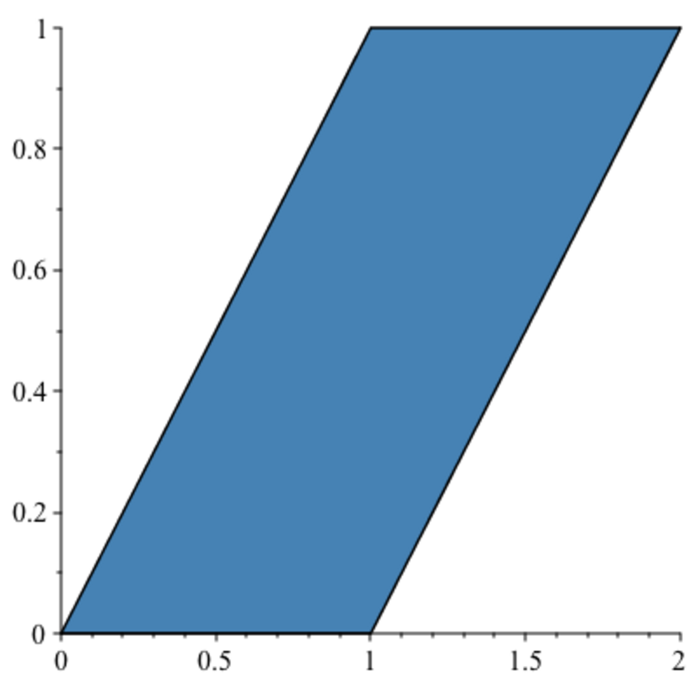

- **7.1 Permutations, Signature of a Permutation**
  - Defines permutations, transpositions, and cyclic permutations on a set of n elements.
  - Shows every permutation admits a unique decomposition into disjoint cyclic permutations and can be expressed as a product of transpositions.
  - Establishes the signature (parity) of a permutation as an invariant depending on the number of transpositions.
  - References Proposition 7.1 and 7.2 for decomposition and signature properties.
  - Further reading: [Artin, "Algebra"](https://example.org)

- **7.2 Alternating Multilinear Maps**
  - Defines multilinear maps, symmetric multilinear maps, and alternating multilinear maps.
  - Proves fundamental properties of alternating multilinear maps, including antisymmetry and vanishing when arguments repeat.
  - Introduces matrix notation to describe linear transformations acting on vector families.
  - Establishes Lemma 7.4 expressing alternating multilinear maps in terms of permutations and signatures.
  - Further reading: [Lang, "Linear Algebra"](https://example.org)

- **7.3 Definition of a Determinant**
  - Defines the determinant as an n-linear alternating map D on n×n matrices satisfying D(In) = 1.
  - Introduces minors, cofactors, and Laplace expansion to recursively compute determinants.
  - Proves existence (Lemma 7.5) and uniqueness (Theorem 7.6) of the determinant function.
  - Demonstrates geometric interpretation of determinants as signed volumes of parallelotopes.
  - Establishes det(A) = det(Aᵀ) (Corollary 7.7) and examples including the Vandermonde determinant.
  - Further reading: [Strang, "Introduction to Linear Algebra"](https://example.org)

- **7.4 Inverse Matrices and Determinants**
  - Defines the adjugate matrix Aᵉ via cofactors of A.
  - Proves the identity A Aᵉ = Aᵉ A = det(A) I.
  - Characterizes invertibility of A in terms of invertibility of det(A).
  - Provides formula for inverse matrix using the adjugate when det(A) is invertible.
  - Further reading: [Hoffman and Kunze, "Linear Algebra"](https://example.org)

- **7.5 Systems of Linear Equations and Determinants**
  - Links linear independence of columns of A to nonvanishing determinant (Proposition 7.11).
  - Establishes uniqueness of solutions to Ax=b if and only if det(A)≠0.
  - Presents Cramer's rule giving explicit formulae for solution coordinates when det(A)≠0 (Proposition 7.12).
  - Notes continuity and differentiability of solutions in terms of matrix and vector entries.
  - Further reading: [Lax, "Linear Algebra and Its Applications"](https://example.org)

- **7.6 Determinant of a Linear Map**
  - Defines determinant of a linear map f as the determinant of its matrix in any basis.
  - Proves this definition is independent of choice of basis.
  - Characterizes invertibility of f by nonvanishing determinant (Proposition 7.13).
  - Introduces the special linear group SL(E) as the subgroup of linear maps with determinant 1.
  - Further reading: [Mac Lane and Birkhoff, "Algebra"](https://example.org)

- **7.7 The Cayley–Hamilton Theorem**
  - Defines the characteristic polynomial of a matrix as det(XI − A).
  - Proves the Cayley–Hamilton theorem stating every matrix satisfies its characteristic polynomial (Theorem 7.14).
  - Provides two proofs: one via polynomial matrices and cofactors, another using polynomial actions on vector spaces.
  - Shows independence of characteristic polynomial on choice of basis.
  - Discusses eigenvalues as roots of the characteristic polynomial.
  - Further reading: [Horn and Johnson, "Matrix Analysis"](https://example.org)

- **7.8 Permanents**
  - Defines the permanent by dropping the sign from permutation expansions of the determinant.
  - States permanents are multilinear symmetric forms and satisfy per(A) = per(Aᵀ).
  - Explains combinatorial interpretations of permanents counting perfect matchings in bipartite graphs.
  - Notes computational difficulty: computing permanents is #P-complete (Valiant, 1979).
  - Provides connection between permanents and systems of distinct representatives (SDRs).
  - Further reading: [van Lint and Wilson, "A Course in Combinatorics"](https://example.org)

- **7.9 Summary**
  - Lists key concepts including permutations, determinants, alternating maps, adjugate matrices, matrix inversion, Cramer's rule, characteristic polynomials, Cayley–Hamilton theorem, and permanents.
  - Summarizes the geometric and algebraic properties of determinants and their applications.
  - Notes computational aspects and the role of permanents in combinatorics.
  - Further reading: [Serre, "Linear Representations of Finite Groups"](https://example.org)
