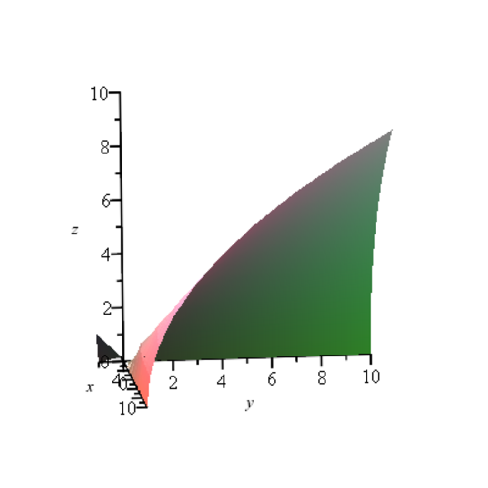

- **8.1 Motivating Example: Curve Interpolation**
  - The three principles are the use of cubic Bézier curves, smoothness between junction points, and interpolation conditions.
  - C² continuity ensures tangents and curvatures agree between curve segments.
  - The N Bézier curves depend on auxiliary de Boor control points satisfying a linear system.
  - The matrix of this system is tridiagonal and strictly diagonally dominant.
  - For further reading, see [Curve and Surface Design](https://www.amazon.com/Curve-Surface-Design-Computational/dp/0442302408).

- **8.2 Gaussian Elimination**
  - Gaussian elimination transforms a linear system Ax = b into an upper-triangular system for back-substitution.
  - Row operations, including permutations, are applied to handle zero pivots.
  - The method avoids explicit matrix inversion and determinant calculation for efficiency.
  - Upper (or lower) triangular matrices are invertible iff their diagonal entries are nonzero.
  - For general theory, consult [Numerical Linear Algebra](https://epubs.siam.org/doi/book/10.1137/1.9781611971484).

- **8.3 Elementary Matrices and Row Operations**
  - Elementary row operations correspond to left multiplication by elementary matrices (permutation, row addition, scaling).
  - Permutation matrices swap rows and have determinant -1.
  - Matrices adding multiples of one row to another have determinant 1 and are invertible.
  - Product of elementary matrices represents the invertible matrix transforming A into an upper-triangular matrix.
  - Additional details found in [Matrix Analysis](https://press.princeton.edu/books/hardcover/9780691111221/matrix-analysis).

- **8.4 LU-Factorization**
  - An invertible matrix A has an LU-factorization if all principal leading submatrices are invertible.
  - LU-factorization expresses A = LU where L is unit lower-triangular and U is upper-triangular.
  - Pivoting is required if some submatrix is singular; pivoting reduces Gaussian elimination to P A = LU form.
  - Theorem 8.5 gives a constructive algorithm to decompose A into P, L, U matrices with pivoting.
  - For implementations and proofs, refer to [Applied Numerical Linear Algebra](https://epubs.siam.org/doi/book/10.1137/1.9780898717839).

- **8.5 P A = LU Factorization**
  - Any invertible matrix A can be permuted by P so that Gaussian elimination without pivoting applies to P A.
  - Pivoting matrices P arise as products of transpositions, and Gaussian elimination with pivoting yields P A = LU.
  - L is constructed by applying the same row permutations to the lower-triangular multipliers during elimination.
  - The permutation matrix P, lower-triangular matrix L, and upper-triangular matrix U satisfy unique factorization.
  - For further study, see [Matrix Computations](https://press.princeton.edu/books/hardcover/9780691043615/matrix-computations).

- **8.6 Proof of Theorem 8.5**
  - The uniqueness of LU-factorization without pivoting is proven via the simultaneous lower and upper triangular structure.
  - The inductive step formalizes the construction of L and the transformation matrices E_jk integrating pivoting.
  - The proof shows the invertibility and triangular structure persistence throughout elimination stages.
  - It demonstrates how permutations affect elementary matrices and factorization.
  - A detailed proof can also be found in [Numerical Linear Algebra and Applications](https://www.cambridge.org/core/books/numerical-linear-algebra-and-applications/086AEC63FEB3F30670460EB3F6FB7FB6).

- **8.7 Dealing with Roundoff Errors; Pivoting Strategies**
  - Choosing pivots with large absolute value (partial pivoting) reduces numerical instability caused by roundoff errors.
  - Strict diagonal dominance guarantees invertibility and no pivoting is needed during elimination.
  - Complete pivoting maximizes pivot selection but is often too costly in practice.
  - Partial pivoting balances numerical stability and computational efficiency.
  - Recommended references include [Accuracy and Stability of Numerical Algorithms](https://www.ec-securehost.com/SIAM/BOOKS/OT112.html).

- **8.8 Gaussian Elimination of Tridiagonal Matrices**
  - Tridiagonal matrices allow efficient LU-factorization via recursion on principal minors δ_k.
  - The LU-factorization has explicit formulas for L and U entries in terms of δ_k and the tridiagonal elements.
  - Solving Ax = d reduces to a fast forward and backward substitution exploiting matrix sparsity.
  - The computational cost is linear in n, much less than general Gaussian elimination.
  - For practical algorithms, see [Numerical Recipes](http://numerical.recipes).

- **8.9 SPD Matrices and the Cholesky Decomposition**
  - Symmetric positive definite (SPD) matrices have strictly positive pivots and principal minors.
  - The Cholesky factorization writes A = BB > , with B lower-triangular and positive diagonal entries.
  - Uniqueness of Cholesky decomposition follows from uniqueness of LU with positive pivots.
  - Cholesky factorization is more efficient and numerically stable than LU for SPD matrices.
  - Standard treatment found in [Matrix Analysis and Applied Linear Algebra](https://web.math.princeton.edu/~sswang/MAAL.pdf).

- **8.10 Reduced Row Echelon Form (RREF)**
  - RREF matrices satisfy key properties: leading entries (pivots) are 1, pivots move right down the rows, and pivots have zeros above and below.
  - Any matrix can be converted into unique RREF by elementary row operations including rescaling pivots.
  - The solution sets of linear systems are preserved under these row operations on augmented matrices.
  - RREF reveals relationships between variables and the dimension of solution spaces.
  - For further learning, see [Introduction to Linear Algebra](https://math.mit.edu/~gs/linearalgebra/).

