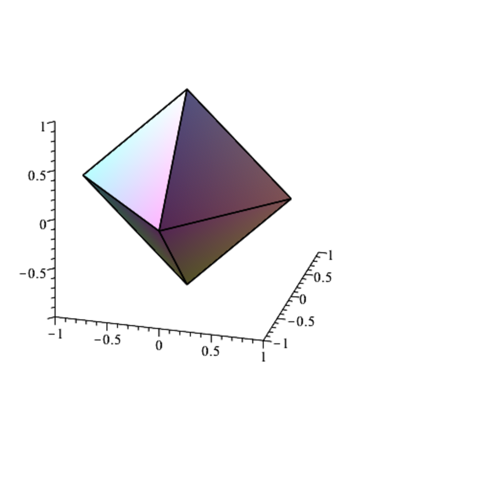

- **9.1 Normed Vector Spaces**  
  - Defines norms on vector spaces over real or complex fields with three axioms: positivity, homogeneity, and the triangle inequality.  
  - Discusses seminorms which satisfy some but not all norm properties.  
  - Presents examples of norms including `p`-norms on finite-dimensional spaces and other specific norms.  
  - Proves that all `p`-norms for `p ≥ 1` satisfy the norm axioms, including Hölder and Minkowski inequalities.  
  - Explains the equivalence of all norms on finite-dimensional vector spaces and establishes continuity of norms.

- **9.2 Matrix Norms**  
  - Defines matrix norms on spaces of square matrices along with submultiplicativity property.  
  - Reviews matrix concepts including transpose, adjoint, normal, unitary, and symmetric matrices.  
  - Introduces eigenvalues and eigenvectors, spectrum, and spectral radius of matrices.  
  - Establishes that spectral radius is bounded above by any matrix norm.  
  - Defines and analyzes the Frobenius norm and its properties including unitary invariance.

- **9.3 Subordinate Norms**  
  - Shows every linear map on a finite-dimensional normed space is bounded and continuous.  
  - Defines subordinate (operator) matrix norms induced by vector norms and proves they are matrix norms.  
  - Characterizes subordinate operator norms induced by `1`, `2`, and `∞` vector norms explicitly.  
  - Connects spectral norm to largest singular value and shows unitary invariance.  
  - Notes Frobenius norm is an upper bound for the spectral norm but is not subordinate.

- **9.4 Inequalities Involving Subordinate Norms**  
  - Proves invertibility of matrices of form `I + B` when subordinate norm of `B` is less than 1 and bounds norm of inverse.  
  - Shows if `I + B` is singular then norm of `B` is at least 1 for any matrix norm.  
  - Demonstrates existence of subordinate matrix norms arbitrarily close to the spectral radius of a matrix.

- **9.5 Condition Numbers of Matrices**  
  - Defines the condition number as the product of the norm of a matrix and the norm of its inverse.  
  - Analyzes stability of linear systems under perturbations of data and coefficient matrix.  
  - Quantifies bounds on relative errors in solutions relative to condition numbers.  
  - Details characterization of condition number with respect to spectral norm using singular values.  
  - Notes unitary and orthogonal matrices have condition number equal to 1 and condition number is invariant under unitary transformations.  
  - Explains large condition numbers imply ill-conditioned systems, with examples including the Hilbert matrix.  
  - Suggests further reading: [Matrix Analysis by Horn and Johnson](https://www.cambridge.org/core/books/matrix-analysis/9E2048593B55BD0F2D37B0F4880E4E77).

- **9.6 An Application of Norms: Solving Inconsistent Linear Systems**  
  - Motivates least-squares problem for inconsistent overdetermined linear systems, such as best-fit plane approximation.  
  - Introduces the minimization of least-squares error norm and mentions the Penrose pseudo-inverse for solutions.  
  - Shows that minimizing `1`-norm residuals leads to a linear programming formulation using additional variables and constraints.  
  - Connects to practical data fitting scenarios and outlier handling.

- **9.7 Limits of Sequences and Series**  
  - Defines convergence of sequences and series in normed vector spaces, emphasizing completeness (Banach spaces).  
  - States necessary and sufficient conditions for convergence, including Cauchy sequences and absolute convergence.  
  - Highlights that absolute convergence implies convergence in complete spaces.  
  - Notes rearrangements of absolutely convergent series preserve sum and convergence.

- **9.8 The Matrix Exponential**  
  - Defines the matrix exponential via the absolutely convergent power series in any operator norm.  
  - Proves that if two matrices commute, their exponentials multiply as expected.  
  - Shows exponential of skew-symmetric matrices yields orthogonal matrices and unitary matrices preserve orthogonality under exponentiation.  
  - Gives explicit formulas for exponentials of 2x2 skew-symmetric matrices using trigonometric functions.  
  - States that the series for logarithms of matrices converge absolutely if matrix norm is less than 1.

- **9.9 Summary**  
  - Lists key topics including norms, matrix norms, eigenvalues, matrix decompositions, operator norms, condition numbers, SVD, least-squares, convergence, and matrix exponential.  
  - Provides a succinct overview of all major results and definitions covered in the chapter.

- **9.10 Problems**  
  - Contains exercises reinforcing computation of operator norms, norm inequalities, limits of `p`-norms, invertibility conditions, and properties of diagonally dominant matrices.  
  - Promotes deeper understanding through direct application of chapter concepts.
