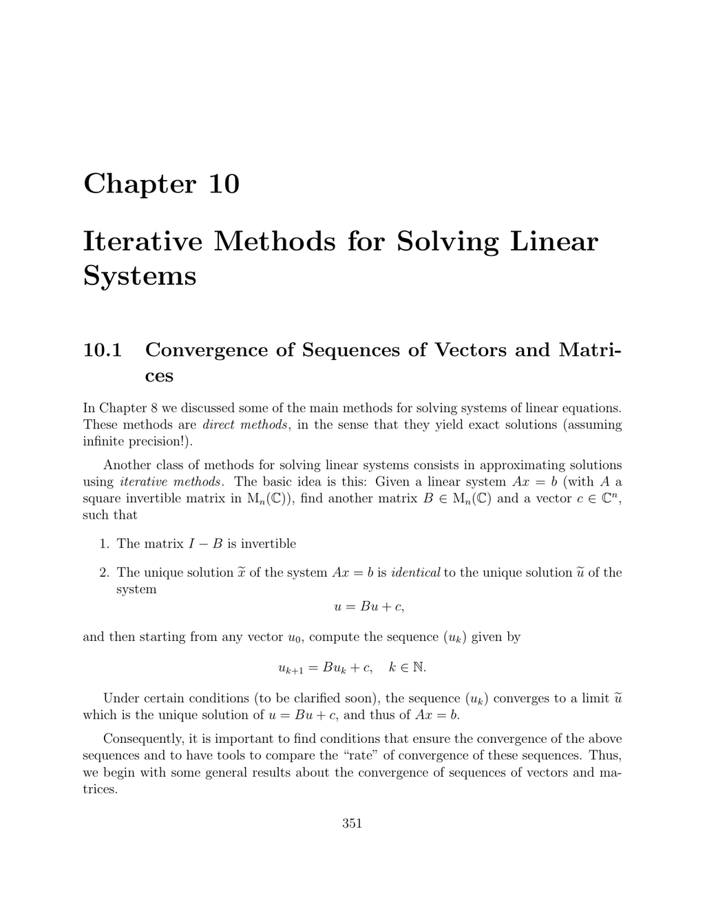

- **10.1 Convergence of Sequences of Vectors and Matrices**
  - The equivalence between convergence of vectors and convergence of their coordinate sequences in finite-dimensional normed spaces is established.
  - The spectral radius ρ(B) is defined and shown to determine whether the sequence of matrix powers (Bk) converges to zero.
  - Theorem 10.1 states that lim Bk = 0 iff ρ(B) < 1, which is equivalent to the existence of a subordinate matrix norm with kBk < 1.
  - Proposition 10.2 characterizes the spectral radius as the limit of kBk^(1/k) as k → ∞.
  - For further details, see [Matrix Analysis by Horn and Johnson](https://www.cambridge.org/core/books/matrix-analysis/1113F64676A7CC7DC4FEF9EE3623C4A2).

- **10.2 Convergence of Iterative Methods**
  - Iterative methods involve expressing the linear system Ax = b as u = Bu + c with I − B invertible, producing a sequence uk+1 = Buk + c.
  - Theorem 10.3 states that convergence of the iterative method is equivalent to ρ(B) < 1 or equivalently kBk < 1 for some subordinate norm.
  - Proposition 10.4 analyzes the asymptotic error behavior showing error magnitude behaves like (ρ(B))^k.
  - Comparison of two iterative methods reduces to comparing their spectral radii.
  - For a foundational understanding, see [Iterative Methods for Linear Systems by Saad](https://www.siam.org/books/siam-books/siam-series-on-numerical-analysis-and-scientific-computation).

- **10.3 Description of the Methods of Jacobi, Gauss–Seidel, and Relaxation**
  - Iterative schemes involve splitting A = M − N, with M invertible and computationally easy to invert.
  - The Jacobi method uses M = D (diagonal matrix), N = E + F, with iteration uk+1 = D⁻¹(E + F)uk + D⁻¹b.
  - The Gauss–Seidel method uses M = D − E and N = F, updating components sequentially using latest values, associated with matrix L1 = (D − E)⁻¹F.
  - The relaxation method introduces a parameter ω and splits as M = (1/ω)D − E, N = ((1−ω)/ω)D + F, leading to matrix Lω.
  - The relaxation method converges only if ω ∈ (0, 2), with ω = 1 corresponding to Gauss–Seidel.
  - All three methods can be implemented efficiently as shown in Matlab function examples.
  - See [Numerical Linear Algebra by Trefethen and Bau](https://epubs.siam.org/doi/book/10.1137/1.9780898719577) for practical implementations.

- **10.4 Convergence of the Methods of Gauss–Seidel and Relaxation**
  - Proposition 10.5 shows that if A is Hermitian positive definite and M* + N is positive definite, then ρ(M⁻¹N) < 1 ensuring convergence.
  - The Ostrowski-Reich theorem (Theorem 10.6) asserts convergence of Gauss–Seidel and relaxation methods for Hermitian positive definite A when ω ∈ (0, 2).
  - Proposition 10.7 provides a necessary condition stating relaxation method convergence requires |ω − 1| < 1.
  - The convergence result extends to block matrix decompositions.
  - For advanced proofs, see [Matrix Iterative Analysis by Varga](https://link.springer.com/book/10.1007/978-1-4612-5948-9).

- **10.5 Convergence of the Methods of Jacobi, Gauss–Seidel, and Relaxation for Tridiagonal Matrices**
  - Proposition 10.8 shows that for tridiagonal matrices, the spectral radius of Gauss–Seidel matrix L1 equals the square of the spectral radius of Jacobi matrix J: ρ(L1) = (ρ(J))².
  - Simultaneous convergence or divergence of Jacobi and Gauss–Seidel methods occurs for tridiagonal matrices.
  - Proposition 10.9 identifies the optimal relaxation parameter ω0 minimizing ρ(Lω) for real eigenvalues of J.
  - Proposition 10.10 states all three methods converge on Hermitian positive definite tridiagonal matrices for ω ∈ (0, 2) with relations ρ(Lω0) < ρ(L1) = (ρ(J))² < ρ(J).
  - Overrelaxation (ω > 1) often yields faster convergence than Gauss–Seidel.
  - For practical analysis, refer to [Iterative Methods for Sparse Linear Systems by Saad](https://www.siam.org/books/10-085).

- **10.6 Summary**
  - Iterative methods rely on matrix splittings A = M − N with convergence linked to spectral radius ρ(B) < 1.
  - Jacobi, Gauss–Seidel, and relaxation methods are defined via specific splits involving matrices D, E, F.
  - The Ostrowski-Reich theorem provides convergence conditions for Hermitian positive definite matrices and relaxation parameter ω ∈ (0, 2).
  - The relaxation method generalizes Gauss–Seidel and can achieve faster convergence through an optimal ω.
  - Tridiagonal matrices enable explicit spectral radius relations supporting convergence and efficiency comparisons.

- **10.7 Problems**
  - Problem set includes exercises to verify spectral radius calculations for Jacobi and Gauss–Seidel matrices.
  - Problems address convergence criteria for strictly diagonally dominant matrices.
  - Some problems invite direct solution by elimination and implementation of iterative methods with varying relaxation parameters.
  - Verification of converses related to Proposition 10.5 is also included.
  - For solutions and extended problems, see [Numerical Analysis by Burden and Faires](https://www.cengage.com/c/numerical-analysis-10e-burden).
