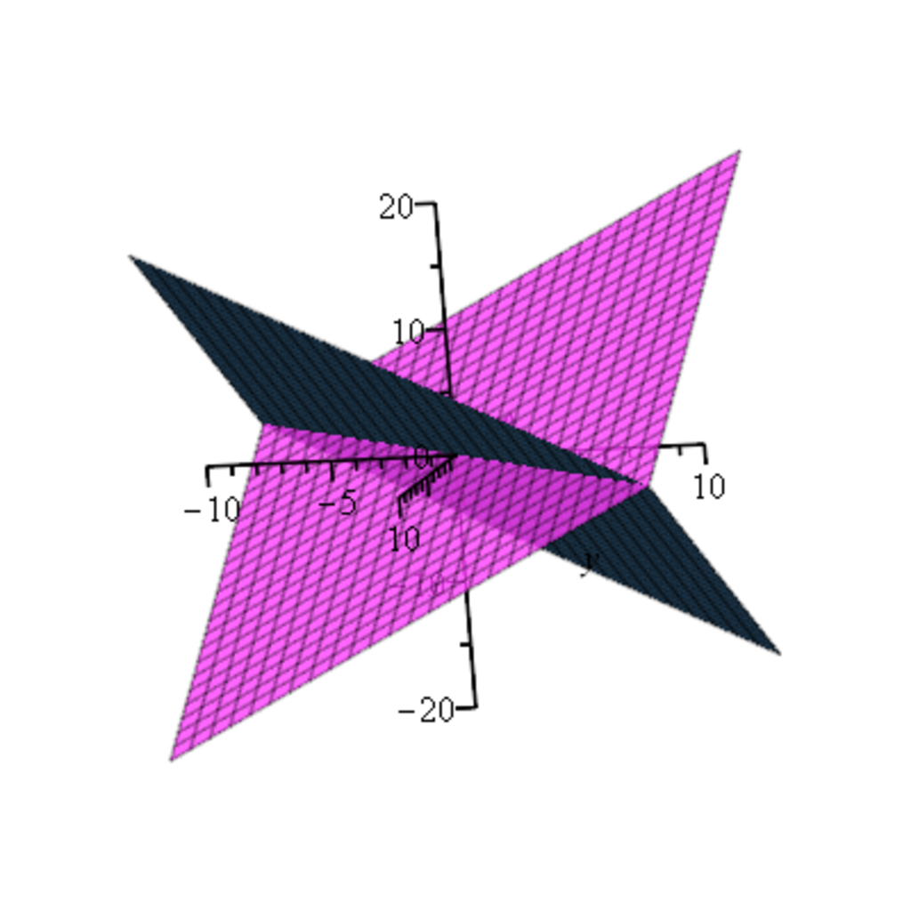

- **11.1 The Dual Space E\* and Linear Forms**
  - Defines the dual space E\* as the space of linear maps from E to field K.
  - Introduces coordinate forms associated with a basis and the concept of the dual basis.
  - Describes how coordinates of linear forms transform covariantly under a basis change.
  - Demonstrates representation of linear forms and vectors as row and column vectors, respectively.
  - Suggests Einstein notation for indices and references linear algebra texts for further reading.

- **11.2 Pairing and Duality Between E and E\***
  - Introduces the canonical bilinear pairing ⟨u\*, v⟩ between E\* and E.
  - Defines orthogonality between vectors and linear forms and the concept of orthogonal subspaces (annihilators).
  - States inclusion relationships for orthogonals of nested subspaces.
  - Provides examples related to symmetric and skew-symmetric matrices illustrating annihilators.
  - Notes the relation of algebraic varieties and polynomial ideals to this linear duality framework, with references to [Lang](https://example.org) and [Dummit and Foote](https://example.org).

- **11.3 The Duality Theorem and Some Consequences**
  - Establishes that coordinate forms associated with any basis are linearly independent.
  - Proves the fundamental duality: V = V\*\* (bidual orthogonal) and similar for subspaces of E\*.
  - Shows bijections between subspaces of E and subspaces of E\* via orthogonals (dual spaces).
  - Explains dimension relationships: dim(V) + dim(V\*) = dim(E), and for finite codimension.
  - Illustrates methods to find orthogonal subspaces and bases using matrix nullspaces and echelon forms.
  - Provides problems and examples involving hyperplanes and the rank-nullity relation.

- **11.4 The Bidual and Canonical Pairings**
  - Defines the evaluation map eval\_E: E → E\*\* and proves its injectivity and isomorphism in finite dimensions.
  - Introduces the concept of bilinear pairings and nondegenerate pairings between vector spaces.
  - Shows how a nondegenerate pairing induces injective linear maps between spaces and their duals.
  - Notes that in finite dimensions, these maps are isomorphisms, reinforcing the isomorphism E ≅ E\*\*.
  - Recommends further algebraic context, referencing Artin.

- **11.5 Hyperplanes and Linear Forms**
  - Proves every nonzero linear form defines a hyperplane as its kernel.
  - Shows that every hyperplane arises as the kernel of a nonzero linear form.
  - Characterizes uniqueness of linear forms defining the same hyperplane up to scalar multiples.
  - Suggests that every subspace (≠ E) is the intersection of hyperplanes containing it.

- **11.6 Transpose of a Linear Map and of a Matrix**
  - Defines the transpose map f\*>: F\* → E\* associated with f: E → F satisfying ⟨v\*, f(u)⟩ = ⟨f\*>(v\*), u⟩.
  - Establishes fundamental properties: linearity, preservation of addition, and reversal of composition order.
  - Shows that injectivity/surjectivity properties of f impact f\* inversely.
  - Connects the transpose of a surjection to the annihilator of the kernel.
  - Demonstrates that the matrix of f\*> relative to dual bases is the transpose of the matrix of f.
  - Proves that the rank of a matrix equals the rank of its transpose.
  - Summarizes criteria for linear system solvability using orthogonality and left-nullspace perspectives.

- **11.7 Properties of the Double Transpose**
  - Shows that the evaluation map intertwines f and its double transpose f\>> via a commutative diagram.
  - Proves that eval\_E is an isomorphism in finite dimensions, making f\>> conjugate to f.
  - Establishes relationships among kernels of these maps connecting back to the original map's kernel.
  - Uses these properties to give alternative proofs for rank equalities and fundamental dualities.

- **11.8 The Four Fundamental Subspaces**
  - Identifies the four fundamental subspaces associated with a linear map f: Im f, Im f\* (row space), Ker f, and Ker f\* (left nullspace).
  - Explains dimension equalities and orthogonality relations among these four spaces:
    - Ker f is orthogonal to Im f\*.
    - Ker f\* is orthogonal to Im f.
  - Translates these abstract concepts to matrix terms as column space, row space, nullspace, and left nullspace.
  - Provides the Fundamental Theorem of Linear Algebra Part I and II linking ranks and orthogonality.
  - Presents solvability criterion for Ax = b problems in terms of the left nullspace and hyperplanes.
  - Illustrates with examples how certain linear systems' solutions depend on orthogonality conditions.

- **11.9 Summary**
  - Lists the main concepts: dual space, bilinear pairing, evaluations, orthogonality, duality theorem, dual bases, bidual isomorphism, pairings, hyperplanes, transpose maps, rank equalities, and fundamental subspaces.
  - Emphasizes key results such as rank equalities and solvability criteria.
  - Mentions canonical isomorphisms and the role of duality in linear algebra.
  - Serves as a concise overview for review and reference.

- **11.10 Problems**
  - Problems focus on proving transposition properties and relationships between hyperplanes and linear forms.
  - Includes exercises on the determinant-based linear form defining hyperplanes.
  - Addresses bilinearity and nondegeneracy of canonical pairings on R^n.
  - Provides practice reinforcing theoretical results on dual spaces and forms.
