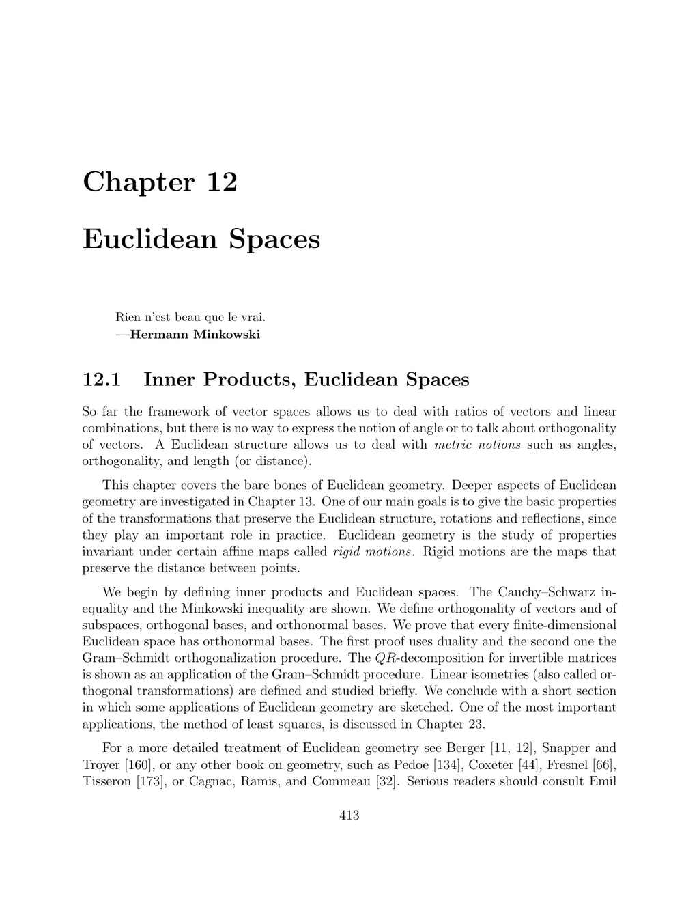

- **12.1 Inner Products, Euclidean Spaces**
  - Defines Euclidean spaces as real vector spaces equipped with a positive definite symmetric bilinear form (inner product).
  - Introduces key properties such as the quadratic form Φ(u) = ϕ(u,u) and the polar form relationship.
  - Presents classical examples including Euclidean space Rⁿ, function spaces with integral inner products, and matrix spaces with the Frobenius norm.
  - States and proves foundational inequalities: the Cauchy–Schwarz and Minkowski inequalities.
  - Notes the parallelogram law as a necessary and sufficient condition for a norm to be induced by an inner product.
  - Recommends further detailed treatments by Emil Artin [6], Coxeter [44], and others.

- **12.2 Orthogonality and Duality in Euclidean Spaces**
  - Defines orthogonality of vectors, orthogonal and orthonormal families, and orthogonal complements.
  - Proves orthogonal families of nonzero vectors are linearly independent.
  - Explains coordinate computation using orthonormal bases via inner products.
  - Establishes canonical isomorphism between Euclidean space and its dual via the inner product (the musical isomorphisms).
  - Provides examples including function spaces (Fourier basis) and matrix spaces with the cross-product in R³.
  - Notes Riesz representation theorem as an extension for infinite-dimensional Hilbert spaces.

- **12.3 Adjoint of a Linear Map**
  - Defines the adjoint f^* of a linear map f on a Euclidean space via the inner product condition f^*(u)·v = u·f(v).
  - Proves linearity and uniqueness of the adjoint.
  - Introduces self-adjoint maps where f = f^* and highlights their importance in geometry and physics.
  - Notes that if f^−1 = f^*, then f is a linear isometry (orthogonal transformation).
  - Extends adjoint definition to maps between distinct Euclidean spaces, preserving similar properties.
  - Summarizes algebraic properties of adjoints and relations with bases and Gram matrices.

- **12.4 Existence and Construction of Orthonormal Bases**
  - Proves every finite-dimensional Euclidean space admits an orthonormal basis via induction and duality.
  - Introduces the Gram–Schmidt orthonormalization procedure to construct orthonormal bases from arbitrary bases.
  - Provides a detailed example in R³ illustrating the Gram-Schmidt steps geometrically.
  - Presents the modified Gram–Schmidt method for better numerical stability and a Matlab implementation.
  - Discusses orthogonal polynomials (Legendre and Chebyshev) as orthonormal bases with respect to weighted inner products.
  - States the orthogonality decomposition E = F ⊕ F^⊥ for any subspace F, and the dimension formula.

- **12.5 Linear Isometries (Orthogonal Transformations)**
  - Defines linear isometries as linear maps preserving the Euclidean norm or equivalently the inner product.
  - Proves equivalence between preservation of norms, preservation of distances with f(0) = 0, and preservation of inner products.
  - Shows linear isometries are bijections and that any distance-preserving map f is affine with linear isometric part.
  - Notes that isometries map orthonormal bases to orthonormal bases.
  - Establishes that whether a map preserves inner products suffices to prove linearity in finite dimension.

- **12.6 The Orthogonal Group, Orthogonal Matrices**
  - Characterizes isometries f by the property f ∘ f^* = f^* ∘ f = id.
  - Shows that with respect to an orthonormal basis, the adjoint corresponds to the transpose matrix.
  - Defines orthogonal matrices A satisfying A A^T = A^T A = I_n.
  - Explains equivalence of orthogonality conditions and preservation of orthonormal bases by such matrices.
  - Defines the orthogonal group O(n) as all isometries, with determinant ±1, and the special orthogonal group SO(n) consisting of rotations (det = +1).
  - Discusses the group properties and classification of isometries into proper and improper types.

- **12.7 The Rodrigues Formula**
  - Provides the Rodrigues formula expressing the exponential map from the Lie algebra so(3) of skew-symmetric matrices to SO(3).
  - States explicit formula for e^A in terms of sin θ, cos θ, A, and A^2 where θ relates to the magnitude of the associated vector.
  - Proves algebraic identities on powers of skew-symmetric matrices underlying the formula.
  - Notes this formula corresponds to representing rotations by axis and angle.
  - Explains surjectivity of the exponential map for SO(3) and conditions on the trace of rotation matrices.
  - Points to more complicated cases when trace(R) = -1 and suggests problem for further understanding.

- **12.8 QR-Decomposition for Invertible Matrices**
  - Defines QR-decomposition as matrix factorization A = QR with Q orthogonal and R upper triangular.
  - Proves existence and uniqueness of QR-decomposition for invertible matrices using the Gram–Schmidt procedure.
  - Demonstrates how the columns of A are orthonormalized to produce Q and R with positive diagonal entries.
  - Presents examples of QR-decomposition for 2×2 and 3×3 matrices.
  - Provides modified Gram–Schmidt method for computational stability and a Matlab implementation.
  - Outlines practical applications including solving linear systems and least squares methods.
  - States Hadamard's inequality bounding the determinant by the product of norms of rows or columns, with equality iff A is orthogonal or has zero row/column.
  - Establishes the related Hadamard inequality for symmetric positive semidefinite matrices using Cholesky decomposition.
  - Notes equivalence of both Hadamard inequalities and references classical sources.

- **12.9 Some Applications of Euclidean Geometry**
  - Surveys applications in computational geometry, including Voronoi diagrams and Delaunay triangulations with relevance to motion planning.
  - Highlights matrix analysis results: symmetric matrices have real eigenvalues and can be diagonalized by orthogonal matrices.
  - Describes foundational matrix factorizations: QR, polar decomposition (A=QS with Q orthogonal and S symmetric positive semidefinite), and singular value decomposition (SVD).
  - Emphasizes the role of these decompositions in engineering and physics.
  - Introduces the method of least squares for inconsistent systems, leading to normal equations A^T A x = A^T b.
  - Notes solutions via QR or SVD decompositions, with key applications in computer vision.
  - Refers to Chapters 17, 18, 22, and 23 for further details.

- **12.10 Summary**
  - Lists fundamental concepts covered: bilinear and positive definite forms, inner products, quadratic forms, Gram matrices.
  - Recaps key inequalities: Cauchy–Schwarz, Minkowski, parallelogram law.
  - References orthogonality theory including orthogonal complements, orthonormal bases, and isomorphisms between spaces and duals.
  - Mentions adjoint maps, Gram–Schmidt procedure, Legendre and Chebyshev polynomials.
  - Highlights linear isometries and structure of orthogonal groups and matrices.
  - Includes QR-decomposition, Hadamard inequalities, and Rodrigues formula.
  
- **12.11 Problems**
  - Provides exercises on verifying Euclidean inner products in dimension 2 and function spaces.
  - Includes problems on orthogonality of trigonometric functions in L² spaces.
  - Contains tasks on orthogonal and skew-symmetric matrices.
  - Challenges students to relate adjoints and Gram matrices under basis changes.
  - Encourages proving properties and working through explicit examples related to chapter content.
