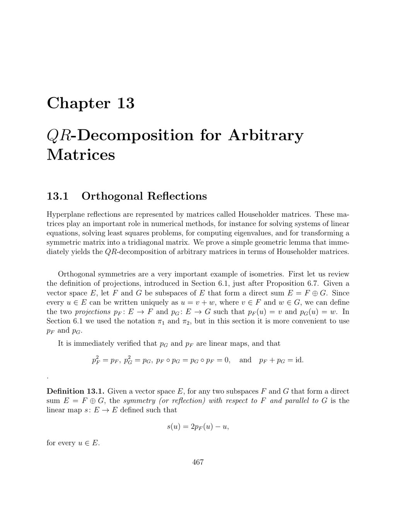

- **13.1 Orthogonal Reflections**
  - Defines orthogonal symmetries as isometries represented by reflections about subspaces in Euclidean spaces.
  - Introduces symmetry with respect to a subspace F parallel to G and establishes its algebraic properties.
  - Provides explicit formulas for hyperplane reflections using vectors orthogonal to the reflecting hyperplane.
  - Establishes that such reflections are isometries and links them to Householder matrices.
  - Suggests further reading in Kincaid and Cheney [101] and Ciarlet [41] on numerical applications of Householder matrices.

- **13.2 QR-Decomposition Using Householder Matrices**
  - Proves that any sequence of vectors can be transformed by a sequence of hyperplane reflections into upper-triangular form.
  - Demonstrates the construction of these reflections inductively, ensuring nonnegative diagonal entries in the resulting upper-triangular matrix.
  - States and proves the QR decomposition theorem: any real square matrix can be factored as A = QR with Q orthogonal and R upper triangular, using Householder matrices.
  - Highlights practical algorithmic implementations through Matlab functions for computing the QR factorization via Householder reflections.
  - Recommends deeper study in Strang [167, 168], Golub and Van Loan [80], Trefethen and Bau [174], Kincaid and Cheney [101], and Ciarlet [41].

- **13.3 Summary**
  - Lists key concepts: symmetries/reflections about subspace pairs, orthogonal symmetries, hyperplane reflections, and Householder matrices.
  - Reiterates the importance of Proposition 13.2 concerning reflections.
  - Emphasizes the QR decomposition result relying on Householder transformations.

- **13.4 Problems**
  - Presents exercises focusing on properties of Householder matrices and reflections, including geometric interpretations.
  - Includes proofs involving reflections, isometries, and matrix factorization into triangular forms using Householder matrices.
  - Encourages readers to rigorously apply and extend concepts from the chapter.
  - Suggests solving these to deepen understanding of QR decomposition and orthogonal transformations.
