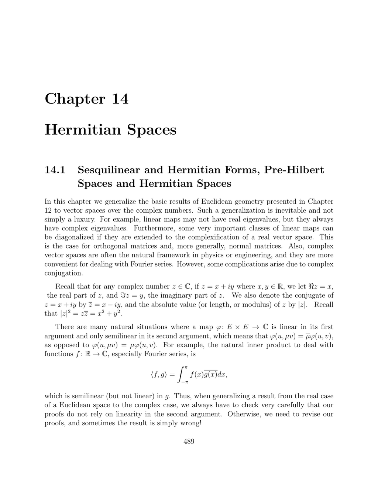

- **14.1 Hermitian Spaces, Pre-Hilbert Spaces and Hermitian Spaces**
  - Sesquilinear forms are linear in the first argument and semilinear in the second argument on complex vector spaces.
  - Hermitian forms satisfy the condition ϕ(v, u) = conjugate of ϕ(u, v), ensuring ϕ(u, u) ∈ ℝ.
  - Positive definite Hermitian forms induce norms and pre-Hilbert or Hermitian space structures on complex vector spaces.
  - The Gram matrix of a Hermitian product is Hermitian positive definite and changes via P*GP under basis change.
  - Refer to [Lang's Algebra](https://link.springer.com/book/10.1007/978-1-4612-2529-0) for Hermitian bilinear forms.

- **14.2 Orthogonality, Duality, Adjoint of a Linear Map**
  - The Hermitian inner product induces a canonical semilinear isomorphism between a finite-dimensional Hermitian space and its dual.
  - Linear forms correspond uniquely to vectors via this isomorphism, encoding orthogonality and adjoint operators.
  - The adjoint map f* of a linear map f exists uniquely and satisfies f*(u)·v = u·f(v).
  - The adjoint operation is involutive, conjugate-linear, and reverses composition.
  - See [Schwartz's Functional Analysis](https://books.google.com/books?id=7BWcDwAAQBAJ) for detailed adjoint properties.

- **14.3 Linear Isometries (Unitary Transformations)**
  - Linear isometries on Hermitian spaces preserve the Hermitian norm and satisfy f(iv) = i f(v).
  - The polarization identity involves complex scalars, so additional conditions beyond distance preservation are needed for linearity.
  - Equivalences between norm preservation, distance preservation with complex scalar compatibility, and inner product preservation characterize unitary maps.
  - Unitary transformations are necessarily bijections.
  - For further insights, see [Horn & Johnson, Matrix Analysis](https://www.cambridge.org/core/books/matrix-analysis/).

- **14.4 The Unitary Group, Unitary Matrices**
  - The adjoint of a linear map corresponds to the conjugate transpose of its matrix in an orthonormal basis.
  - A matrix is unitary if AA* = A*A = I, preserving orthonormality of columns and rows.
  - The unitary group U(n) consists of all unitary matrices and has determinant modulus one; SU(n) is the subgroup of determinant one matrices.
  - Unit quaternions form SU(2), which relates to rotations in SO(3).
  - See [Strang's Linear Algebra and Its Applications](https://math.mit.edu/~gs/linearalgebra/) for unitary groups and their applications.

- **14.5 Hermitian Reflections and QR-Decomposition**
  - Hermitian reflections generalize hyperplane reflections via complex phase angles eiθ acting on a one-dimensional complement.
  - Any vector mapping with equal norms can be achieved by composing at most two Hermitian reflections.
  - QR-decomposition for complex matrices follows by a sequence of Hermitian Householder reflections, yielding Q unitary and R upper-triangular.
  - Nonnegative diagonal entries in R can be ensured via further unitary diagonal transformations.
  - For implementation details, consult [Kincaid and Cheney, Numerical Analysis](https://books.google.com/books?id=).

- **14.6 Orthogonal Projections and Involutions**
  - Linear involutions (f² = id) correspond to projections by splitting E into eigen-subspaces U+ and U− with eigenvalues +1 and −1.
  - Orthogonal reflections are unitary involutions with orthogonal subspaces U+ and U−.
  - Projections are orthogonal iff their kernel and image are orthogonal subspaces; equivalently, the projection is self-adjoint.
  - The matrix of an orthogonal projection onto a subspace spanned by vectors (a1,...,ak) is P = A(A* A)^−1 A*, where A has columns a_i.
  - Classical linear algebra texts like [Axler's Linear Algebra Done Right](https://linear.axler.net/) cover orthogonal projections in depth.

- **14.7 Dual Norms**
  - The dual norm k·k_D of a norm k·k on a finite-dimensional Hermitian space E is defined via the supremum of |<x,y>| over unit vectors x.
  - The dual of a pre-norm is always a norm and satisfies the triangle inequality by construction.
  - The dual norm is symmetric with respect to real and imaginary parts, allowing expressions using real parts alone.
  - For p, q ≥ 1 with 1/p + 1/q = 1, the dual of the ℓ^p norm is the ℓ^q norm.
  - The nuclear (trace) norm on matrices is the dual of the spectral norm and sums the singular values.
  - Nuclear norm minimization aids matrix completion problems such as Netflix's recommendation system.
  - For convex optimization approaches, see [Boyd and Vandenberghe's Convex Optimization](https://web.stanford.edu/~boyd/cvxbook/).

- **14.8 Summary**
  - The chapter summarizes semilinear and sesquilinear maps, Hermitian and quadratic forms, and associated inequalities.
  - It includes Gram matrices, musical isomorphisms, adjoints, orthonormal bases, unitary groups, QR decompositions, and dual norms.
  - Covered topics include Hadamard inequalities, orthogonal projections, involutions, nuclear norms, and matrix completion applications.
  - This section lists all key results and definitions for quick reference.
  - Consult referenced textbooks in earlier sections for comprehensive details.

- **14.9 Problems**
  - Problem set includes proofs of self-adjoint map properties, polarization identities, construction of SU(2) matrices, and exploration of linear spans.
  - Problems address contrasts between real and complex cases, QR decomposition, and matrix classifications.
  - Several problems connect unitary groups with matrix algebra and representation theory.
  - The problem set reinforces demonstrated concepts and suggests further study directions.
  - Problems adapt concepts from earlier chapters and invite applications in linear algebra and functional analysis.
