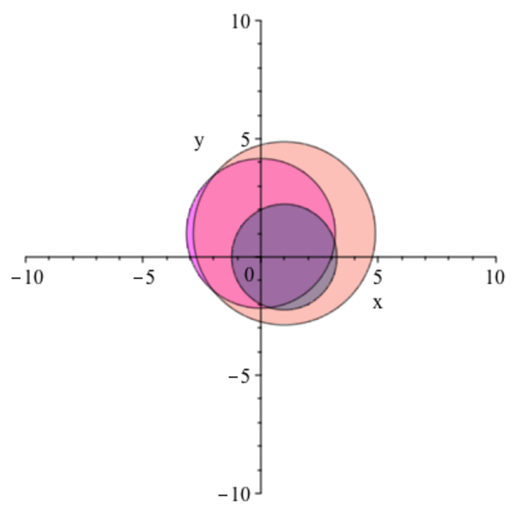

- **15.1 Eigenvectors and Eigenvalues of a Linear Map**  
  - Defines eigenvalues and eigenvectors of linear maps on finite-dimensional vector spaces over a field K.  
  - Describes diagonalizable maps characterized by a basis of eigenvectors with diagonal matrix representation.  
  - Introduces characteristic polynomial whose roots are the eigenvalues, and eigenspaces as kernels of (λ id − f).  
  - Establishes algebraic and geometric multiplicities of eigenvalues and shows geometric multiplicity ≤ algebraic multiplicity.  
  - States linear independence of eigenvectors corresponding to distinct eigenvalues and introduces diagonalizability criteria.  
  - Suggests further reading: [Eigenvalues and Eigenvectors - Khan Academy](https://www.khanacademy.org/math/linear-algebra/alternate_bases/eigen-everything/a/linear-algebra-introduction-to-eigenvalues-and-eigenvectors)

- **15.2 Reduction to Upper Triangular Form**  
  - States that a linear map can be represented by an upper triangular matrix if and only if all eigenvalues lie in the field K.  
  - Provides constructive proof via induction leveraging eigenvectors and invariant subspaces.  
  - Presents Schur decomposition: for complex Hermitian spaces, the matrix can be triangularized with respect to an orthonormal basis using a unitary matrix.  
  - Shows that polynomials of a matrix have eigenvalues obtained by evaluating the polynomial at matrix eigenvalues.  
  - Clarifies the diagonalizability of Hermitian (self-adjoint) matrices with real eigenvalues and orthonormal eigenbasis.  
  - Suggests further reading: [Schur Decomposition - Wikipedia](https://en.wikipedia.org/wiki/Schur_decomposition)

- **15.3 Location of Eigenvalues**  
  - Introduces Gershgorin discs, sets in the complex plane centered on diagonal entries with radius the sum of absolute values of non-diagonal entries in the row.  
  - The Gershgorin disc theorem states that all eigenvalues of a matrix lie within the union of these discs.  
  - Provides conditions under which strict row or column diagonal dominance guarantees invertibility and location of eigenvalues in the complex plane.  
  - Extends the result with intersection of row and column Gershgorin domains for refined eigenvalue localization.  
  - Suggests further reading: [Gershgorin Circle Theorem - Wolfram MathWorld](https://mathworld.wolfram.com/GershgorinCircleTheorem.html)

- **15.4 Conditioning of Eigenvalue Problems**  
  - Discusses sensitivity of eigenvalues to perturbations in the matrix, illustrated by examples with large changes due to small perturbations.  
  - Introduces the condition number Γ(A) relative to eigenvalue computation as the infimum of condition numbers of diagonalizing matrices.  
  - States Bauer-Fike theorem relating eigenvalue perturbations to the condition number of the diagonalizing matrix and perturbation magnitude.  
  - Normal matrices have the minimal condition number Γ(A) = 1, implying well-conditioned eigenvalue problems.  
  - Suggests further reading: [Matrix Perturbation Theory](https://epubs.siam.org/doi/book/10.1137/1.9780898719604)

- **15.5 Eigenvalues of the Matrix Exponential**  
  - Shows eigenvalues of the matrix exponential e^A are exponentials of eigenvalues of A.  
  - Proves similarity preservation under conjugation for the matrix exponential, e.g., e^{U A U^{-1}} = U e^A U^{-1}.  
  - Establishes eigenvector correspondence: eigenvectors of A correspond to those of e^A with eigenvalues exponentiated.  
  - Gives formula relating determinant and trace: det(e^A) = e^{tr(A)}.  
  - Applies to special matrices: e^B for skew symmetric B lies in SO(n); e^B symmetric positive definite if B symmetric.  
  - Suggests further reading: [Matrix Exponential - Wikipedia](https://en.wikipedia.org/wiki/Matrix_exponential)
