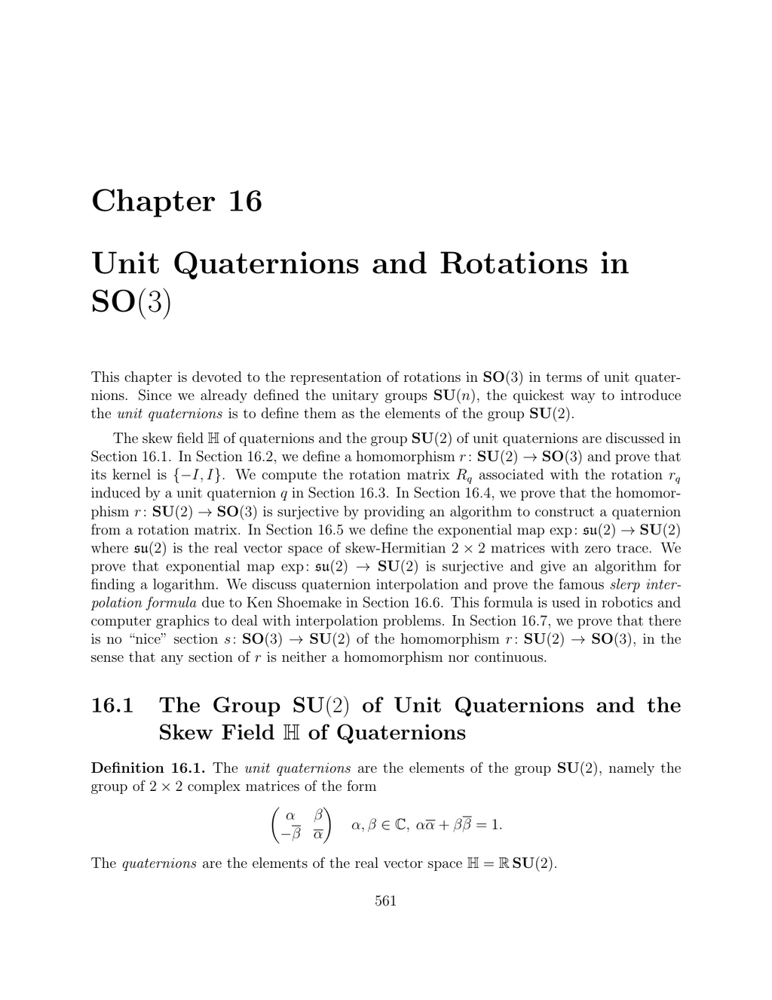

- **16.1 The Group SU(2) of Unit Quaternions and the Skew Field H of Quaternions**  
  - The unit quaternions are defined as elements of the group SU(2), consisting of 2×2 complex matrices with unit norm.  
  - The real vector space H of quaternions corresponds to R SU(2) and has dimension 4 with basis {1, i, j, k}.  
  - Hamilton’s identities describe the multiplication rules for i, j, k, including that i² = j² = k² = ijk = −1 and the noncommutative nature of multiplication.  
  - Every nonzero quaternion X is invertible with inverse given by X⁻¹ = (norm squared)⁻¹ times its conjugate.  
  - Further reading: [Hamilton's Quaternions (Britannica)](https://www.britannica.com/science/quaternion)  

- **16.2 Representation of Rotations in SO(3) by Quaternions in SU(2)**  
  - The adjoint representation Ad of SU(2) acts on the real vector space su(2) of 2×2 skew Hermitian matrices with zero trace by conjugation qAq*.  
  - The embedding ψ maps vectors in R³ to pure quaternions in H, enabling the definition of rotation maps ρ_q and r_q on R³ via conjugation by unit quaternions.  
  - The rotation map r_q is linear and orthogonal, i.e., r_q ∈ O(3), and further identified as a rotation in SO(3) with axis corresponding to the vector part of q.  
  - The group homomorphism r : SU(2) → SO(3) has kernel {I, -I} and image equal to SO(3), thus establishing a 2-to-1 covering.  
  - Further reading: [Lie Groups and Lie Algebras - SU(2) and SO(3)](https://mathworld.wolfram.com/SU2.html)  

- **16.3 Matrix Representation of the Rotation r_q**  
  - The rotation matrix R_q corresponding to a unit quaternion q = [a, b, c, d] is explicitly given by a 3×3 matrix with entries expressed as quadratic polynomials in a, b, c, d.  
  - The matrix R_q matches the Euler rotation form induced by q and preserves vector norms, confirming that r_q ∈ SO(3).  
  - The formula links quaternion parameters directly to rotation angle and axis, facilitating computation and interpretation.  
  - The matrix form enables an explicit algorithmic connection between quaternion elements and rotations in SO(3).  
  - Further reading: [Quaternion to Rotation Matrix](https://en.wikipedia.org/wiki/Rotation_matrix#Quaternion)  

- **16.4 An Algorithm to Find a Quaternion Representing a Rotation**  
  - The homomorphism r : SU(2) → SO(3) is surjective; every rotation matrix R ∈ SO(3) corresponds to some unit quaternion q ∈ SU(2).  
  - The scalar part a of q is computed from the trace of R using a² = (tr(R) + 1)/4.  
  - For tr(R) ≠ −1, the vector part (b, c, d) is determined by off-diagonal elements scaled by 1/(4a).  
  - For tr(R) = −1 (rotation angle π), special case computations derive the components of q from diagonal and symmetrized off-diagonal entries.  
  - This method aligns with the Rodrigues formula approach for logarithms of rotations, confirming quaternion representation completeness.  
  - Further reading: [Rodrigues' Rotation Formula](https://en.wikipedia.org/wiki/Rodrigues%27_rotation_formula)  

- **16.5 The Exponential Map exp : su(2) → SU(2)**  
  - Every matrix A ∈ su(2), with su(2) consisting of skew Hermitian 2×2 matrices with zero trace, exponentiates to a unit quaternion in SU(2).  
  - The explicit exponential formula is e^A = cos θ I + (sin θ / θ) A for θ = norm of vector part, yielding a surjective map exp : su(2) → SU(2).  
  - The logarithm of a quaternion q ≠ ±I is given by A = θ B with θ = arccos(a) and B derived from the vector component normalized by sin θ.  
  - The exponential map is injective on the open ball {θ B | det(B) = 1, 0 ≤ θ < π} in su(2), ensuring local invertibility.  
  - Further reading: [Lie Groups Exponential Map](https://en.wikipedia.org/wiki/Exponential_map_(Lie_theory))  

- **16.6 Quaternion Interpolation**  
  - Quaternion multiplication can be expressed in terms of scalar and vector parts using inner product and cross product in R³.  
  - Interpolation between quaternions q1 and q2 is performed via geodesics in SU(2), exploiting the Lie group structure and the biinvariant Riemannian metric induced by the trace inner product.  
  - The slerp formula Z(λ) = (sin((1−λ)Ω)/sin Ω) q1 + (sin(λΩ)/sin Ω) q2 gives an explicit closed-form interpolation between q1 and q2, where Ω depends on the angle between q1 and q2.  
  - The interpolation ensures smooth, constant angular velocity transitions critical for applications in robotics and computer graphics.  
  - Further reading: [Shoemake's Slerp](https://en.wikipedia.org/wiki/Slerp)  

- **16.7 Nonexistence of a “Nice” Section from SO(3) to SU(2)**  
  - There is no continuous or group homomorphism section s : SO(3) → SU(2) such that ρ ◦ s = id, reflecting the double cover property and sign ambiguity of quaternions representing rotations.  
  - The proof involves considering a U(1) subgroup where ρ acts as squaring, showing inconsistency in sign lifting and discontinuity around −1.  
  - Another proof uses the factorization of any unit quaternion as a product of pure quaternions, showing any such section would force contradictions in quotient homomorphisms.  
  - This nonexistence implies no globally consistent sign selection for quaternions representing rotations in SO(3) is possible.  
  - Further reading: [Topology of SO(3) and SU(2)](https://en.wikipedia.org/wiki/Special_unitary_group)  

- **16.8 Summary**  
  - The chapter covered the groups SU(2), SO(3), and skew field H of quaternions, linking algebraic and geometric rotation representations.  
  - Key results include the homomorphism r : SU(2) → SO(3) with kernel {±I}, explicit quaternion-to-rotation matrix formulas, and methods for quaternion logarithms/exponentials.  
  - Quaternion interpolation and Shoemake’s slerp formula were derived for smooth transitions between orientations.  
  - The chapter concludes with insights on the topological and algebraic impossibility of a “nice” section from SO(3) to SU(2).  
  - Further reading: [Gallier, Geometric Methods in Robotics](https://cs.nyu.edu/~gallier/books/geommethods.pdf)
