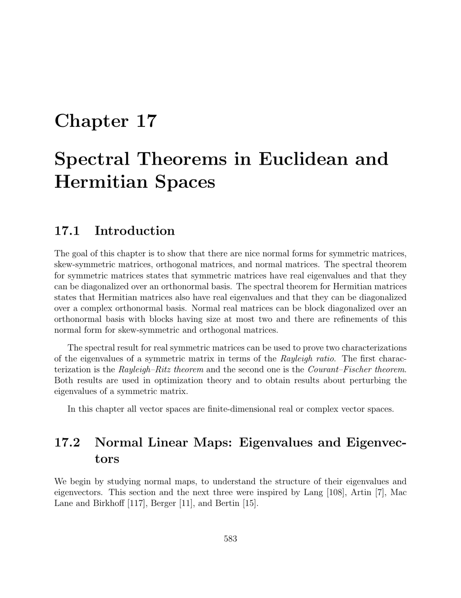

- **17.1 Introduction**
  - The chapter shows normal forms for symmetric, skew-symmetric, orthogonal, and normal matrices.
  - The spectral theorem states symmetric and Hermitian matrices have real eigenvalues and diagonalizable orthonormal bases.
  - Normal real matrices block diagonalize with 1x1 or 2x2 blocks and have refinements for skew-symmetric and orthogonal cases.
  - Rayleigh–Ritz and Courant–Fischer theorems characterize symmetric matrix eigenvalues via the Rayleigh ratio.
  - Further details and proofs reference finite-dimensional real and complex vector spaces.
  - See [Spectral Theorem - Wikipedia](https://en.wikipedia.org/wiki/Spectral_theorem).

- **17.2 Normal Linear Maps: Eigenvalues and Eigenvectors**
  - Defines normal, self-adjoint, skew-self-adjoint, and orthogonal linear maps in Euclidean/Hermitian spaces.
  - Normal maps satisfy f∘f* = f*∘f; eigenvectors of distinct eigenvalues are orthogonal.
  - Self-adjoint maps have real eigenvalues; skew-self-adjoint have pure imaginary or zero eigenvalues.
  - Complexification of real spaces and maps helps analyze eigenvalue structures.
  - Proves Ker f = Ker f* for normal maps and relations between eigenvalues of f and f*.
  - Recommended reading: Lang [108], Artin [7], Mac Lane and Birkhoff [117].

- **17.3 Spectral Theorem for Normal Linear Maps**
  - Shows existence of invariant subspaces W of dimension 1 or 2 with f(W) ⊆ W for all linear maps.
  - Normal maps admit orthonormal bases so that matrices are block diagonal with 1x1 or 2x2 blocks.
  - Self-adjoint maps diagonalize fully over orthonormal bases with real eigenvalues.
  - Uses complexification and orthogonal complements to prove invariance properties.
  - Normal maps on Hermitian spaces diagonalize with respect to a complex orthonormal basis.
  - See [Spectral theorem - mathworld](https://mathworld.wolfram.com/SpectralTheorem.html).

- **17.4 Self-Adjoint, Skew-Self-Adjoint, and Orthogonal Linear Maps**
  - Self-adjoint maps have orthonormal bases yielding diagonal matrices with real eigenvalues.
  - Skew-self-adjoint maps block diagonalize into 2x2 skew-symmetric blocks or zeros with imaginary eigenvalues.
  - Orthogonal maps block diagonalize with blocks either ±1 or 2x2 rotation matrices.
  - Cartan–Dieudonné theorem states every orthogonal map is product of reflections with minimal count.
  - 3D rotations admit invariant axes and explicit Rodrigues formulas.
  - Further reading: Gallier [73] on the exponential map and rotations.

- **17.5 Normal and Other Special Matrices**
  - Defines normal, symmetric, skew-symmetric, and orthogonal real matrices, and their complex analogues.
  - Adjoint matrices correspond to adjoint linear maps relative to orthonormal bases.
  - Theorems 17.12 and 17.14–17.16 restated as matrix diagonalization/block-diagonalization via orthogonal matrices.
  - Complex normal matrices diagonalize by unitary matrices; Hermitian matrices yield real diagonal entries.
  - Spectral theorems for skew-Hermitian and unitary matrices yield purely imaginary or unit modulus eigenvalues.
  - See [Matrix analysis - Horn and Johnson](https://www.cambridge.org/us/academic/subjects/mathematics/linear-algebra/matrix-analysis-2nd-edition).

- **17.6 Rayleigh–Ritz Theorems and Eigenvalue Interlacing**
  - Defines Rayleigh ratio R(A)(x) = (xᵀAx)/(xᵀx) for symmetric matrices.
  - Rayleigh–Ritz theorem characterizes eigenvalues as maxima/minima of Rayleigh quotients over orthogonal subspaces.
  - Interlacing inequalities compare eigenvalues of principal submatrices or related matrices.
  - Poincaré separation theorem relates eigenvalues of submatrices formed from orthonormal vectors.
  - Cauchy interlacing theorem provides precise inequalities for eigenvalues of principal submatrices.
  - Reference: [Rayleigh–Ritz method - Encyclopedia of Mathematics](https://encyclopediaofmath.org/wiki/Rayleigh%E2%80%93Ritz_method).

- **17.7 The Courant–Fischer Theorem; Perturbation Results**
  - Courant–Fischer theorem expresses eigenvalues as min-max and max-min of Rayleigh quotients over subspaces.
  - Uses Grassmann dimension arguments for intersections of subspaces.
  - Weyl inequalities provide bounds on eigenvalue perturbations with norm estimates.
  - Proposition 17.29 (Weyl) gives inequalities relating eigenvalues of sum of symmetric matrices to individual eigenvalues.
  - Monotonicity theorem states eigenvalues increase upon adding positive semidefinite matrices.
  - Recommended reading: Horn and Johnson [93], Lax [112].

- **17.8 Summary**
  - Lists main concepts: normal maps, spectral theorems for various linear map classes, and complexifications.
  - Emphasizes spectral theorems and diagonalization/block-diagonalization results.
  - Highlights Rayleigh quotient, eigenvalue interlacing, and perturbation inequalities.
  - Summarizes Weyl and Courant–Fischer results as key eigenvalue characterizations.
  - Useful for foundational understanding before advanced applications in optimization and physics.

- **17.9 Problems**
  - Problem 17.1 asks to prove that the complexification EC of a real vector space is a complex vector space.
  - Encourages understanding of complexification construction and vector space axioms.
  - Exercises consolidate comprehension of preceding theoretical material.
