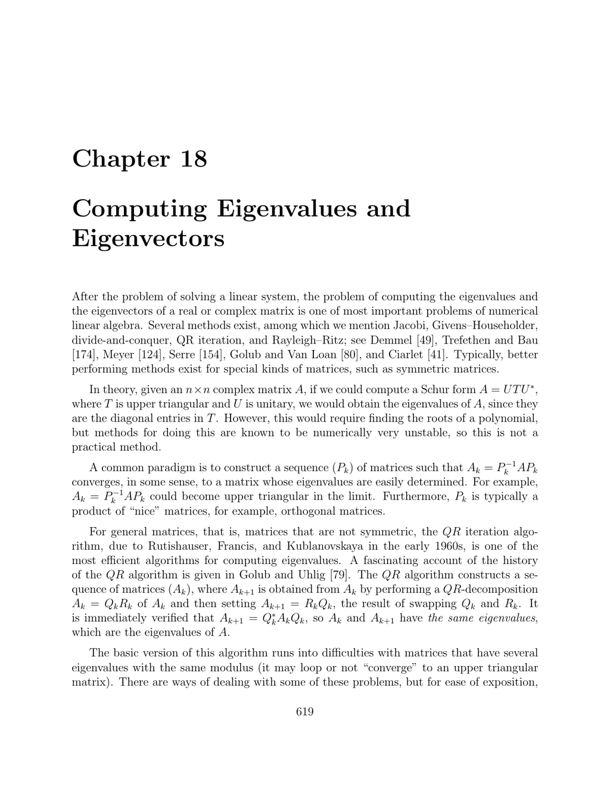

- **Chapter 18: Computing Eigenvalues and Eigenvectors**
  - **18.1 The Basic QR Algorithm**
    - The basic QR algorithm constructs sequences of matrices \( A_k \), \( Q_k \), \( R_k \), and \( P_k \) through QR factorization and swapping factors.  
    - The sequence \( A_k \) remains similar to \( A \) and ideally converges to an upper triangular matrix revealing the eigenvalues on the diagonal.  
    - Convergence is proven under restrictive conditions: diagonalizability, invertibility, and distinct moduli of eigenvalues.  
    - The algorithm struggles with unitary or orthogonal matrices and those with eigenvalues sharing the same modulus.  
    - For detailed theory and proofs, see [Ciarlet (41), Serre (154)].  
  - **18.2 Hessenberg Matrices**
    - Hessenberg matrices are almost upper triangular with one subdiagonal possibly nonzero.  
    - Every square matrix is unitarily similar to a Hessenberg matrix constructed via Householder reflections.  
    - Unreduced Hessenberg matrices have nonzero subdiagonal entries and possess simple eigenvalues, enabling effective eigenvalue computations.  
    - Symmetric (Hermitian) matrices reduce to symmetric tridiagonal form, streamlining computations.  
    - For algorithms and structure, consult [Trefethen and Bau (174), Demmel (49), Meyer (124)].  
  - **18.3 Making the QR Method More Efficient Using Shifts**
    - Efficiency is improved by reducing \( A \) to Hessenberg form and using shifts and double shifts to speed convergence and handle complex conjugate eigenvalues.  
    - Implicit shifts allow QR steps without explicit QR factorizations, implemented via bulge chasing and Givens rotations.  
    - Deflation simplifies the problem when subdiagonal entries become zero or very small.  
    - Wilkinson's shift and Francis double shifts optimize convergence, especially for symmetric matrices.  
    - Challenges remain in finding shift strategies that guarantee convergence for all matrices; see [Demmel (49), Golub and Van Loan (80), Watkins (185,186)].  
  - **18.4 Krylov Subspaces; Arnoldi Iteration**
    - Arnoldi iteration generates an orthonormal basis of the Krylov subspace \( K_n(A,b) \) and produces a Hessenberg matrix \( H_n \) representing the projection of \( A \) onto this subspace.  
    - The algorithm performs a modified Gram–Schmidt process and breaks down when \( h_{n+1,n} = 0 \), indicating a block structure.  
    - The characteristic polynomial of \( H_n \) minimizes \( \|p(A)b\|_2 \) among monic polynomials of degree \( n \).  
    - Ritz values (eigenvalues of \( H_n \)) approximate eigenvalues of \( A \), especially extreme eigenvalues.  
    - See [Trefethen and Bau (174)] for detailed exposition on iteration and polynomial minimization.  
  - **18.5 GMRES**
    - GMRES approximates solutions to \( Ax = b \) by minimizing the residual \( \|b - Ax_n\|_2 \) over Krylov subspaces \( K_n(A,b) \).  
    - The method uses Arnoldi iteration to build the subspace and solves a least-squares problem involving the Hessenberg matrix \( H_n \).  
    - The residual minimization converts to solving \( \min_y \|H_n y - \|b\| e_1\|_2 \).  
    - The approximate solution is formed as \( x_n = U_n y \).  
    - For algorithmic improvements and applications, see [Trefethen and Bau (174)].  
  - **18.6 The Hermitian Case; Lanczos Iteration**
    - For Hermitian matrices, Arnoldi iteration simplifies to Lanczos iteration, generating symmetric tridiagonal matrices \( H_n \).  
    - Lanczos uses a three-term recurrence relation to build basis vectors efficiently without full orthogonalization.  
    - Lanczos iteration shares properties with Arnoldi but is computationally cheaper and has error estimates available.  
    - Loss of orthogonality in floating-point arithmetic may require reorthogonalization.  
    - The symmetric tridiagonal form enables efficient eigenvalue computation methods; see [Demmel (49), Trefethen and Bau (174)].  
  - **18.7 Power Methods**
    - Power iteration computes an eigenvalue of largest modulus and an associated eigenvector, converging linearly when eigenvalues have distinct moduli.  
    - Inverse iteration uses an approximate eigenvalue to find associated eigenvectors efficiently through solving linear systems involving \( (A - \mu I) \).  
    - Rayleigh quotient iteration refines inverse iteration for Hermitian matrices, achieving cubic convergence.  
    - Convergence requires the initial vector to have a nonzero component along the desired eigenspace.  
    - Detailed convergence proofs and rates appear in [Serre (154), Ciarlet (41), Trefethen and Bau (174)].  
  - **18.9 Problems**
    - Problems cover proving Hessenberg reduction (Theorem 18.2) and properties of Hessenberg matrices from Hermitian matrices.  
    - Additional exercises involve proving the preservation of Hessenberg structure in QR decompositions using Householder reflections.  
    - Engage with these problems for deeper understanding of structural and algorithmic properties.
