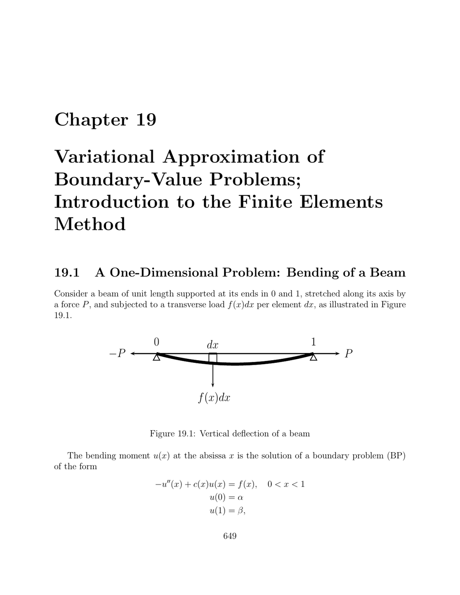

- **19.1 A One-Dimensional Problem: Bending of a Beam**
  - **Beam bending modeled by a boundary problem (BP) involving a second-order ODE**
    - The bending moment u(x) satisfies −u''(x) + c(x)u(x) = f(x), with zero boundary conditions.
    - c(x) depends on applied force and material properties, assumed non-negative on [0,1].
    - The space V consists of continuous, piecewise continuously differentiable functions vanishing at boundaries.
    - The weak formulation (WF) and variational approach reformulate (BP) via bilinear and linear forms.
    - For detailed finite element analysis see [Ciarlet’s Finite Element Method](https://link.springer.com/book/10.1007/978-3-642-58809-2).
  - **Derivation and properties of the weak formulation (WF)**
    - Integration by parts converts differential equation problem into a weak form using test functions in V.
    - The bilinear form a(u,v) and linear form fₑ(v) define the variational equation: a(u,v) = fₑ(v) for all v ∈ V.
    - The energy functional J(v) = ½ a(v,v) − fₑ(v) is minimized uniquely by the solution u of (WF).
    - Positivity of c ensures uniqueness and coercivity of the bilinear form.
  - **Discrete approximation of the problem using finite-dimensional subspaces**
    - Finite element spaces Vₐ of dimension n approximate V, with u^{(a)} ∈ Vₐ satisfying discrete weak form (DWF).
    - The discrete problem leads to a symmetric positive definite linear system Au = b.
    - Basis functions with small support (e.g., hat functions) lead to sparse, structured matrices.
    - Approximation error is bounded by the best approximation error in Vₐ.
  - **Examples of finite element spaces and basis functions**
    - Piecewise affine functions (V_{N}^0) constructed on uniform partitions use hat-shaped basis functions.
    - Higher-order spaces (e.g., cubic polynomials, V_{N}^1) include basis functions determined by function and derivative values.
    - Explicit formulas for basis functions (w_{i}^0, w_{j}^1) are given on intervals, facilitating assembly of system matrices.
    - For detailed polynomial basis construction see [Bernstein Polynomials](https://en.wikipedia.org/wiki/Bernstein_polynomial).
- **19.2 A Two-Dimensional Problem: An Elastic Membrane**
  - **Modeling of membrane displacement with Poisson’s equation**
    - Vertical displacement u(x) satisfies −Δu = f on domain Ω with boundary condition u = g on boundary Γ.
    - Δ is the Laplacian operator combining second derivatives in x₁ and x₂ directions.
    - The membrane is modeled as a surface under vertical force with tension τ.
    - Well-posedness requires smoothness assumptions on f, g, and domain boundary.
  - **Weak formulation and variational approach in 2D**
    - Homogeneous boundary conditions are assumed or enforced via lifting functions.
    - Green’s first identity transforms PDE into: a(u,v) = fₑ(v) for all test functions v vanishing on Γ.
    - Bilinear form a(u,v) integrates gradients of u and v over Ω.
    - Linear form fₑ(v) integrates external forces against test functions.
  - **Finite element method approach for 2D problems**
    - Triangulate domain Ω and approximate solution by piecewise polynomial functions on the mesh elements.
    - Basis functions have small support centered on nodes of the triangulation, leading to sparse matrices.
    - Good triangulation methods like Delaunay triangulations improve approximation quality.
    - Requirements for finite element methods include mesh quality, function space choices, and compactly supported basis functions.
    - For foundational material see [The Finite Element Method: Theory, Implementation, and Applications](https://www.cambridge.org/core/books/finite-element-method/0293992BAB630867C2D0A3E6607D5F45).
- **19.3 Time-Dependent Boundary Problems: The Wave Equation**
  - **Wave equation modeling transverse vibrations of a stretched string**
    - The displacement u(x,t) satisfies (1/c²) ∂²u/∂t² − ∂²u/∂x² = f(x,t), for x ∈ [0,L], t > 0.
    - The constant c = τ/ρ depends on tension τ and string linear density ρ.
    - Boundary conditions fix displacements at endpoints x = 0 and x = L.
    - This PDE governs small vertical oscillations of the string.
