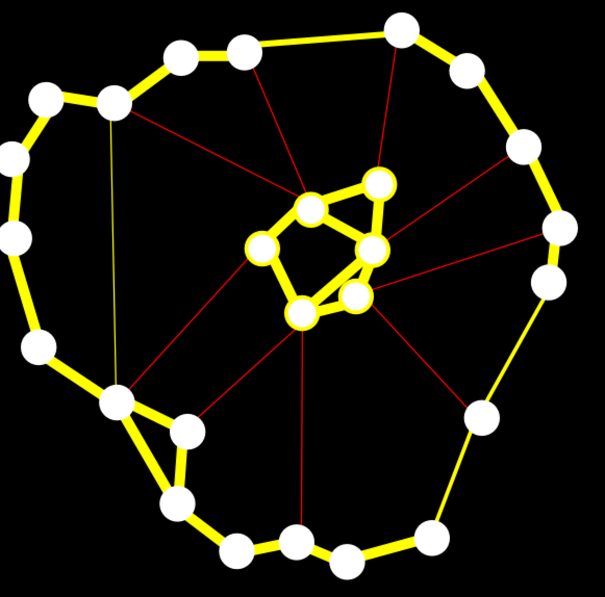

- **Chapter 20: Graphs and Graph Laplacians; Basic Facts**
  - **Introduction and Overview**
    - Graphs can be represented using matrices such as incidence, adjacency, and Laplacian matrices.  
    - The graph Laplacian is symmetric positive semidefinite and captures connectivity properties of the graph through its eigenvalues.  
    - Spectral graph theory applies linear algebra techniques to graphs and is foundational for graph clustering methods like normalized cuts by Shi and Malik.  
    - Further reading includes [Godsil and Royle](https://link.springer.com/book/10.1007/978-1-4614-0667-9) and [Chung](https://bookstore.ams.org/cbms-92).  
  - **20.1 Directed Graphs, Undirected Graphs, Incidence Matrices, Adjacency Matrices, Weighted Graphs**
    - Directed graphs have edges as ordered pairs without self-loops, and incidence matrices are defined with +1 and -1 entries corresponding to edge orientation.  
    - Undirected graphs have edges as unordered pairs with incidence matrices containing only nonnegative entries (+1 or 0).  
    - Degree matrices are diagonal with node degrees computed as sums of adjacent edge weights.  
    - Weighted graphs generalize adjacency using a symmetric weight matrix with nonnegative entries and zero diagonal for no self-loops.  
    - The degree notion extends to weighted graphs as the sum of weights adjacent to each node.  
  - **20.2 Laplacian Matrices of Graphs**
    - The unnormalized graph Laplacian L is defined as L = D - W, where D is the degree matrix and W the adjacency or weight matrix.  
    - For any orientation of an undirected graph, L = Bσ Bσᵀ is invariant and positive semidefinite.  
    - The quadratic form xᵀ L x equals half the sum of weighted squared differences over all edges, proving positive semidefiniteness.  
    - The dimension of the nullspace of L equals the number of connected components, corresponding to indicator vectors of these components.  
    - Further reading: [Godsil and Royle](https://link.springer.com/book/10.1007/978-1-4614-0667-9).  
  - **20.3 Normalized Laplacian Matrices of Graphs**
    - Normalized Laplacians Lsym = D^{-1/2} L D^{-1/2} and Lrw = D^{-1} L are defined for graphs without isolated vertices.  
    - Lsym is symmetric positive semidefinite; Lrw shares its spectrum but is generally not symmetric.  
    - The eigenvalues of normalized Laplacians lie in [0, 2] with multiplicity and values reflecting graph properties like bipartiteness and completeness.  
    - Relations exist between eigenvectors of Lsym, Lrw, and solutions to generalized eigenproblems involving L and D.  
    - For detailed proofs and properties, see [Chung](https://bookstore.ams.org/cbms-92).  
  - **20.4 Graph Clustering Using Normalized Cuts**
    - Graph clustering partitions nodes to minimize edge weights between groups while maximizing within-group similarity.  
    - The mincut approach can be biased toward trivial partitions; normalized cuts balance cluster size using volumes (sum of node degrees).  
    - The normalized cut cost function normalizes cut values by cluster volumes, improving partition quality.  
    - Extensions to multiway clustering were developed by Yu and Shi.  
    - For formal optimization in matrix form, refer to Gallier [70].  
  - **20.5 Summary**
    - The chapter presents definitions and properties of directed/undirected graphs, incidence/adjacency matrices, weighted graphs, and the graph Laplacian.  
    - It introduces normalized Laplacians and their spectral properties used in clustering.  
    - The connection between graph Laplacians and graph clustering via normalized cuts is emphasized.  
  - **20.6 Problems**
    - Problems include computing Laplacians of simple graphs like triangles and squares.  
    - Exploration of normalized Laplacians for complete and complete bipartite graphs is provided.  
    - Questions address characteristic polynomials and eigenvalue multiplicities tied to graph structure.
