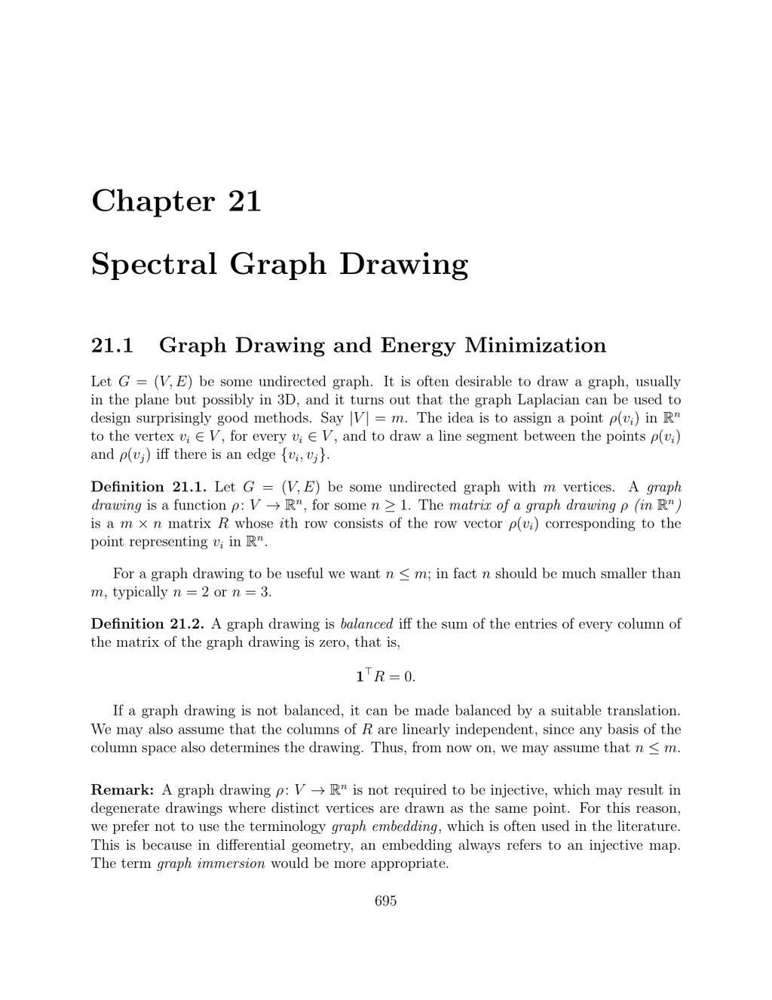

- **21.1 Graph Drawing and Energy Minimization**
  - Defines graph drawing as a function assigning points in Rn to vertices of a graph with n typically 2 or 3.
  - Introduces the concept of balanced graph drawings where each column of the drawing matrix sums to zero.
  - Describes the energy function of a graph drawing based on the weighted sum of squared distances between adjacent vertices.
  - Proves that the energy function can be expressed as the trace of RᵀLR, where L is the graph Laplacian and R the drawing matrix.
  - States Theorem 21.2 showing minimal energy balanced orthogonal drawings correspond to eigenvectors of L associated to the smallest nonzero eigenvalues.
  - Provides a method to draw graphs using eigenvectors corresponding to λ₂ and λ₃ to get a drawing in R².
  - References Godsil and Royle [77] for foundational proofs and related theory.

- **21.2 Examples of Graph Drawings**
  - Presents five concrete examples illustrating spectral graph drawing using Matlab.
  - Example 1 shows a graph with four nodes using eigs(L) and confirms a double eigenvalue λ₂=λ₃=2.
  - Example 2 uses eigen(L) on a five-node graph showing a drawing that may not be convex.
  - Example 3 demonstrates drawing a ring graph yielding a pleasing circular layout and noting repeated eigenvalues.
  - Example 4 generates a random planar graph based on Delaunay triangulation and draws it using spectral coordinates.
  - Example 5 displays the Buckyball graph drawing in 2D and 3D, highlighting multiple eigenvalues and improved visualization with three eigenvectors.
  - Connects examples to visualization functions in Matlab such as gplot and eigs.
  - Attributes examples adapted from Spielman [161].

- **21.3 Summary**
  - Summarizes main concepts and results from the chapter related to spectral graph drawing and energy minimization.
  - Encourages further exploration of spectral methods and Laplacian eigenvectors for graph visualization.
  - Suggests reviewing prior chapters and references for deeper understanding of spectral graph theory.

- **Further Reading**
  - [Godsil and Royle, Algebraic Graph Theory](https://www.cambridge.org/core/books/algebraic-graph-theory/5D0F9B2202FF64D2B4A58E00D4D0E7F2)
  - [Spielman, Spectral Graph Theory Lecture Notes](http://cs.yale.edu/homes/spielman/561/lec14.pdf)
