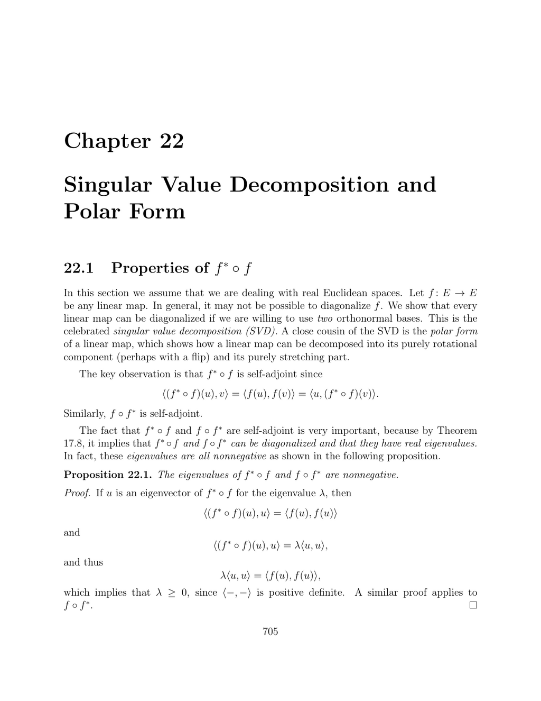

- **22.1 Properties of f ∗ ◦ f**  
  - Every linear map f : E → E on a real Euclidean space has f ∗ ◦ f and f ◦ f ∗ that are self-adjoint.  
  - The eigenvalues of f ∗ ◦ f and f ◦ f ∗ are real and nonnegative due to positive definiteness of inner products.  
  - f ∗ ◦ f and f ◦ f ∗ have the same nonzero eigenvalues.  
  - The singular values of f are the positive square roots of the nonzero eigenvalues of f ∗ ◦ f (or equivalently f ◦ f ∗).  
  - For detailed properties of self-adjoint linear maps, see [Horn and Johnson](https://epubs.siam.org/doi/book/10.1137/1.9781611971217).

- **22.2 Singular Value Decomposition for Square Matrices**  
  - Every real n × n matrix A can be decomposed as A = V D U > , where U and V are orthogonal and D is diagonal with nonnegative entries.  
  - The singular values σi are the positive square roots of the nonzero eigenvalues of A> A (or AA>).  
  - The columns of U and V are eigenvectors of A> A and AA> respectively.  
  - The SVD allows A to be diagonalized using two different orthonormal bases simultaneously.  
  - Algorithms for computing the SVD are described in [Golub and Van Loan](https://epubs.siam.org/doi/book/10.1137/1.9781611971217).

- **22.3 Polar Form for Square Matrices**  
  - Every real n × n matrix A admits a polar decomposition A = RS where R is orthogonal and S is symmetric positive semidefinite.  
  - R and S are unique if A is invertible.  
  - The polar decomposition can be derived from the SVD by setting R = V U > and S = U D U > .  
  - The polar form separates rotation/reflection from stretching/compression in a matrix.  
  - Applications include continuum mechanics; see [Marsden and Hughes](https://press.princeton.edu/books/paperback/9780691049682-mathematical-foundations-of-elasticity).

- **22.4 Singular Value Decomposition for Rectangular Matrices**  
  - The SVD extends to any real m × n matrix A as A = V D U > , with U (n×n) and V (m×m) orthogonal.  
  - The diagonal matrix D contains singular values along the main diagonal, padded with zeros as needed.  
  - The columns of U and V are eigenvectors of A> A and AA> respectively, corresponding to nonzero eigenvalues.  
  - The SVD reveals orthonormal bases for the image and kernel spaces of A and its adjoint.  
  - Applications include data compression, pseudo-inverse computation, and least squares solutions; see [Strang 1993](https://math.mit.edu/~gs/linearalgebra/).

- **22.5 Ky Fan Norms and Schatten Norms**  
  - Ky Fan k-norm Nk(A) is the sum of the top k singular values of matrix A.  
  - Ky Fan p-k-norm Nk;p(A) generalizes Ky Fan norms via the p-th power sum of the top k singular values.  
  - Schatten p-norms are Ky Fan p-norms with k equal to the minimal matrix dimension.  
  - When k=1, the Ky Fan norm equals the spectral norm; when k=q and p=2, it equals the Frobenius norm.  
  - These norms are unitarily invariant and relevant in quantum information and spectral graph theory; see [Horn and Johnson](https://epubs.siam.org/doi/book/10.1137/1.9781611971217).

- **22.6 Summary**  
  - Identifies key results: self-adjointness and positivity of f ∗ ◦ f and f ◦ f ∗, singular values, and kernel-image relationships.  
  - States the singular value decomposition theorems for square and rectangular matrices.  
  - Includes the polar decomposition and Weyl inequalities relating eigenvalues and singular values.  
  - Notes definitions and properties of Ky Fan and Schatten norms.

- **22.7 Problems**  
  - Provides exercises expanding on the theory of SVD, polar decomposition, and related matrix properties.  
  - Problem 22.1 introduces symmetric matrix constructions related to SVD.  
  - Problems enhance understanding through proofs and computations suggested by the text.  
  - Useful for reinforcing concepts in [Golub and Van Loan](https://epubs.siam.org/doi/book/10.1137/1.9781611971217).
