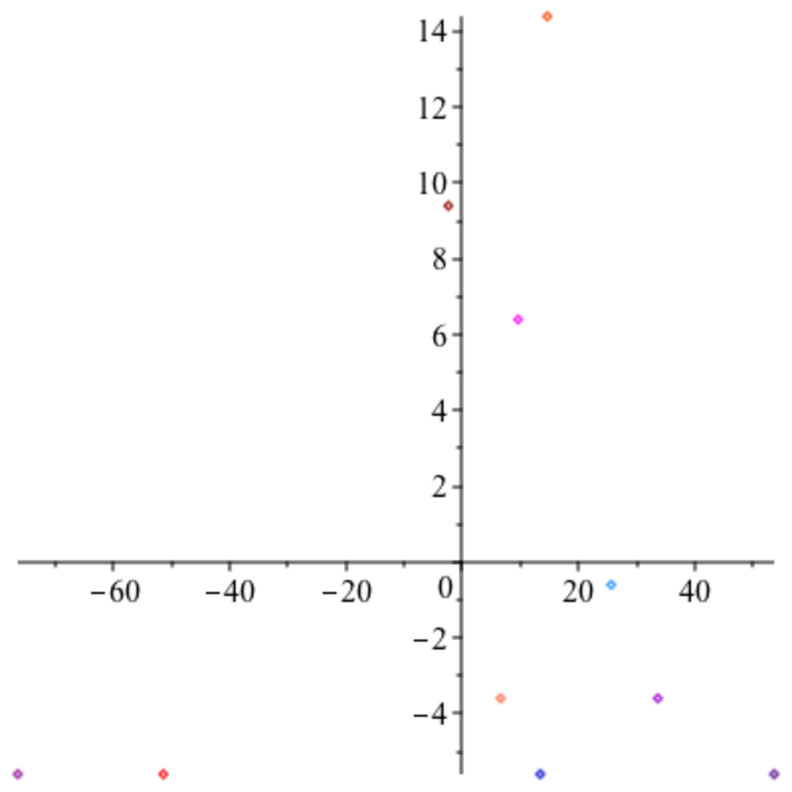

- **Least Squares Problems and the Pseudo-Inverse**
  - The method of least squares solves overdetermined linear systems by minimizing the sum of squared errors.  
  - The normal equations AᵀA x = Aᵀb provide a way to compute least squares solutions, unique when A’s columns are linearly independent.  
  - The pseudo-inverse A⁺, derived from the SVD of A, yields the minimum norm least squares solution even when A’s columns are dependent.  
  - Gauss and Legendre historically developed this method with applications in astronomy and geodesy.  
  - Readers may consult [Golub and Van Loan](https://epubs.siam.org/doi/book/10.1137/1.9781611971484) for more on least squares applications.

- **Properties of the Pseudo-Inverse**
  - For full-rank matrices, the pseudo-inverse simplifies to (AᵀA)⁻¹Aᵀ if m ≥ n, or Aᵀ(AAᵀ)⁻¹ if n ≥ m.  
  - The pseudo-inverse yields orthogonal projection matrices AA⁺ and A⁺A onto the range of A and range of Aᵀ, respectively.  
  - The pseudo-inverse of normal matrices can be computed directly via their block diagonalizations.  
  - Penrose first characterized the pseudo-inverse by four algebraic properties involving AA⁺ and A⁺A.  
  - For further detail, see [Kincaid and Cheney](https://www.pearson.com/us/higher-education/program/Kincaid-Numerical-Analysis-Third-Edition/PGM129094.html).

- **Data Compression and SVD**
  - The Eckart–Young theorem states the best rank-k approximation to a matrix minimizes the 2-norm difference, constructed by truncating the SVD.  
  - Approximating large matrices reduces storage from mn entries to (m+n)k entries for k < rank(A).  
  - SVD-based low-rank approximations are widely used in image compression and data reduction.  
  - Computing SVD efficiently remains nontrivial, often involving diagonalization of related symmetric matrices.  
  - For algorithms and applications, see [Demmel, Applied Numerical Linear Algebra](https://bookstore.siam.org/ot103/).

- **Principal Components Analysis (PCA)**
  - PCA reduces dimensionality by projecting data onto orthogonal principal directions maximizing variance.  
  - The covariance matrix Σ = (X−μ)ᵀ(X−μ)/(n−1) encodes variance and covariance between features of centered data.  
  - SVD of centered data yields principal components and directions directly, with variance along components given by squared singular values scaled by 1/(n−1).  
  - PCA's principal directions are eigenvectors of Σ corresponding to largest eigenvalues, ensuring uncorrelated principal components.  
  - PCA has applications in pattern recognition and data interpretation; see [Hastie, Tibshirani, and Friedman, The Elements of Statistical Learning](https://web.stanford.edu/~hastie/ElemStatLearn/).

- **Best Affine Approximation**
  - The best affine subspace of dimension d−k approximating data minimizes the sum of squared orthogonal distances from points to the subspace.  
  - This subspace always passes through the data centroid μ and is defined by principal directions obtained from the SVD of centered data.  
  - For p = d−1, the affine hyperplane minimizing error has normal vector corresponding to the smallest singular value’s singular vector.  
  - PCA principal directions naturally yield best approximations of various lower-dimensional affine subspaces.  
  - This approach underlies dimensionality reduction tasks in machine learning and computer vision; see [Forsyth and Ponce, Computer Vision: A Modern Approach](https://www.pearson.com/us/higher-education/program/Forsyth-Computer-Vision-A-Modern-Approach-2nd-Edition/PGM155477.html).
