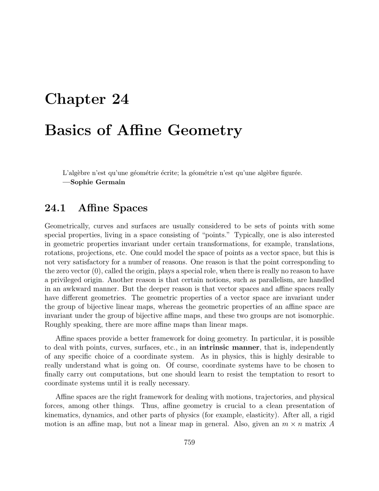

- **24.1 Affine Spaces**
  - Affine spaces distinguish points and vectors by defining a set of points and a vector space acting on them.
  - The vector space acts transitively and faithfully on the set of points, formalized by three axioms (A1, A2, A3).
  - Coordinate systems identify points with vectors but are frame-dependent and not intrinsic.
  - For an intrinsic definition, points are treated separately from free vectors, with translations linking them.
  - External references include Pedoe, Snapper and Troyer, Berger, and others ([Pedoe](134), [Berger](11,12), [Snapper and Troyer](160)).

- **24.2 Examples of Affine Spaces**
  - Affine spaces may be subsets of Euclidean space defined by linear equations with non-homogeneous terms.
  - Lines and planes defined by equations like x + y − 1 = 0 and x + y + z − 1 = 0 serve as affine spaces with vector space actions.
  - More general nonlinear surfaces like paraboloids can also be given affine space structures via specified vector space actions.
  - Such examples show affine spaces encompass more than just vector spaces or subspaces.

- **24.3 Chasles’s Identity**
  - The identity states that vector addition of free vectors corresponding to points satisfies ab + bc = ac.
  - It follows that the zero vector corresponds to the vector from a point to itself, and reversing orientation negates the vector.
  - This identity underlies the parallelogram law for points as vectors.

- **24.4 Affine Combinations, Barycenters**
  - Affine combinations of points require scalar coefficients summing to one to remain frame-invariant.
  - Barycenters are defined as affine combinations and are independent of the chosen origin.
  - Weighted points pair points with scalar weights summing to one, extending the definition of barycenters.
  - Convex combinations restrict barycenter weights to nonnegative scalars summing to one.
  - Barycenters enable definitions of curves like Bézier curves as affine combinations of control points.

- **24.5 Affine Subspaces**
  - Affine subspaces are subsets closed under affine combinations, generalizing linear subspaces.
  - Every affine subspace corresponds to a particular translation of a linear subspace called its direction.
  - Affine lines and planes correspond to one- and two-dimensional affine subspaces.
  - Affine subspaces can be represented as solutions to linear systems Ax = b with corresponding homogeneous space Ax = 0 defining direction.
  - Affine subspaces are parallel if and only if they share the same direction vector space.

- **24.6 Affine Independence and Affine Frames**
  - Affine independence of a family of points means the vectors obtained by choosing one point as origin are linearly independent.
  - Affine frames consist of an origin point and a basis of vectors defined by differences from the origin.
  - Coordinates and barycentric coordinates provide unique representations of points with respect to affine frames.
  - Affinely dependent families satisfy a linear relation with zero sum of scalar coefficients and nonzero coefficients somewhere.
  - Convex hulls and parallelotopes are geometric constructs defined from affine frames with convex or bounded combinations.

- **24.7 Affine Maps**
  - Affine maps preserve affine combinations, or barycenters, extending linear maps by incorporating translations.
  - Every affine map is uniquely determined by the image of one point and an associated linear map on vectors.
  - The composition of affine maps corresponds to composition of linear parts and translation parts.
  - Affine maps map affine subspaces to affine subspaces, preserving parallelism and ratios of points.
  - Representation of affine maps involves linear transformations plus translation vectors, expressible in augmented matrix form.
  - Affine bijections preserving collinearity characterize affine maps between spaces of same dimension.
  - Affine maps preserve ratios of three collinear points.

- **24.8 Affine Groups**
  - The affine group GA(E) consists of bijective affine maps on an affine space E.
  - This group has a homomorphism to the general linear group of the associated vector space, with translations as the kernel.
  - The subgroup of dilatations includes translations and central dilatations (homotheties) defined by center and ratio.
  - Central dilatations fix their center and scale vectors by a ratio, forming a subgroup under composition.
  - Affine dilatations can be geometrically characterized by line parallelism.
  - Affine bijections preserve volumes up to a scalar factor, with special affine group preserving volume exactly.

- **24.9 Affine Geometry: A Glimpse**
  - Affine geometry studies properties invariant under affine bijections, including parallelism and ratios.
  - Theorem of Thales states that parallel hyperplanes intersect lines such that ratios of segments are equal.
  - Affine dilatations map lines to parallel lines, enabling characterization of points by intersections or parallel lines.
  - Pappus’s theorem affirms conditions under which lines are parallel under certain point and line configurations.
  - Desargues’s theorem relates parallelism and concurrency of points and lines in affine triangles.
  - These classical results connect affine geometry with projective geometry and field commutativity.
  
- **24.10 Affine Hyperplanes**
  - Affine hyperplanes are affine subspaces of codimension 1 defined as kernels of nonconstant affine forms (affine maps to R).
  - Unlike linear forms, affine forms may have empty kernels if no solutions satisfy f(x) = 0.
  - Every hyperplane corresponds uniquely (up to scalar multiple) to an affine form, and vice versa.
  - Parallel hyperplanes differ by constant shifts in their defining affine forms.
  - Affine hyperplanes can be represented by equations λ1 x1 + ... + λn xn + µ = 0 in coordinate systems.

- **24.11 Intersection of Affine Spaces**
  - The intersection of affine subspaces M and N is nonempty if and only if the vector between some points in M and N lies in M + N.
  - The intersection reduces to a single point when the zero vector is the only vector in the intersection of associated vector spaces.
  - The affine subspace generated by M and N can be expressed as M + N plus the span of the vector between chosen points.
  - The proof appeals to a short exact sequence relating intersections, sums, and direct sums of vector subspaces, establishing the Grassmann relation.
  - These structural results extend the linear algebra theory of subspaces to affine contexts.
