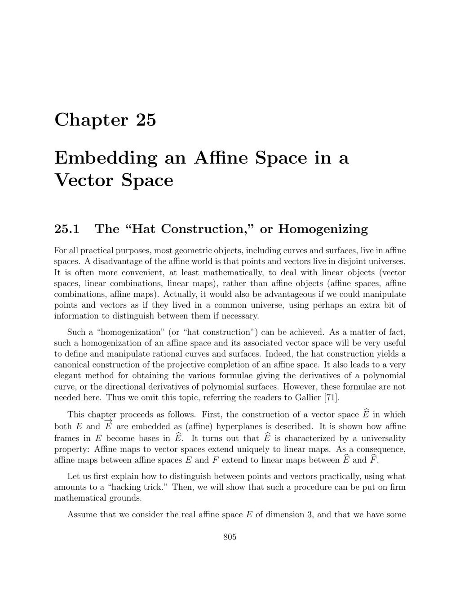

- **Embedding an Affine Space in a Vector Space**
  - **25.1 The “Hat Construction,” or Homogenizing**
    - Most geometric objects live in affine spaces where points and vectors are distinct entities.
    - The hat construction embeds both the affine space E and its associated vector space E into a larger vector space Eᵇ.
    - The embedding uses an extra coordinate to distinguish points (fourth coordinate 1) from vectors (fourth coordinate 0).
    - Translations and dilatations form the elements of Eᵇ, with operations defined to ensure vector space structure.
    - The universal property ensures affine maps uniquely extend to linear maps on Eᵇ.
    - See [Gallier 71](https://link.springer.com/book/10.1007/978-0-8176-4753-0) and [Berger 11](https://doi.org/10.1007/978-3-319-10967-1_2) for detailed treatments.

  - **25.2 Affine Frames of E and Bases of Eᵇ**
    - Every affine frame in E corresponds to a basis in Eᵇ including the weighted point coordinates.
    - Points in E correspond to vectors in Eᵇ with last coordinate 1; vectors correspond to coordinates with last coordinate 0.
    - The proposition proves a one-to-one correspondence between affine frames and bases, allowing computations in Eᵇ.
    - Coordinate transformations between E and Eᵇ respect the affine and vector structures.
    - Visual representation clarifies how an affine plane E becomes a vector space Eᵇ.

  - **25.3 Another Construction of Eᵇ**
    - Defines Eᵇ alternatively as F = E ⊕ ℝ where ℝ is treated as a one-dimensional vector space.
    - Embeds E as an affine hyperplane H = 1 + E inside F, with E as the vector subspace.
    - The linear isomorphism Ωᵇ : Eᵇ → F maps weighted points and vectors to elements of F preserving operations.
    - Geometric constructions of sums and scalar multiplication in Eᵇ correspond to points and vectors in F.
    - Illustrations clarify barycentric and affine geometry relationships.
  
  - **25.4 Extending Affine Maps to Linear Maps**
    - Defines homogenization of an affine space as a triple (E, j, ω) with universal properties.
    - For any affine map from E to a vector space F, there exists a unique linear extension from Eᵇ to F.
    - The map j embeds E as the affine hyperplane ω⁻¹(1) and i embeds the direction E as the hyperplane ω⁻¹(0).
    - The construction ensures linearization of affine maps, ensuring uniqueness and functorial behavior.
    - Such universal property characterizes Eᵇ uniquely up to isomorphism.
