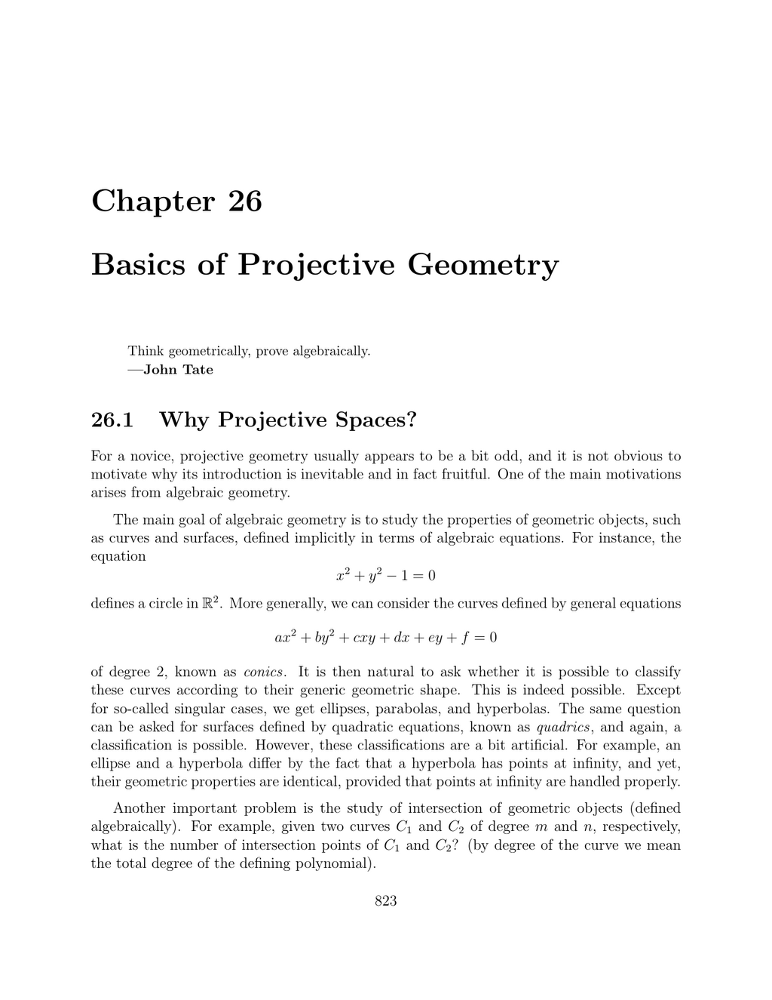

- **26.1 Why Projective Spaces?**
  - Projective geometry resolves exceptions caused by points at infinity in algebraic geometry.  
  - It unifies regular points and points at infinity for cleaner classification and intersection theory.  
  - Rational curves arise as projections of polynomial curves in higher-dimensional spaces.  
  - Central projection models and spherical models illustrate projective spaces.  
  - For deeper study, see [http://www.cis.upenn.edu/ejean/gbooks/geom2.html](http://www.cis.upenn.edu/ejean/gbooks/geom2.html).

- **26.2 Projective Spaces**
  - Projective space P(E) is the set of lines through the origin in vector space E, factoring out scalar multiples.  
  - Dimension of P(E) is dim(E) − 1 for finite dimension E.  
  - Hyperplane and spherical models visualize projective spaces; antipodal points on spheres correspond to projective points.  
  - Real and complex projective spaces inherit quotient topologies.  
  - See [Berger] and [Samuel] for systematic treatments.

- **26.3 Projective Subspaces**
  - Projective subspaces correspond to subspaces of the underlying vector space E.  
  - Dimension of projective subspace is dimension of vector subspace minus one.  
  - Grassmann relation connects dimensions of subspaces and their intersections in projective terms.  
  - Hyperplanes correspond bijectively to non-null linear forms modulo scalars.  
  - Lines in dual space correspond to pencils of lines through a point in the primal space.

- **26.4 Projective Frames**
  - A projective frame in P(E) consists of n+2 points linked to a basis of E with a special point as sum of basis vectors.  
  - Homogeneous coordinates represent projective points uniquely up to scalar multiple.  
  - Projective line P1K is identified with K plus a point at infinity.  
  - Equations of lines and intersections use cross-products of homogeneous coordinate vectors.  
  - The space of conics and quadrics forms projective spaces of homogeneous degree-2 polynomials with associated zero loci.  
  - For algebraic geometry, complex projective spaces ensure injectivity and richer intersection theory.  
  - References include [Fulton], [Samuel], [Coxeter].

- **26.5 Projective Maps**
  - Projective maps P(f) arise from linear maps f : E → F modulo scalar multiples on non-kernel vectors.  
  - Projectivities are bijective projective maps induced by invertible linear maps.  
  - Projectivities on P1K correspond to fractional linear transformations.  
  - Projections between hyperplanes define perspectivities characterized by centers outside the hyperplanes.  
  - Two linear maps induce the same projective map iff they differ by a nonzero scalar multiple.  
  - Any two projective frames of P(E) determine a unique projectivity mapping one to the other.  
  - Desargues's theorem and perspectivity characterizations rely on projectivities and geometric configurations.  
  - See Emil Artin's work and [Samuel] for axiomatic and algebraic perspectives.

- **26.6 Finding a Homography Between Two Projective Frames**
  - Unique homography between two projective frames is represented by a matrix determined by expressing one frame's last point in coordinates of the other.  
  - The matrix is computed up to a scalar and depends on barycentric coordinates of the points.  
  - Method generalizes to any dimension and bases.  
  - The homography matrix can be expressed relative to the canonical or chosen bases.  
  - Necessary and sufficient sign conditions on barycentric coordinates ensure the homography maps the convex hull correctly without points at infinity.  
  - Applications include computer vision tasks such as image morphing.  
  - For detailed algorithms in higher dimensions, see computer graphics literature such as [Penna and Patterson].

- **26.7 Affine Patches**
  - Projective space P(E) minus any hyperplane P(H) is an affine patch with an affine space structure isomorphic to an affine hyperplane of E.  
  - The affine structure on the complement depends only on the chosen hyperplane.  
  - Projective spaces are covered by multiple affine patches glued together, e.g., RP1 by two affine lines, RP2 by three affine planes.  
  - Full embedding of RP2 into A3 is impossible; immersions like the Boy surface exist with self-intersections.  
  - Treating projective spaces as manifolds formed from affine patches is foundational in algebraic geometry.  
  - For visualization and topology of projective spaces, see [Hilbert and Cohn-Vossen].

- **26.8 Projective Completion of an Affine Space**
  - The projective completion of an affine space E is a projective space P(Eb) where Eb is the homogenized vector space of E.  
  - E embeds injectively as an affine patch in the projective completion, with points at infinity forming a projective hyperplane.  
  - Projective completion satisfies a universal property: every affine injection into a projective space with complement to a hyperplane factors uniquely through the projective completion.  
  - This construction uses the "hat construction" from Chapter 25.  
  - The completion provides a clean framework to incorporate points at infinity uniformly in geometric reasoning.
