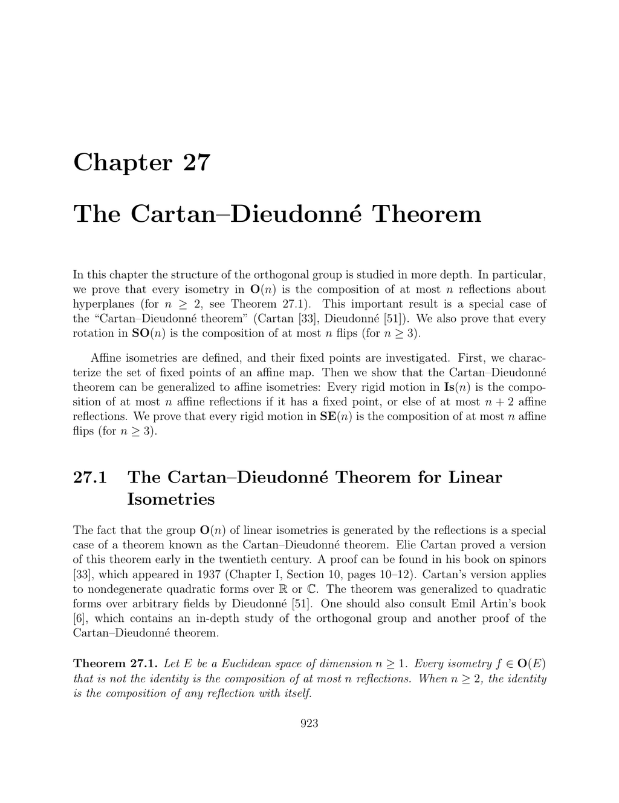

- **27.1 The Cartan–Dieudonné Theorem for Linear Isometries**
  - Every linear isometry in O(n) (n ≥ 1) is the composition of at most n reflections about hyperplanes.
  - If 1 is an eigenvalue of the isometry, the proof uses an invariant hyperplane and induction on dimension.
  - If 1 is not an eigenvalue, constructing a reflection allows reduction to the previous case.
  - Reflections have determinant -1, and the parity of the number of reflections determines whether an isometry is proper or improper.
  - Recommended further reading: [Elie Cartan’s Spinors (1937)](https://mathscinet.ams.org/mathscinet-getitem?mr=1503866).

- **Remarks on Theorem 27.1**
  - The minimal number of reflections to represent an isometry relates to the dimension of the 1-eigenspace.
  - In O(2), every rotation is a product of two reflections; in O(3), improper isometries factor uniquely with reflections and rotations.
  - Every rotation in odd dimension preserves a nontrivial vector inducing an axis of rotation.
  - The proof’s geometric construction is illustrated in multiple figures showing hyperplanes, lines, and extensions of reflections.

- **Proposition 27.2: Stability of Orthogonal Complements Under Isometries**
  - For any invariant subspace F under an isometry f, the orthogonal complement F⊥ is also invariant under f.
  - The space decomposes orthogonally as E = F ⊕ F⊥.

- **Proposition 27.3: Eigenvalue 1 Existence for Rotations and Improper Orthogonal Transformations**
  - Every rotation on an odd-dimensional Euclidean space admits eigenvalue 1 with an eigenspace of odd dimension.
  - Every improper orthogonal transformation on an even-dimensional space admits eigenvalue 1 with an eigenspace of odd dimension.
  - Matrices decompose into blocks with rotation components lacking eigenvalue 1, and identity components corresponding to eigenvalue 1.
  - Counterexamples exist in even dimensions where rotations lack real eigenvalues.
  - Classical 2D rotations and reflections correspond to specific matrix forms parametrized by an angle θ.

- **Properties of the Rotation Group SO(2)**
  - SO(2) is abelian, generated by products of two reflections.
  - Inverses correspond to negation of the rotation angle.
  - Decomposition into reflections is not unique; one reflection can be freely chosen.
  - Rotations in SO(3) correspond to two reflections about planes intersecting at half the rotation angle.
  - Axis and angle of rotation relate to eigenvalues and the trace of rotation matrices.

- **Proposition 27.4: Composition of Two Reflections as Two Flips in Dimension ≥ 3**
  - For two distinct reflections about hyperplanes H1 and H2 in dimension n ≥ 3, their composition equals the composition of two flips.
  - Flips are rotations by 180° fixing subspaces of dimension n-2.
  - The construction uses orthonormal bases adapted to intersections of hyperplanes and trigonometric calculations.
  - Flips generate rotations, providing building blocks for elements of SO(n).

- **Theorem 27.5: Rotations as Compositions of Flips**
  - Every rotation in SO(n) (n ≥ 3) is the composition of an even number of flips, with total flips ≤ n.
  - If a vector is invariant under the rotation, one can choose the last flip such that this vector lies in its determining subspace.
  - The minimal number of flips corresponds to n minus the dimension of the fixed eigenspace.
  - Flips provide a refined generating set for SO(n) beyond reflections.

- **27.2 Affine Isometries (Rigid Motions)**
  - Affine isometries are affine maps preserving distance between points.
  - Such maps form the group of rigid motions, with special subgroups for proper (SE(n)) and improper isometries.
  - Affine isometries factor uniquely into a linear isometry and a translation commuting with it.
  - Every affine isometry is bijective and induced by an isometry on the associated vector space.
  - More details on the structure can be found in [Snapper and Troyer](https://doi.org/10.1007/BFb0076647).

- **Proposition 27.7: Characterization of Affine Isometries**
  - A map is an affine isometry if and only if it preserves distances between all pairs of points.
  - The preservation of distance alone implies affinity; thus, affine isometries are determined by distance preservation.
  - The proof constructs an associated linear map fixing an origin and applies linear isometry results.

- **27.3 Fixed Points of Affine Maps**
  - The set Fix(f) of fixed points of an affine map f is either empty or an affine subspace with direction given by the eigenspace corresponding to eigenvalue 1 of the associated linear map.
  - Fix(f) = a + Ker(f − id) if a fixed point a exists.
  - The fixed point is unique if and only if Ker(f − id) = {0}.
  - This characterization generalizes eigenspaces from linear to affine maps.

- **27.4 Affine Isometries and Fixed Points**
  - Affine orthogonal symmetries about affine subspaces generalize linear reflections and projections.
  - Composition of two affine reflections about parallel subspaces yields a translation.
  - Every translation can be expressed as a composition of two affine orthogonal symmetries about parallel affine subspaces.
  - These properties allow decomposing affine isometries into factors with geometric interpretations.

- **Theorem 27.10: Decomposition of Affine Isometries into Translation and Fixed-Point Isometry**
  - Every affine isometry f uniquely decomposes as f = t ◦ g, where t is a translation by τ ∈ Ker(f − id), and g has at least one fixed point.
  - The fixed points of g form an affine subspace with direction Ker(f − id).
  - The translation t and isometry g commute.
  - If f has no fixed points, then Ker(f − id) has dimension at least 1.
  - This generalizes Chasles’s theorem for rigid motions in three dimensions.

- **Remarks on Affine Isometry Classification in Low Dimensions**
  - In 2D, affine isometries with fixed points are either rotations or reflections; those without fixed points are translations or glide reflections.
  - In 3D, affine isometries with fixed points may be rotations (around a line), reflections (about a plane), or combinations thereof.
  - Affine isometries without fixed points include translations, screw motions (rotation plus translation along axis), and improper isometries composed with translations.
  - These classifications relate geometric transformations to algebraic decomposition.

- **27.5 The Cartan–Dieudonné Theorem for Affine Isometries**
  - The theorem extends to affine isometries: those with a fixed point admit decomposition into at most n affine reflections.
  - Affine isometries without fixed points can be composed of at most n + 2 affine reflections due to translations.
  - For n ≥ 3, every rigid motion in SE(n) is a composition of at most n affine flips.
  - Detailed proofs and treatments are available in Berger [11], Snapper and Troyer [160], and Tisseron [173].
