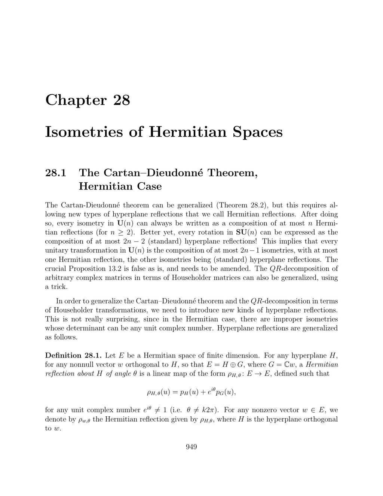

- **28.1 The Cartan–Dieudonné Theorem, Hermitian Case**
  - Defines Hermitian reflections, generalizing standard hyperplane reflections by including a complex angle.
  - States that every isometry in U(n) can be decomposed into at most n Hermitian reflections; rotations in SU(n) can be decomposed into at most 2n−2 standard reflections.
  - Introduces Proposition 28.1 showing two Hermitian reflections suffice to map vectors with equal norms.
  - Proves Theorem 28.2, establishing existence of an orthonormal eigenbasis with unitary eigenvalues for isometries.
  - Demonstrates the decomposition of unitary transformations into rotations and a possible single Hermitian reflection.
  - Presents Proposition 28.3 and Proposition 28.4, showing compositions of Hermitian reflections can be expressed as compositions of standard reflections.
  - States the improved Cartan–Dieudonné theorem (Theorem 28.5) expressing rotations as compositions of standard reflections and general isometries with at most one Hermitian reflection.
  - Notes subgroup generated by Hermitian isometries equals SU(n)±, and rotations for n≥3 decompose into even numbers of flips (Theorem 28.6).
  - Extends QR-decomposition to complex matrices using Householder matrices generalized by Hermitian reflections (Propositions 28.7, 28.8).
  - References for further reading include works by Kincaid and Cheney, Golub and Van Loan, and Ciarlet.

- **28.2 Affine Isometries (Rigid Motions)**
  - Affine isometries of Hermitian spaces generalize Euclidean affine isometries without complications.
  - Every affine isometry uniquely decomposes into a translation and an isometry with a fixed point.
  - The translation component is characterized by its invariance under the affine isometry.
  - The section references Proposition 28.13 for further structural properties of affine isometries.
