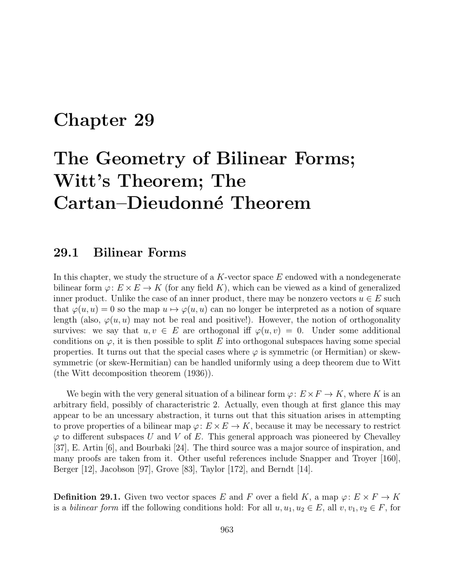

- **29.1 Bilinear Forms**
  - Defines bilinear forms as pairings linear in each argument over any field K, including characteristic 2.
  - Establishes the association between symmetric bilinear forms and quadratic forms when characteristic is not 2.
  - Describes alternating and skew-symmetric bilinear forms and their equivalence in characteristic ≠ 2.
  - Introduces nondegeneracy, dual maps \( l_\varphi \) and \( r_\varphi \), and conditions for injectivity and isomorphisms with finite dimension.
  - For further reading, see [Bourbaki §3.4](https://link.springer.com/book/10.1007/978-1-4757-5951-3).

- **29.2 Sesquilinear Forms**
  - Extends bilinear forms to sesquilinear forms with an involutive field automorphism, covering Hermitian and skew-Hermitian forms.
  - Demonstrates that sesquilinear forms are determined by their diagonal values when characteristic ≠ 2, except in special cases.
  - Defines nondegeneracy and associated injective maps analogous to bilinear forms.
  - Provides matrix representation rules and generalization of orthogonality and form diagonalization.
  - Consult [Jacobson 97] or [Bourbaki] for detailed constructions.

- **29.3 Orthogonality**
  - Defines orthogonality in sesquilinear settings, with notation for right and left orthogonal complements.
  - Discusses when orthogonality is symmetric, characterized by symmetric, alternating, or \(\varepsilon\)-Hermitian forms.
  - Formalizes lattice properties of orthogonal complements, dimension, codimension relations, and rank of the form.
  - Establishes rank equivalence between bilinear/sesquilinear forms and associated maps.
  - Additional insights in [Artin, 6] and [Grove, 83].

- **29.4 Adjoint of a Linear Map**
  - Defines left and right adjoints for linear maps between spaces with sesquilinear forms based on dualities induced by forms.
  - Derives explicit matrix formulas for adjoints in terms of the representing matrices of forms and maps.
  - Shows equality of left and right adjoints for symmetric or \(\varepsilon\)-Hermitian forms.
  - Demonstrates behavior of adjoints under composition, scalar multiplication, and involution.
  - Further details found in [Taylor, 172].

- **29.5 Isometries Associated with Sesquilinear Forms**
  - Defines metric maps and isometries as linear maps preserving sesquilinear forms.
  - Provides equivalence between isometries and invertibility conditions linking maps and their adjoints.
  - Proves the group structure of isometries for finite-dimensional nondegenerate forms.
  - Identifies standard matrix groups for orthogonal, symplectic, and unitary cases over \(\mathbb{R}\) and \(\mathbb{C}\).
  - Reference examples in [Berger, 12] and [Grove, 83].

- **29.6 Totally Isotropic Subspaces**
  - Introduces isotropic vectors and subspaces for \(\varepsilon\)-Hermitian forms, including radical and degeneracy criteria.
  - Characterizes nondegenerate subspaces and their orthogonal decompositions.
  - Proves dimension relations: codimension and double orthogonal equality for finite-dimensional cases.
  - Presents decomposition of alternating bilinear forms into orthogonal hyperbolic planes plus radical.
  - See [Serre, 155] Chapter IV and [Bourbaki, 24] for exhaustive treatments.

- **29.7 Witt Decomposition**
  - States Property (T) controlling diagonal values for \(\varepsilon\)-Hermitian forms, necessary for decomposition.
  - Defines weak and strong Witt decompositions decomposing space into totally isotropic, anisotropic, and radical parts.
  - Proves existence and uniqueness results for maximal totally isotropic subspaces and complementary anisotropic parts.
  - Provides normal forms of matrices in cases of alternating, symmetric, and Hermitian forms.
  - Foundational material also in Chevalley [37] and Witt’s original [188].

- **29.8 Symplectic Groups**
  - Recalls symplectic forms as nondegenerate alternating forms on even-dimensional spaces.
  - Characterizes symplectic transvections fixing hyperplanes and shows these generate the symplectic group.
  - Establishes that all symplectic group elements have determinant 1.
  - Demonstrates construction of symplectic maps transforming bases via compositions of transvections.
  - Detailed studies available at [Jacobson, 97] and [Grove, 83].

- **29.9 Orthogonal Groups and the Cartan–Dieudonné Theorem**
  - Defines orthogonal groups of symmetric bilinear (quadratic) forms, including special orthogonal groups.
  - Introduces hyperplane reflections as involutive isometries associated to nondegenerate hyperplanes.
  - Proves that every orthogonal transformation decomposes into at most \(n\) hyperplane reflections (strong theorem).
  - Explains distinction between rotations (det = 1) and improper orthogonal transformations (det = −1).
  - See [Serre, 155] and [Taylor, 172] for classical proofs and further context.

- **29.10 Witt’s Theorem**
  - States and proves the extension property for isometries defined on subspaces of spaces with nondegenerate \(\varepsilon\)-Hermitian forms.
  - Employs metric linear maps and orthogonality conditions to construct global isometries extending partial isometries.
  - Uses decomposition techniques and injectivity criteria in the extension proof.
  - Namesake result enabling classification and extension of isometries across spaces.
  - Foundational sources: original Witt [188], [Bourbaki, 24], and Serre [155].
