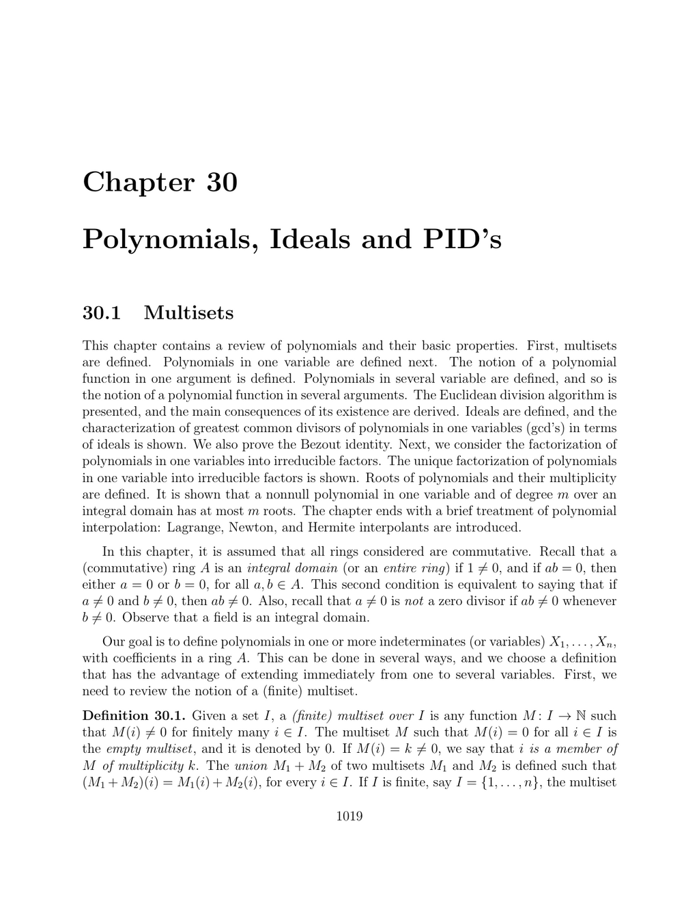

- **30.1 Multisets**
  - A finite multiset over a set I is a function M: I → N with finitely many nonzero values.
  - Multiset union is commutative and sums multiplicities element-wise.
  - When I is finite, multisets correspond to n-tuples of multiplicities but order is irrelevant.
  - Multisets differ from strings in that multisets' order is irrelevant.
  - Relevant further reading includes [Multiset Theory](https://en.wikipedia.org/wiki/Multiset).

- **30.2 Polynomials**
  - Polynomials in one variable over a ring A are finite-support functions from N to A.
  - Polynomial addition, scalar multiplication, and multiplication are defined by coefficient-wise and convolution operations.
  - The degree of a polynomial is the highest index with a nonzero coefficient; zero polynomial degree is −∞.
  - Polynomials with coefficients in a field K form an integral domain; the degree of product sums degrees if leading coefficients are non-zero divisors.
  - Polynomial evaluation at elements of rings extends ring homomorphisms and is uniquely defined.
  - Polynomials in multiple variables are defined as finitely supported functions from multisets of variable indices to coefficients.
  - The total degree is sum of exponents in monomials; ring A[X1,...,Xn] is commutative with identity.
  - Polynomial evaluation extends uniquely to n-tuples in a ring B containing A.
  - For further in-depth study see [Polynomial Rings](https://mathworld.wolfram.com/PolynomialRing.html).
  
- **30.3 Euclidean Division of Polynomials**
  - Division with remainder is possible in A[X] if the divisor has invertible leading coefficient.
  - For polynomials f, g with deg(f) = m, there exist unique q, r with g = fq + r and deg(r) < m.
  - The Euclidean algorithm inductively constructs q and r.
  - This division underlies factorization and the structure of ideals in polynomial rings.
  - Detailed treatments found in [Euclidean Algorithm](https://en.wikipedia.org/wiki/Euclidean_algorithm).

- **30.4 Ideals, PID’s, and Greatest Common Divisors**
  - An ideal I in a ring A is a nonempty subset closed under additive inverses and multiplication by A.
  - Principal ideals are generated by a single element, denoted (a).
  - Prime ideals satisfy ab ∈ I implies a ∈ I or b ∈ I; maximal ideals satisfy no larger proper ideal contains them.
  - Quotient rings A/I are rings with kernel I; I prime iff A/I integral domain; I maximal iff A/I field.
  - Rings like Z and K[X] (K a field) are principal ideal domains (PIDs).
  - GCDs of polynomials correspond to generators of the sum of the principal ideals they define.
  - Bezout identity: gcd d of f and g satisfies d = uf + vg for some u, v in K[X].
  - Euclid’s proposition: if f divides gh and f is coprime to g, then f divides h.
  - K[X] has unique factorization into irreducibles; irreducibles generate maximal ideals.
  - Euclidean domains admit division with remainder, implying PID structure.
  - Gaussian integers Z[i] form a Euclidean domain via the norm function.
  - For background see [Ideals and PID](https://mathworld.wolfram.com/PrincipalIdealDomain.html) and [Bezout’s Identity](https://en.wikipedia.org/wiki/B%C3%A9zout%27s_identity).

- **30.5 Factorization and Irreducible Factors in K[X]**
  - Irreducible polynomials are those of degree ≥ 1 with no nontrivial divisors.
  - Over R, irreducibles are linear or quadratics with negative discriminant; over C, only linear polynomials are irreducible.
  - A polynomial p is irreducible iff (p) is a maximal ideal in K[X].
  - Factorization theorem: any nonzero polynomial can be uniquely factored into powers of distinct irreducible monic polynomials.
  - The uniqueness proof relies on the integral domain property of K[X].
  - Euclidean domains generalize this factorization structure beyond fields.
  - See further details in [Unique Factorization Domain](https://en.wikipedia.org/wiki/Unique_factorization_domain).

- **30.6 Roots of Polynomials**
  - A root α ∈ A of polynomial f ∈ A[X] satisfies f(α) = 0.
  - α is a root of multiplicity h if (X−α)^h divides f but (X−α)^{h+1} does not.
  - Number of roots (counted with multiplicities) in an integral domain is at most degree of polynomial.
  - Addition and multiplication of polynomials relate multiplicities via min and sum respectively.
  - Polynomial division remainder r in f = (X−α)q + r equals f(α); remainder zero iff α is a root.
  - Derivatives are defined algebraically and relate to multiplicity: simple roots are roots where derivative is nonzero.
  - In fields of characteristic zero, the multiplicity of roots decreases by one upon taking derivatives.
  - Polynomial functions induced by polynomials over infinite integral domains determine the polynomial uniquely.
  - The Zariski topology is linked to zero sets of polynomials.
  - For foundational reading see [Roots of Polynomials](https://mathworld.wolfram.com/Root.html) and [Multiplicities](https://mathworld.wolfram.com/Multiplicity.html).

- **30.7 Polynomial Interpolation (Lagrange, Newton, Hermite)**
  - Given distinct points α_i and values β_i in a field K, there exists a unique polynomial of degree ≤ m interpolating these points.
  - Lagrange polynomials L_i(X) satisfy L_i(α_j) = δ_{i,j} and form a basis for interpolation.
  - The interpolating polynomial P(X) is the linear combination ∑ β_i L_i(X).
  - Interpolation generalizes to include derivatives (Hermite interpolation) using algebraic roots and multiplicities.
  - See additional treatments in [Polynomial Interpolation](https://en.wikipedia.org/wiki/Polynomial_interpolation).
