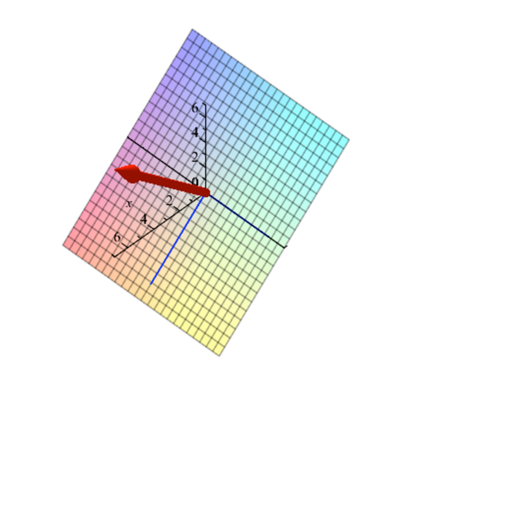

- **31.1 Annihilating Polynomials and the Minimal Polynomial**
  - The annihilator Ann(f) is the ideal of all polynomials that annihilate a linear map f.
  - The minimal polynomial mf is the unique monic polynomial of smallest degree generating Ann(f).
  - The minimal polynomial divides the characteristic polynomial and shares its zeros.
  - Eigenvalues of f are exactly the zeros of mf.
  - See [Linear Algebra Done Right](https://www.springer.com/gp/book/9783319110790) for a deeper discussion of minimal polynomials.

- **31.2 Minimal Polynomials of Diagonalizable Linear Maps**
  - A linear map f is diagonalizable if and only if its minimal polynomial factors into distinct linear terms.
  - Invariant subspaces have minimal polynomials dividing that of the whole space.
  - Introduces the f-conductor, an ideal related to invariance and polynomial actions on vectors.
  - The minimal polynomial's shape influences diagonalizability, proven via conductors.
  - Refer to [Algebra](https://link.springer.com/book/10.1007/978-0-387-30727-4) for invariant subspace theory.

- **31.3 Commuting Families of Diagonalizable and Triangulable Maps**
  - Any finite commuting family of diagonalizable linear maps has a common diagonalizing basis.
  - Proves that commuting triangulable maps have a common upper-triangularizing basis.
  - Applies induction on dimension and uses invariant subspaces and conductors.
  - Extends to infinite commuting families due to finite dimensionality restrictions.
  - Consult [Matrix Analysis](https://press.princeton.edu/books/hardcover/9780691114084/matrix-analysis) for commuting operator results.

- **31.4 The Primary Decomposition Theorem**
  - Decomposes E into a direct sum of kernels of powers of irreducible factors of the minimal polynomial.
  - Each component is invariant under f and has a minimal polynomial a power of a single irreducible factor.
  - Provides explicit construction of projections onto primary components using polynomial identities.
  - When eigenvalues are in K, the decomposition corresponds to generalized eigenspaces.
  - See [Advanced Linear Algebra](https://www.springer.com/gp/book/9780387728282) for applications of primary decomposition.

- **31.5 Jordan Decomposition**
  - Every linear map with eigenvalues in K decomposes uniquely into a commuting sum of a diagonalizable map D and a nilpotent map N.
  - Both D and N are polynomials in f, guaranteeing commutativity and uniqueness.
  - The decomposition generalizes diagonalization to non-diagonalizable maps.
  - Provides explicit formulas via projections associated with minimal polynomial factors.
  - For more on Jordan decomposition, consult [Linear Algebra](https://www.sciencedirect.com/book/9780128140426/linear-algebra).

- **31.6 Nilpotent Linear Maps and Jordan Form**
  - Nilpotent maps have increasing kernels Ni with strict inclusions up to some r: N0 ⊂ N1 ⊂ ... ⊂ Nr+1 = E.
  - There exist subspaces Ui such that each Ni = Ni-1 ⊕ Ui, and f maps Ui injectively into Ui-1.
  - Constructs a basis with matrix representation having off-diagonal νi equal to 1 or 0, representing a nilpotent map.
  - Defines Jordan blocks and states the Jordan normal form theorem characterizing f via Jordan matrices.
  - See [Matrix Analysis](https://press.princeton.edu/books/hardcover/9780691114084/matrix-analysis) for detailed Jordan form derivation and applications.

- **31.7 Summary**
  - Lists main concepts: ideals, minimal polynomials, invariant subspaces, f-conductors, generalized eigenvectors, nilpotent maps, Jordan decomposition, and related forms.
  - Highlights connections between polynomial ideals and linear map structure.
  - Emphasizes importance of Jordan form in understanding linear transformations.
  - Encourages further study of finitely generated modules and tensor products for broader canonical forms.
  - See [Algebraic Theory of Linear Operators](https://www.springer.com/gp/book/9780387941764) for extended summaries.

- **31.8 Problems**
  - Exercises include proving Ann(f) is ideal, details on invariant subspaces and conductors, and minimal polynomials computation.
  - Problems on Jordan decomposition and finding minimal polynomials of specific matrices.
  - Encourages application of theoretical results to concrete linear maps.
  - Serves as reinforcement for understanding primary decomposition and Jordan normal form.
  - See accompanying solutions or [Linear Algebra Workbook](https://www.cambridge.org/core/books/workbook-in-linear-algebra/86D56D518A56AB7614AAE07C5ADFA5C0) for practice guidance.
