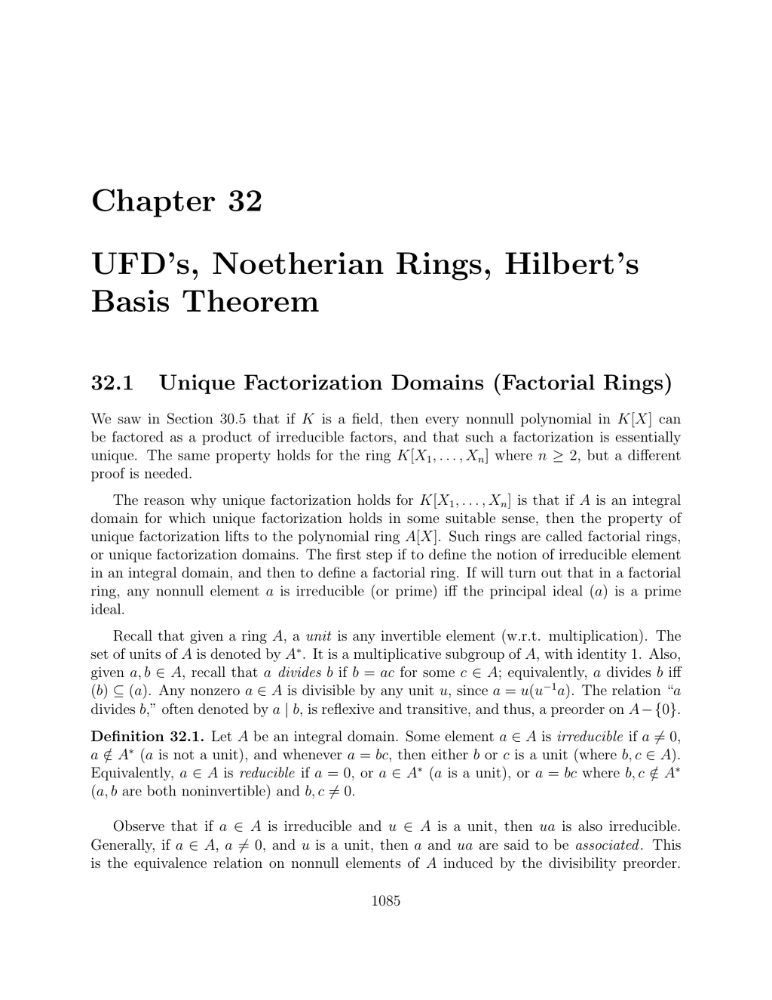

- **Unique Factorization Domains (Factorial Rings)**
  - Defines irreducible elements in integral domains and unique factorization domains (UFDs).
  - Establishes the equivalence of irreducible and prime elements in factorial rings.
  - Proves that polynomial rings over a UFD are also UFDs using Gauss’s lemma and fraction fields.
  - Characterizes principal ideal domains (PIDs) as UFDs and provides conditions for when a UFD is a PID.
  - References include [Stark (1966)](https://example.org) for the characterization of ring of integers as UFDs.
- **The Chinese Remainder Theorem**
  - States that for comaximal ideals \(a\) and \(b\) in a ring \(A\), the quotient \(A/ab\) is isomorphic to \(A/a \times A/b\).
  - Generalizes the theorem to finite collections of pairwise comaximal ideals.
  - Provides explicit constructions of solutions to simultaneous congruences in the integer setting.
  - Characterizes direct decompositions of rings via sequences of idempotent elements and ideals.
  - Illustrates the theorem with the example of \(\mathbb{Z}/30\mathbb{Z}\) and its ideals.
- **Noetherian Rings and Hilbert’s Basis Theorem**
  - Defines the ascending chain condition (a.c.c.) and its equivalence to the maximal condition and finite generation of ideals.
  - Introduces noetherian rings as those satisfying the a.c.c. condition.
  - Proves Hilbert’s basis theorem: if \(A\) is noetherian, then so is \(A[X]\).
  - Uses ascending chains of coefficient ideals and explicit generation arguments in proofs.
  - Extends the noetherian property to polynomial rings in multiple variables.
  - References include foundational texts such as [Zariski and Samuel (1958)](https://example.org) and [Lang (2002)](https://example.org).
