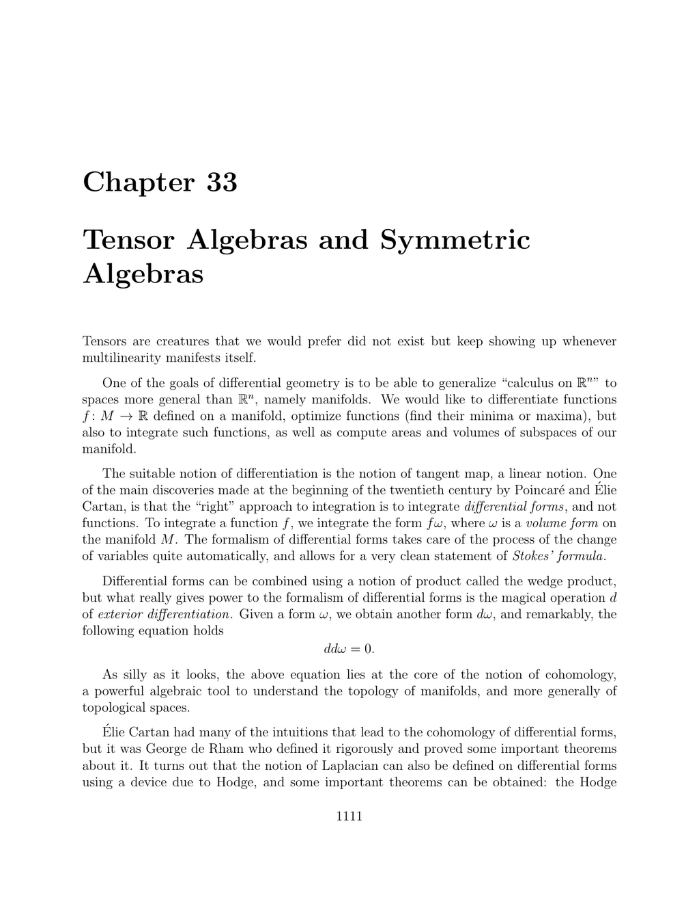

- **Tensor Algebras and Symmetric Algebras Introduction**
  - Tensors arise naturally in multilinear contexts, especially in differential geometry and vector bundle theory.
  - Differential forms correspond to skew-symmetric tensors and differential geometry extends calculus beyond ℝⁿ.
  - The text emphasizes a coordinate-free approach and avoids defining tensors as multilinear maps on dual spaces.
  - For detailed tensor algebra, readers should master tensor products, symmetric and skew-symmetric tensors, and duality.

- **33.1 Linear Algebra Preliminaries: Dual Spaces and Pairings**
  - Defines dual space E* as all linear maps from E to the field K.
  - Introduces nondegenerate pairing to connect vector spaces E and F with canonical isomorphisms E ≅ F* and F ≅ E* when finite dimensional.
  - Presents raising and lowering of indices using inner products, including explicit matrix formulas.
  - Explains canonical isomorphisms induced by inner products are independent of basis choice.
  - Recommends [Linear Algebra Done Right](https://www.springer.com/gp/book/9783319110790) by Sheldon Axler for further study.

- **33.2 Tensor Products**
  - Defines multilinear maps and tensor products via a universal property linking multilinear maps and linear maps.
  - Proves uniqueness of tensor product spaces up to canonical isomorphism.
  - Constructs tensor products using free vector spaces modulo relations enforcing multilinearity.
  - Demonstrates that linear maps tensor via f ⊗ g with natural composition properties.
  - Shows tensor products convert multilinear maps to linear maps on tensor powers.
  - Suggested resource: [Tensor Categories](https://math.berkeley.edu/~etingof/245/) by Pavel Etingof et al.

- **33.3 Bases of Tensor Products**
  - Establishes that tensor products have bases formed by tensor products of basis elements from each factor.
  - Provides constructive approach by showing any family of tensor basis vectors is linearly independent.
  - Concludes dimension of tensor product equals product of dimensions of component spaces.

- **33.4 Some Useful Isomorphisms for Tensor Products**
  - Proves canonical isomorphisms: E⊗F ≅ F⊗E (symmetry), associativity ((E⊗F)⊗G ≅ E⊗(F⊗G)), distributivity over direct sums, and K⊗E ≅ E.
  - Shows these isomorphisms respect tensor product universal properties.
  - Provides functorial properties of tensor products on linear maps.
  - Reference: [Algebra](https://link.springer.com/book/10.1007/978-1-4613-0041-0) by Serge Lang.

- **33.5 Duality for Tensor Products**
  - Defines a canonical nondegenerate pairing between tensor products of duals and original spaces.
  - Proves (E₁⊗...⊗Eₙ)* ≅ E₁*⊗...⊗Eₙ* via this pairing for finite-dimensional vector spaces.
  - Demonstrates identification of linear maps Hom(E,F) with E*⊗F, establishing canonical isomorphisms under finite dimension conditions.
  - Provides explicit construction and proof of injectivity and surjectivity.
  - Recommended reading: [Introduction to Tensor Analysis and the Calculus of Moving Surfaces](https://www.springer.com/gp/book/9780387947012) by Pavel Grinfeld.

- **33.6 Tensor Algebras**
  - Defines tensor algebra T(V) as direct sum of tensor powers V⊗m with natural associative multiplication given by concatenation.
  - Proves T(V) is an associative unital algebra, noncommutative in general.
  - Shows universal mapping property: every linear map from V to an algebra A extends uniquely to algebra homomorphism from T(V) to A.
  - Provides explicit construction using tensor powers and relations.
  - Discusses ideals and graded algebra structures.
  - Guides on polynomial algebra interpretations.
  - See also: [Algebras and Representation Theory](https://link.springer.com/book/10.1007/978-3-030-29514-2) by P. J. Hilton and U. Stammbach.

- **33.7 Symmetric Tensor Powers**
  - Defines symmetric multilinear maps and symmetric tensor powers as universal objects for symmetric multilinear maps.
  - Builds symmetric powers as quotient of tensor powers by subspace enforcing symmetry.
  - Verifies universal mapping property for symmetric tensor powers.
  - Associates symmetric tensors with multisets and commutative products.
  - Demonstrates how symmetrization relates symmetric powers to polynomial-like structures.
  - Further details in [Multilinear Algebra](https://math.mit.edu/~etingof/math719/linear.pdf) by Pavel Etingof.

- **33.8 Bases of Symmetric Powers**
  - Proves bases for symmetric powers are indexed by finite multisets over the basis set of the original vector space.
  - Calculates dimension formulas: dim Sym^m(V) = (dim V + m -1 choose m).
  - Connects bases to homogeneous polynomials of fixed total degree.
  - Provides explicit formulas for expressing symmetric multilinear maps in terms of basis vectors and multisets.
  - See complementary study in [Combinatorics and Symmetric Functions](https://math.mit.edu/~rstan/algcomb.pdf) by Richard Stanley.

- **33.9 Some Useful Isomorphisms for Symmetric Powers**
  - Shows the isomorphism Sn(E⊕F) ≅ ⨁ₖ₌₀ⁿ Sk(E) ⊗ Sn−k(F).
  - Illustrates decomposition of symmetric powers over direct sums.

- **33.10 Duality for Symmetric Powers**
  - Defines nondegenerate pairing on symmetric powers using sums over permutations (permanents).
  - Proves canonical isomorphisms for duals: (Sn(E))* ≅ Sn(E*), and Sn(E*) ≅ symmetric multilinear maps Symn(E;K).
  - Investigates symmetrization projections embedding symmetric powers into tensor powers.
  - Requires finite dimension and zero characteristic for key results.
  - Recommended: [Tensor Algebras and Symmetric Powers](https://www.springer.com/gp/book/9783540932276) by Nicolas Bourbaki.

- **33.11 Symmetric Algebras**
  - Constructs symmetric algebra S(V) as quotient of tensor algebra T(V) by ideal generated by commutation relations u⊗v − v⊗u.
  - Proves S(V) is the algebra of polynomials over V with commutative multiplication.
  - Establishes universal property for symmetric algebras analogous to tensor algebras but over commutative algebras.
  - Shows symmetric powers inherit algebra structures fitting into the direct sum making S(V).
  - Links algebraic structure of polynomials with intrinsic symmetric tensor algebraic construction.
