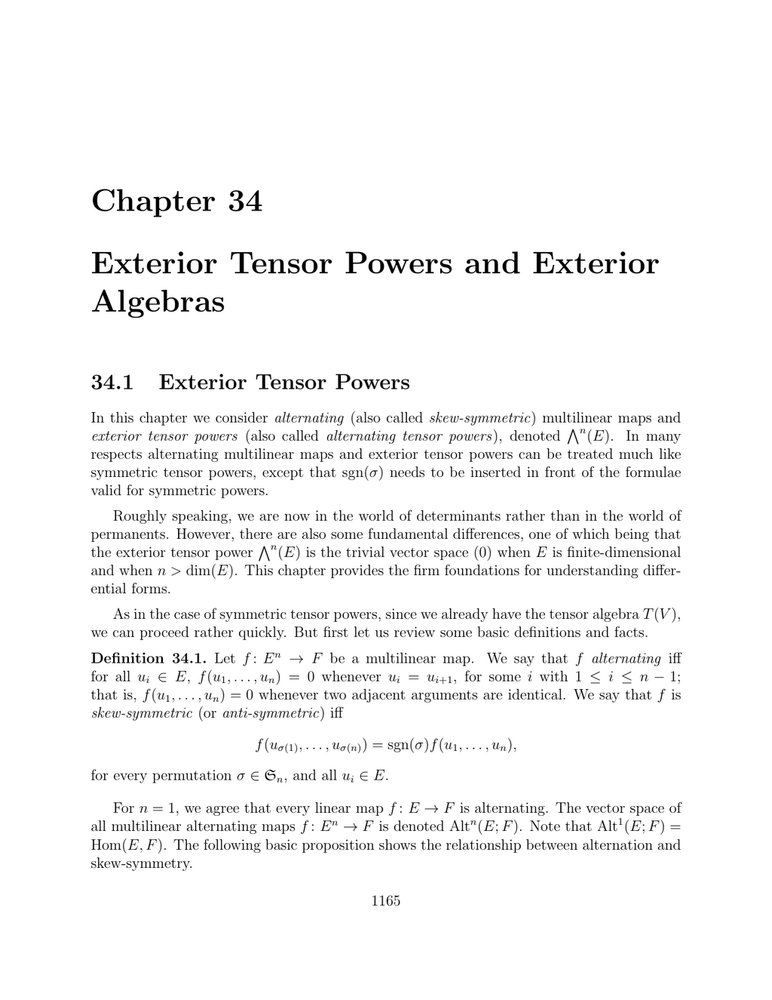

- **Exterior Tensor Powers**
  - **Definition of alternating and skew-symmetric multilinear maps**
    - Alternating maps vanish when two adjacent arguments are identical; skew-symmetric maps satisfy sign-based permutation conditions.
    - Every linear map is alternating for n=1 by agreement.
    - The field characteristic affects equivalence between alternating and skew-symmetric maps.
    - See [Linear Algebra Done Right](https://linear.axler.net/) for an introduction to multilinear algebra.
  - **Properties of alternating multilinear maps**
    - Alternating maps change sign upon swapping adjacent arguments.
    - For fields with characteristic ≠ 2, skew-symmetric equals alternating.
    - The vector space of alternating multilinear maps is denoted Altⁿ(E; F).
  - **Definition and construction of the n-th exterior tensor power**
    - Constructed via quotient of tensor powers by the ideal generated by tensors u⊗u.
    - The universal mapping property characterizes exterior powers.
    - Exterior power (Λⁿ(E)) is generated by simple tensors u₁ ∧ ... ∧ uₙ.
  - **Functorial properties and isomorphisms of exterior powers**
    - For any linear map f: E → E′, there is induced f∧: Λⁿ(E) → Λⁿ(E′).
    - Exterior powers satisfy behavior under compositions of linear maps.
    - Hom(Λⁿ(E), F) ≅ Altⁿ(E; F) canonically.
- **Bases of Exterior Powers**
  - **Construction of bases for Λⁿ(E)**
    - Bases formed by wedge products u_I of basis vectors u_i indexed by increasing subsets I.
    - The dimension of Λⁿ(E) equals the binomial coefficient C(dim(E), n) when finite dimensional.
    - Vectors u₁∧...∧uₙ ≠ 0 if and only if the u_i are linearly independent.
  - **Linear independence and spanning of basis elements**
    - Plücker coordinates relate to linear independence conditions.
    - Example for n=2, dim(E)=3 uses triples e₁∧e₂, e₁∧e₃, e₂∧e₃ as a basis for Λ²(E).
    - Check [Algebraic Geometry and Commutative Algebra](https://perso.univ-rennes1.fr/jean-yves.briot/cours%20ags.pdf) for exercises on bases.
- **Some Useful Isomorphisms for Exterior Powers**
  - **Direct sum decomposition isomorphism**
    - Λⁿ(E ⊕ F) ≅ ⊕_{k=0}^n Λ^k(E) ⊗ Λ^{n-k}(F).
    - This isomorphism respects grading and multilinear structure.
  - **Relation with tensor products helps manipulate complex tensors**
- **Duality for Exterior Powers**
  - **Nondegenerate pairing between Λⁿ(E*) and Λⁿ(E)**
    - Pairing defined by determinant of evaluation of dual vectors on vectors.
    - Canonical isomorphisms: (Λⁿ(E))^* ≅ Λⁿ(E^*) and Λⁿ(E^*) ≅ Altⁿ(E; K).
  - **Natural functorial behavior under linear maps**
    - Transpose maps induce pullbacks on exterior powers of duals.
  - **Hodge-type isomorphisms depend on choice of basis and are independent of orthonormal basis used**
  - Further reading: [Bourbaki, Algebra Chapter III](https://www.springer.com/gp/book/9783540067234).
- **Exterior Algebras**
  - **Definition and construction of exterior algebra Λ(V)**
    - Constructed as quotient of tensor algebra by ideal generated by u⊗u.
    - Graded algebra with skew-symmetric wedge product.
    - Dim(Λ(V)) = 2^dim(V) when V is finite dimensional.
  - **Multiplication properties and graded skew-commutativity**
    - For α ∈ Λ^m(V), β ∈ Λ^n(V), have β ∧ α = (−1)^{mn} α ∧ β.
    - α ∧ α = 0 for simple tensors but not necessarily for compound tensors.
    - Wedge product encodes exterior differentiation and determinant structures.
  - **Universal property of exterior algebras**
    - Characterized by unique algebra morphisms inducing maps on V with square-zero images.
- **The Hodge ∗-Operator**
  - **Definition of Hodge star as an isomorphism Λ^k(V) → Λ^{n−k}(V)**
    - Defined using inner product and orientation on Euclidean vector space V.
    - Satisfies ∗∗ = (−1)^{k(n−k)} id.
  - **Properties and explicit formulas on orthonormal bases**
    - Basis elements transform via sign determined by permutation and complement index sets.
    - Induces inner products on exterior powers compatible with wedge product.
  - **Application to Laplacian generalization on differential forms**
  - Further reading: [Jost, Riemannian Geometry](https://www.springer.com/gp/book/9783540710919).
- **Left and Right Hooks (Interior Products)**
  - **Definitions of left and right interior products y and x on exterior powers**
    - y: Λ^p(E) × Λ^{p+q}(E^*) → Λ^q(E^*) and x: Λ^{p+q}(E^*) × Λ^p(E) → Λ^q(E^*).
    - Left and right hooks are related by sign factors.
  - **Properties and combinatorial description using basis and sign functions ρ**
    - Calculations with basis elements involve detailed inversion count signs.
    - Respect module actions: left hook makes E^* a left Λ(E)-module; similarly for right hook.
  - **Almost anti-derivation properties for hooks**
    - Hooks satisfy Leibniz-type rules with sign modifications.
  - **Insertion operator i(u) defined as right hook by vectors in E**
    - Plays a fundamental role in differential geometry and form calculus.
  - See [Fulton and Harris, Representation Theory](https://link.springer.com/book/10.1007/978-1-4612-0979-9) for detailed expositions.
- **Testing Decomposability**
  - **Characterization of decomposable tensors via interior products and wedge products**
    - z ∈ Λ^p(E) decomposable iff (u^* y z) ∧ z = 0 for all u^* ∈ Λ^{p−1}(E^*).
    - For 2-vectors x, decomposability equivalently characterized by x ∧ x = 0.
  - **Smallest subspace containing decomposable tensor generated by images of left hook**
    - Dimension of subspace equals degree p iff tensor decomposable.
  - **Examples demonstrate explicit construction of bases from wedge parts**
- **The Grassmann-Plücker’s Equations and Grassmannian Manifolds**
  - **Quadratic Plücker relations characterize decomposable tensors**
    - Equations of the form ∑ ϵ_{i,J,H} λ_{H∪{i}} λ_{J−{i}} = 0 must hold for all index subsets.
    - Nonzero vectors satisfying these embed Grassmannian manifolds into projective space.
  - **Embedding of Grassmannian G(p,n) into projective space via wedge of basis vectors**
    - Map i_G is injective and realizes G(p,n) as algebraic variety defined by Plücker relations.
  - **Geometric interpretation: intersection of subspaces corresponds to wedge product vanishing**
  - Classical example: Klein quadric for G(2,4).
  - See [Harris, Algebraic Geometry](https://link.springer.com/book/10.1007/978-1-4757-3849-0) for further study on Grassmannians.
- **Vector-Valued Alternating Forms**
  - **Identification of vector-valued alternating forms with Λ^n(E^*) ⊗ F**
    - Isomorphism holds for finite-dimensional E and any vector space F.
    - Facilitates construction of maps and algebraic operations on forms valued in vector spaces.
  - **Extension of wedge product to forms with values in bilinear algebra structures**
    - Defines wedge product ∧_Φ involving bilinear maps Φ: F × G → H.
    - Special case with Lie algebra structure induces graded commutator bracket.
  - **Canonical isomorphisms and basis expansions for vector-valued forms**
    - Every element has unique expansion via basis of E and F.
    - µ_F map relates alternating forms and tensor products directly.
  - **Application to differential forms taking values in Lie algebras and vector bundles**
