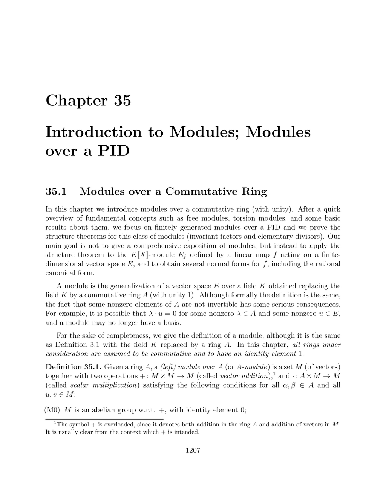

- **Modules over a Commutative Ring**
  - Introduces modules as a generalization of vector spaces over a commutative ring with unity.
  - Defines modules, free modules, and torsion elements, emphasizing differences from vector spaces.
  - Explains conditions under which submodules and direct sums behave analogously to vector spaces.
  - Proves bases in free modules have a well-defined cardinality via quotient construction.
  - References: [Lang, Algebra](https://link.springer.com/book/10.1007/978-1-4612-1369-2)
  
- **Finite Presentations of Modules**
  - Defines module presentations as exact sequences involving free modules and relations.
  - Discusses manipulations of presentation matrices preserving module isomorphism.
  - Shows finitely generated modules over Noetherian rings have finite presentations.
  - Provides conditions characterizing Noetherian rings via submodule finiteness.
  - Reference: [Eisenbud, Commutative Algebra](https://link.springer.com/book/10.1007/978-1-4612-5350-1)
  
- **Tensor Products of Modules over a Commutative Ring**
  - Extends tensor product construction to modules, noting failure of some vector space properties.
  - Defines projective modules as direct summands of free modules with good tensor behavior.
  - Establishes isomorphisms between Hom and tensor products for finitely generated projective modules.
  - Provides explicit decompositions of tensor products when one factor is free.
  - Reference: [Weibel, An Introduction to Homological Algebra](https://press.princeton.edu/books/paperback/9780691029465/an-introduction-to-homological-algebra)
  
- **Torsion Modules over a PID; The Primary Decomposition**
  - Introduces decomposition of modules over product rings and defines p-primary components.
  - Proves primary decomposition theorem expressing torsion modules as direct sums of p-primary parts.
  - Demonstrates uniqueness of decomposition via isomorphism restrictions to primary components.
  - Highlights characterization of semi-simple modules over a PID as torsion modules with p-torsion annihilated by p.
  - See also: [Atiyah & Macdonald, Introduction to Commutative Algebra](https://global.oup.com/academic/product/introduction-to-commutative-algebra-9780201407518)
  
- **Finitely Generated Modules over a PID; Invariant Factor Decomposition**
  - Proves submodules of free modules over a PID are free and admits a basis adapted to divisibility conditions.
  - Establishes structure theorem that finitely generated modules decompose into direct sums of cyclic modules with invariant factors.
  - Demonstrates correspondence between matrix invariant factors and module decomposition.
  - Provides algorithmic and theoretical tools, including use of exterior powers and matrix normal forms.
  - References for further reading: [Dummit & Foote, Abstract Algebra](https://www.wiley.com/en-us/Abstract+Algebra%2C+3rd+Edition-p-9780471433347)
  
- **Extension of the Ring of Scalars**
  - Defines construction of an A-module from a B-module via a ring homomorphism A → B.
  - Explains restriction and extension of scalars functors and defines scalar multiplication accordingly.
  - Describes bilinearity and induced maps associated with scalar extension.
  - Emphasizes relevance in eigenvalue theory and module homomorphism analysis.
  - Reference: [Rotman, Advanced Modern Algebra](https://www.ams.org/books/gsm/191/)
