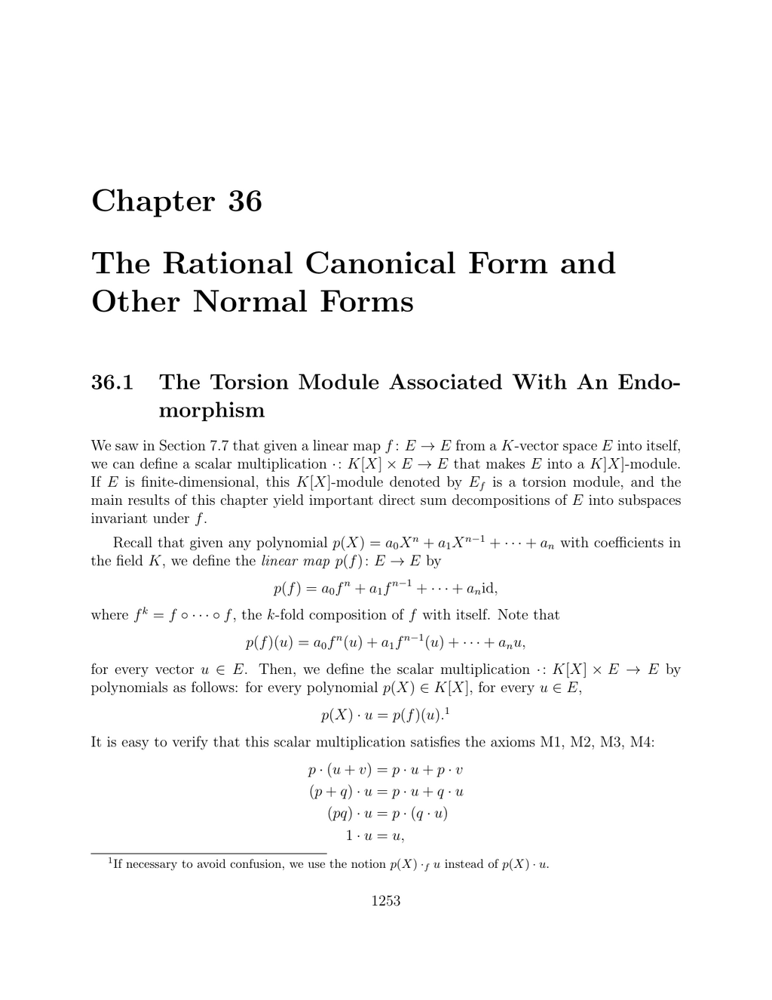

- **36.1 The Torsion Module Associated With An Endomorphism**
  - Defines the scalar multiplication making a vector space E into a K[X]-module Ef via a linear map f.
  - Shows Ef is a finitely generated torsion module over the PID K[X] if E is finite-dimensional.
  - Characterizes submodules, cyclic submodules, and annihilators in terms of invariant subspaces, cyclic subspaces, and minimal polynomials.
  - Introduces companion matrices representing cyclic modules and explains their relationship to minimal polynomials.
  - States and proves Proposition 36.1 relating linear maps between modules to commutation with f and f'.
  - Establishes the exact sequence in Theorem 36.3 linking free modules E[X] and Ef using maps σ and ψ.
  - Discusses the isomorphism between tensor products and free modules, and the induced linear maps.
  - Provides a general viewpoint for modules over rings and connects this setup to the Cayley-Hamilton Theorem.
  - For additional details, see [Module Theory on Wikipedia](https://en.wikipedia.org/wiki/Module_(mathematics)).

- **36.2 The Rational Canonical Form**
  - Applies the primary decomposition theorem to decompose E into invariant subspaces associated with powers of irreducible factors of the minimal polynomial.
  - Introduces the cyclic decomposition theorem giving a direct sum of cyclic subspaces associated with invariant factors q1,...,qn satisfying divisibility conditions.
  - Defines the rational canonical form as a block matrix composed of companion matrices of the invariant factors.
  - Proves uniqueness of the rational canonical form and similarity invariants.
  - Provides an example computing the Smith normal form of XI − M leading to the rational canonical form.
  - States Propositions 36.7-36.13 relating similarity via isomorphism between modules, field extension behavior, and computations involving minors of XI − M.
  - Connects the minimal polynomial, characteristic polynomial, and similarity invariants, including divisibility relations.
  - See [Rational Canonical Form - Wikipedia](https://en.wikipedia.org/wiki/Rational_canonical_form) for more background.

- **36.3 The Rational Canonical Form, Second Version**
  - States the cyclic decomposition theorem in terms of elementary divisors involving powers of irreducible polynomials.
  - Expresses the rational canonical form as a block diagonal matrix with blocks corresponding to companion matrices of the elementary divisors.
  - Highlights uniqueness of the polynomials and multiplicities in the decomposition.
  - Explains how elementary divisors may change under field extensions unlike similarity invariants.
  - Provides a continued example to illustrate decomposition into one-dimensional cyclic subspaces.
  - For algorithmic detail on Smith normal form computation used here, see [Smith Normal Form](https://en.wikipedia.org/wiki/Smith_normal_form).

- **36.4 The Jordan Form Revisited**
  - Assumes all eigenvalues of f lie in K, leading to irreducible polynomials of the form X − λ.
  - Shows that cyclic subspaces with minimal polynomial (X − λ)^n have bases forming Jordan chains.
  - Provides Proposition 36.16 on the existence of Jordan bases and block matrices representing f as Jordan blocks.
  - Includes an explicit example constructing a Jordan basis and corresponding Jordan block matrix.
  - States Theorem 36.17 giving equivalence of eigenvalues in K, existence of triangular and Jordan forms, and uniqueness of block counts.
  - Connects minimal polynomial and characteristic polynomial to the polynomials associated with Jordan blocks.
  - See [Jordan Normal Form - Wikipedia](https://en.wikipedia.org/wiki/Jordan_normal_form) for extended explanations.

- **36.5 The Smith Normal Form**
  - Presents the Smith normal form as a specific application of module decomposition over the PID K[X].
  - Emphasizes that the matrices involved in Smith normal form can be factored into elementary matrices.
  - Notes the general applicability of Smith normal form over any Euclidean ring.
  - Explains the relevance of Smith normal form to algorithmic computation of similarity invariants and canonical forms.
  - For practical algorithms and examples, refer to [Smith Normal Form Tutorial](https://mathworld.wolfram.com/SmithNormalForm.html).
