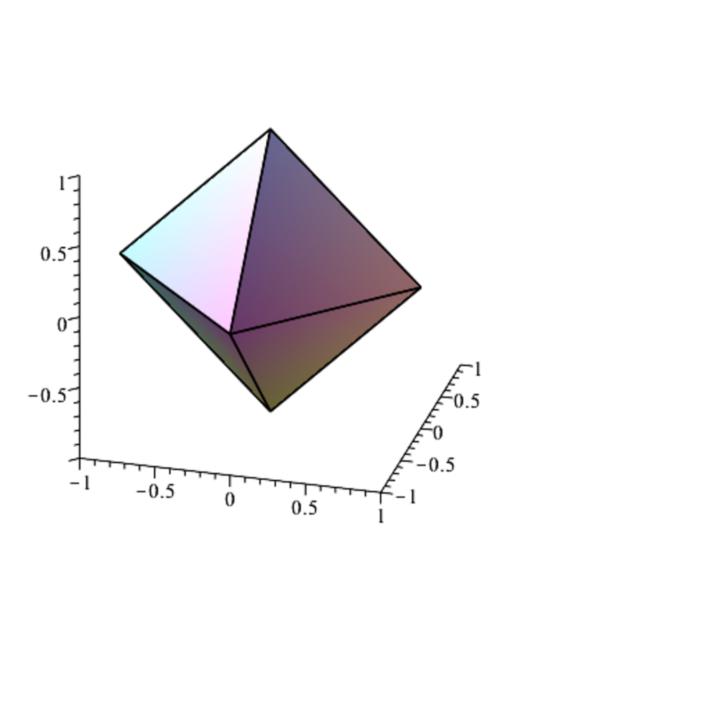

- **37.1 Metric Spaces and Normed Vector Spaces**
  - Metric spaces are sets with a distance function satisfying symmetry, positivity, and the triangle inequality.
  - Normed vector spaces have a norm satisfying positivity, scaling, and the triangle inequality, inducing a metric.
  - Standard examples include Euclidean spaces with various `p`-norms and discrete metrics.
  - Open and closed balls are defined, with their geometric interpretations varying by context.
  - Further reading: [Topology Text by Munkres](https://pi.math.cornell.edu/~mec/2006-2007/Topology/Munkres.pdf)

- **37.2 Topological Spaces**
  - Topological spaces are defined by families of open sets closed under finite intersections and arbitrary unions, including the empty set and entire space.
  - Subspace and product topologies extend the concept to subsets and Cartesian products.
  - The Hausdorff (T2) separation axiom ensures any two distinct points can be separated by disjoint open sets.
  - Bases and subbases for topologies offer ways to generate the topology from smaller families of sets.
  - Further reading: [General Topology](https://en.wikipedia.org/wiki/Topology)

- **37.3 Continuous Functions, Limits**
  - Continuity is defined via preimages of open sets or neighborhoods mapping to neighborhoods.
  - Composition of continuous functions is continuous; coordinate projections are continuous in product spaces.
  - Continuity at isolated points is automatic; non-isolated points in normed spaces have no isolated neighborhoods.
  - Limits of sequences and functions are topologically defined and equivalent to metric definitions when available.
  - Homeomorphisms are bijective continuous maps with continuous inverses, classifying topological equivalences.
  - Further reading: [Introduction to Metric Spaces](https://mathworld.wolfram.com/MetricSpace.html)

- **37.4 Connected Sets**
  - Connected spaces have no nontrivial subsets that are both open and closed.
  - In the real line, connected subsets are exactly intervals.
  - Locally constant functions characterize disconnectedness; connectedness equals constancy of locally constant functions.
  - Every continuous image of a connected space is connected; connected components partition the space and are closed.
  - Local connectedness means neighborhoods can be chosen connected, related to open connected components.
  - Arcwise connected spaces have continuous paths between points; local arcwise connectedness strengthens this.
  - Further reading: [Munkres on Connectedness](https://math.stackexchange.com/questions/2080982/is-arcwise-connectedness-stronger-than-connectedness)

- **37.5 Compact Sets and Locally Compact Spaces**
  - Compactness is defined by every open cover having a finite subcover, assuming Hausdorff separation.
  - Compact subsets of metric spaces are closed and bounded; closed intervals in real numbers are compact.
  - Compactness implies normality; metrizable spaces are normal.
  - Continuity preserves compactness; continuous images of compact sets are compact.
  - Local compactness means every point has a compact neighborhood; Alexandroff compactification adds a single point to compactify noncompact spaces.
  - Further reading: [Munkres on Compactness](https://www.math.kth.se/matstat/kurser/kth/Topology/Compactness.pdf)

- **37.6 Second-Countable and Separable Spaces**
  - Second-countable spaces have countable bases for their topology; separable spaces have countable dense subsets.
  - Metric and normed finite-dimensional vector spaces are both second-countable and separable.
  - In metric spaces, second-countability and separability are equivalent.
  - Second-countable spaces have countable subcovers for open covers and countably many connected components.
  - Urysohn metrization theorem states that regular, second-countable spaces are metrizable.
  - Further reading: [Urysohn Metrization Theorem](https://encyclopediaofmath.org/wiki/Urysohn_metrization_theorem)

- **37.7 Sequential Compactness**
  - Accumulation points of sequences require every neighborhood to contain infinitely many terms.
  - In second-countable spaces, accumulation points coincide with limits of subsequences.
  - Compactness in second-countable Hausdorff spaces is equivalent to every sequence having an accumulation point.
  - An example illustrates constructing sequences without accumulation points to test compactness.
  - Further reading: [Sequential Compactness](https://mathworld.wolfram.com/SequentialCompactness.html)
