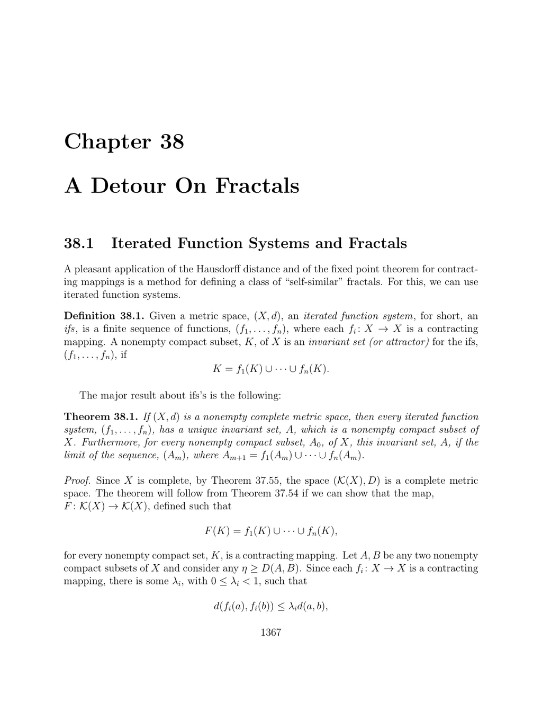

- **38.1 Iterated Function Systems and Fractals**  
  - Defines an iterated function system (ifs) as a finite sequence of contracting mappings on a metric space.  
  - States a nonempty compact subset K is an invariant set of the ifs if K equals the union of the images of K under each function in the sequence.  
  - Presents Theorem 38.1 which guarantees the existence and uniqueness of an invariant set for any ifs on a complete metric space.  
  - Explains the invariant set can be obtained as the limit of iteration applying the ifs functions to any initial compact set.  
  - Suggests further reading on fractals and iterated function systems in [Fractals Everywhere](https://mitpress.mit.edu/books/fractals-everywhere) by Michael F. Barnsley.
