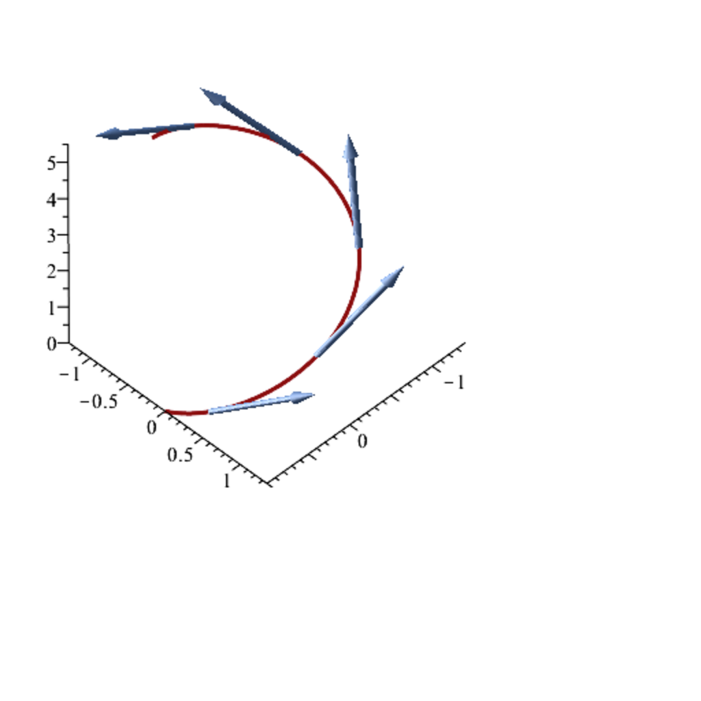

- **Directional Derivatives, Total Derivatives**  
  - The derivative of real-valued functions on open subsets of ℝ is defined as the limit of the difference quotient.  
  - Directional derivatives generalize the derivative in the direction of any vector in normed affine spaces.  
  - The Fréchet derivative is a linear continuous map providing a uniform and intrinsic notion of derivative for functions between normed affine spaces.  
  - The derivative is unique, continuous at the point, and consistent with directional derivatives.  
  - [Lang - Introduction to Differentiable Manifolds](https://example.org)

- **Jacobian Matrices**  
  - Jacobian matrices represent derivatives of finite-dimensional functions as matrices of partial derivatives.  
  - Composition of differentiable functions corresponds to the product of their Jacobian matrices (chain rule).  
  - Partial derivatives must be continuous for the total derivative to exist, but existence of all partials does not guarantee differentiability.  
  - Examples illustrate computation of Jacobians and gradients, including matrix-valued functions and quadratic forms.  
  - [Munkres - Analysis on Manifolds](https://example.org)

- **The Implicit and The Inverse Function Theorems**  
  - The implicit function theorem guarantees local solvability and differentiability of implicit equations under invertibility and continuity conditions of partial derivatives.  
  - Local diffeomorphisms are bijections around points with continuously invertible derivatives.  
  - The inverse function theorem states that a continuously differentiable function with invertible derivative at a point is locally a diffeomorphism.  
  - Immersions and submersions are defined by injectivity and surjectivity of derivatives and characterized locally by diffeomorphisms and projections.  
  - [Cartan - Differential Calculus](https://example.org)

- **Tangent Spaces and Differentials**  
  - The graph of a differentiable function forms a differential submanifold.  
  - The tangent space at a point of the graph is the affine space generated by the derivative linear map.  
  - Tangent vectors are limits of scaled difference vectors of points on the manifold.  
  - The geometric interpretation of derivatives as tangent spaces holds for curves and surfaces.  
  - [do Carmo - Differential Geometry of Curves and Surfaces](https://example.org)

- **Second-Order and Higher-Order Derivatives**  
  - Higher-order derivatives are defined iteratively as derivatives of the derivative map and identified with multilinear symmetric maps.  
  - Schwarz’s lemma states the symmetry of mixed second derivatives under existence conditions.  
  - The Hessian matrix represents the bilinear second derivative for finite-dimensional domains.  
  - Higher derivatives satisfy symmetry properties and are expressed with multi-index partial derivative notation.  
  - [Milnor - Topology from the Differentiable Viewpoint](https://example.org)

- **Taylor’s Formula, Faà di Bruno’s Formula**  
  - Taylor’s formula expresses functions locally as sums of derivatives with remainder terms of varying types (Young, Lagrange, integral).  
  - For vector-valued functions, expansions involve multilinear derivatives and Hessians.  
  - Faà di Bruno’s formula generalizes the chain rule to higher-order derivatives of compositions.  
  - Multivariate Taylor expansions use multi-index notation involving partial derivatives of various orders.  
  - [Kreyszig - Advanced Engineering Mathematics](https://example.org)

- **Vector Fields, Covariant Derivatives, Lie Brackets**  
  - Vector fields assign tangent vectors to each point and their covariant derivatives measure change along other vector fields.  
  - Covariant derivatives satisfy linearity, Leibniz rules, and depend on smoothness assumptions.  
  - The Lie bracket quantifies the noncommutativity of covariant derivatives and acts as a Lie algebra structure on vector fields.  
  - Coordinates expression of the Lie bracket shows its bilinear differential form involving partial derivatives.  
  - [Warner – Foundations of Differentiable Manifolds and Lie Groups](https://example.org)
