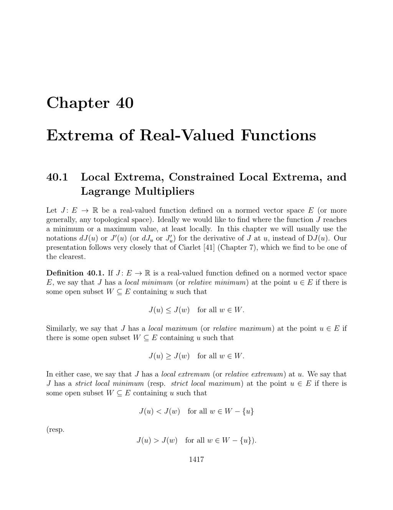

- **40.1 Local Extrema, Constrained Local Extrema, and Lagrange Multipliers**  
  - Defines local minimum, maximum, and extremum in normed vector spaces and importance of openness of the domain.  
  - Establishes the necessary condition for a local extremum as vanishing first derivative (critical point).  
  - Explains constrained extrema via constraints defined by equations or inequalities.  
  - Presents a necessary condition for constrained extrema using Lagrange multipliers under regularity assumptions.  
  - Introduces the Lagrangian function and relates critical points of L to constrained extrema.  
  - Discusses geometric interpretations and potential pitfalls when constraint regularity fails.  
  - Further reading: [Ciarlet, Mathematical Elasticity](https://link.springer.com/book/10.1007/978-3-319-42225-1)  

- **40.2 Using Second Derivatives to Find Extrema**  
  - Provides necessary conditions for local minima involving positive semidefiniteness of second derivative (Hessian).  
  - Gives sufficient conditions for strict local minima when the Hessian is positive definite.  
  - Extends notions to nondegenerate critical points in infinite-dimensional Banach spaces.  
  - Discusses the absence of converse statements and provides counterexamples.  
  - Further reading: [Lang, Differential and Riemannian Manifolds](https://link.springer.com/book/10.1007/978-1-4612-1132-1)  

- **40.3 Using Convexity to Find Extrema**  
  - Defines convex sets and convex functions with geometric intuition and examples.  
  - States necessary conditions for local minima on convex sets involving directional derivatives and inequalities.  
  - Characterizes convexity of differentiable functions in terms of first and second derivatives.  
  - Proves that local minima of convex functions on convex sets are global minima, and strictly convex functions have unique minima.  
  - Applies convexity theory to least squares problems and quadratic functions.  
  - Further reading: [Boyd and Vandenberghe, Convex Optimization](https://web.stanford.edu/~boyd/cvxbook/)  

- **40.4 Summary**  
  - Lists key concepts including local and constrained extrema, necessary and sufficient optimality conditions, Lagrange multipliers, and convexity.  
  - Summarizes results involving first and second derivatives, convexity criteria, and their implications for optimization.  
  - Provides a concise overview of the chapter’s main mathematical tools for identifying extrema.
