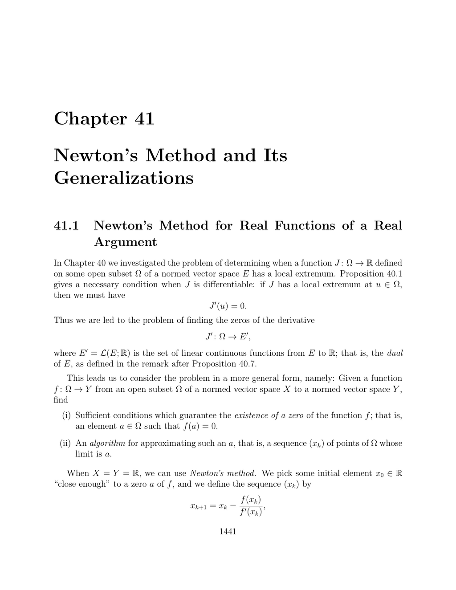

- **41.1 Newton’s Method for Real Functions of a Real Argument**  
  - Newton’s method uses tangent lines to iteratively approximate zeros of real functions.  
  - The iteration formula requires the function to be differentiable and its derivative nonzero at iteration points.  
  - Convergence depends on choosing an initial value sufficiently close to a root.  
  - Newton’s method extends naturally to functions between normed vector spaces with differentiable bijections as derivatives.  
  - See practical applications and convergence conditions in [Ciarlet, Numerical Analysis](https://link.springer.com/book/10.1007/978-3-319-47517-6).

- **41.2 Generalizations of Newton’s Method**  
  - Newton’s method generalizes to systems of nonlinear equations using Jacobian matrices and linear system solves.  
  - Variants keep Jacobians or approximations fixed for multiple iterations to reduce computational cost.  
  - Generalized Newton methods employ sequences of linear isomorphisms to facilitate convergence.  
  - Theorems 41.1, 41.2, and 41.3 provide sufficient conditions for convergence, including bounds on operator norms and Lipschitz continuity.  
  - Specializations apply to zeros of derivatives for optimization problems with Banach space settings.  
  - Full proofs and theoretical background are in [Ciarlet, The Finite Element Method for Elliptic Problems](https://link.springer.com/book/10.1007/978-3-642-61513-3).  
  - Newton methods influence gradient descent and interior-point optimization techniques; see [Boyd and Vandenberghe, Convex Optimization](https://web.stanford.edu/~boyd/cvxbook/).

- **41.3 Summary**  
  - The chapter covers Newton’s method for single-variable functions and its generalizations to vector spaces.  
  - The Newton–Kantorovich theorem establishes convergence guarantees for Newton-type methods.  
  - These concepts underpin approaches in numerical analysis and convex optimization.
