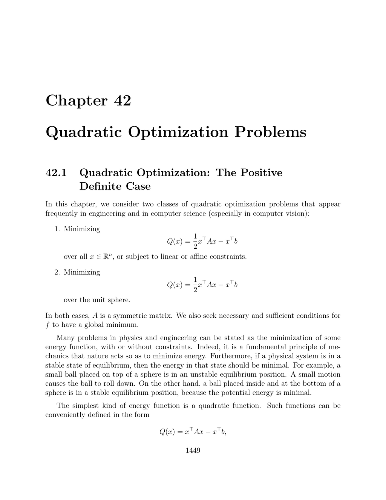

- **Quadratic Optimization Problems**
  - **Quadratic Optimization: The Positive Definite Case**
    - Quadratic functions have the form \( Q(x) = \frac{1}{2} x^T A x - x^T b \) with symmetric matrix \( A \).
    - A unique global minimum exists if and only if \( A \) is symmetric positive definite and \( A x = b \).
    - Lagrange multipliers allow solving quadratic minimization problems subject to linear constraints.
    - The constrained problem reduces to solving a symmetric linear system involving \( A \) and constraint matrices.
    - For foundational insights, see Strang's "Introduction to Linear Algebra" [Strang, 167].
  - **Quadratic Optimization: The General Case**
    - A symmetric matrix \( A \) allows quadratic minimization if \( A \succeq 0 \) and \( (I - A A^{+}) b = 0 \).
    - The pseudo-inverse \( A^{+} \) is essential in characterizing existence and forms of the minimum.
    - Constraints can be transformed via QR decompositions to reduce to unconstrained problems.
    - Problems with affine constraints \( C^T x = t \) are similarly reducible; details of the transformation rely on matrix factorizations.
    - For mathematical foundations, consult the theory of generalized inverses [Ben-Israel & Greville].
  - **Maximizing a Quadratic Function on the Unit Sphere**
    - Maximizing \( x^T A x \) subject to \( x^T x = 1 \) yields the largest eigenvalue and corresponding eigenvector of \( A \).
    - Ellipsoid constraints reduce to sphere constraints via changes of variable involving matrix square roots.
    - Complex Hermitian forms have analogous eigenvalue characterizations for maximization problems.
    - Linear (or affine) constraints reduce dimensionality through QR decompositions or projections.
    - The problem with affine constraints \( N^T x = t \neq 0 \) is more complex and studied by Gander et al. [Gander, Golub, von Matt, 75].
  - **Summary**
    - Key concepts include quadratic forms, positive semidefinite ordering, and constrained optimization.
    - Lagrange multipliers yield saddle point characterizations connecting primal and dual problems.
    - Methods for adding linear and affine constraints rely on matrix decompositions and projections.
    - Maximization on spheres and ellipsoids reduces to eigenvalue problems.
    - The chapter connects theoretical foundations with applications in engineering and computer vision; see Boyd and Vandenberghe on convex optimization [Boyd & Vandenberghe, 29].
