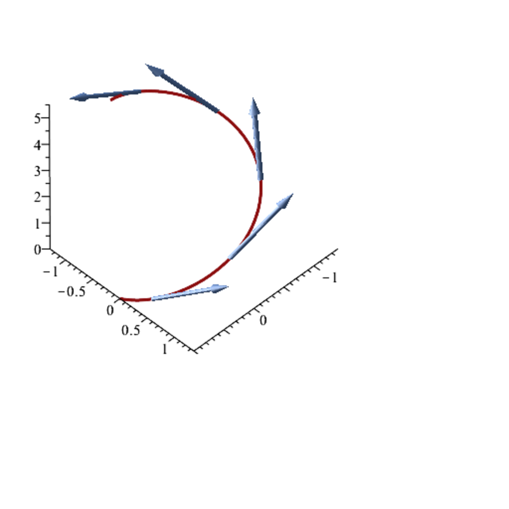

- **Chapter 43**
  - **43.1 Schur Complements**
    - Schur complements arise naturally when inverting block matrices and characterizing positivity in symmetric block matrices.
    - They are essential in quadratic optimization problems, particularly for definiteness and pseudo-inverse considerations.
    - Related results and proofs are connected to material in Appendix A.5 of Boyd and Vandenberghe [29].
    - Schur complements involve block partitions of matrices and linear systems that can be reduced through these blocks.
    - See further details in Boyd and Vandenberghe [29] Appendix B for applications in quadratic optimization.
