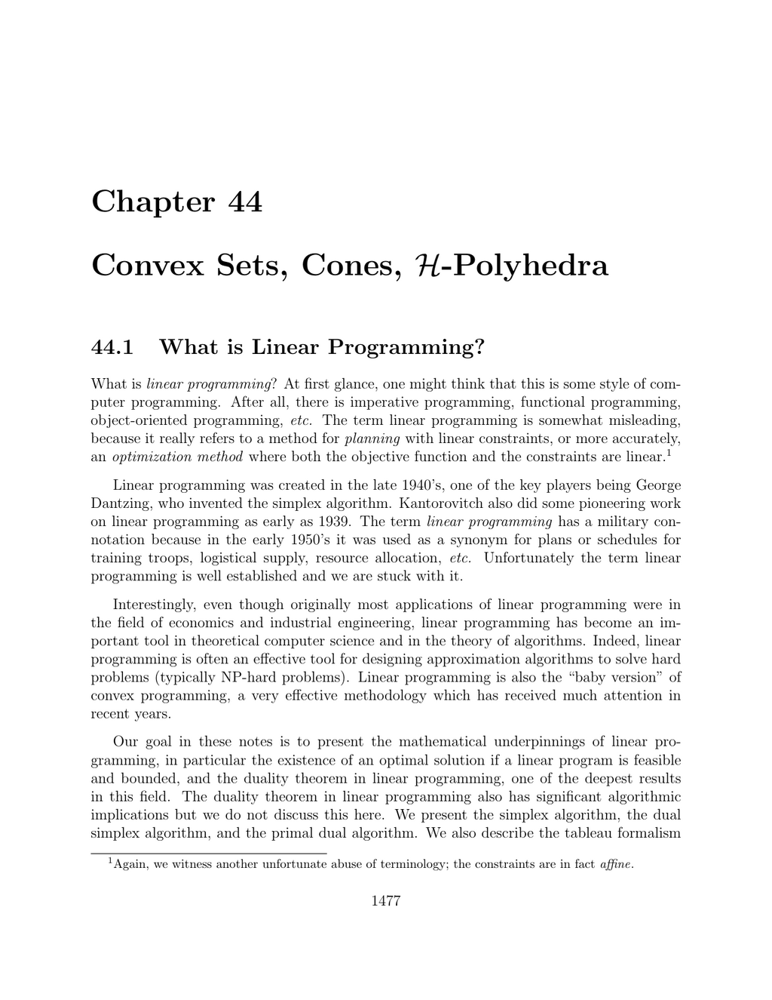

- **44.1 What is Linear Programming?**
  - Linear programming is an optimization method where both the objective function and the constraints are linear.
  - It originated in the late 1940s with key figures such as George Dantzig and Kantorovich.
  - The feasible region of a linear program is a convex polyhedron, and the maximum of the objective function, if bounded and feasible, is attained within this region.
  - The simplex algorithm, dual simplex algorithm, and primal dual algorithm are fundamental solution techniques.
  - Further reading includes [Matousek and Gardner](https://link.springer.com/book/10.1007/978-3-540-71866-1) and [Boyd and Vandenberghe](https://web.stanford.edu/~boyd/cvxbook/).

- **44.2 Affine Subsets, Convex Sets, Affine Hyperplanes, Half-Spaces**
  - Affine subspaces are subsets of Rⁿ closed under affine combinations where coefficients sum to one.
  - Convex sets are subsets where every line segment between two points lies entirely within the set.
  - Convex hulls are the smallest convex sets containing a given subset.
  - Affine forms define affine hyperplanes and half-spaces; both half-spaces are convex and bounded by the hyperplane.
  - For deeper exploration, see [Gallier](https://www.cis.upenn.edu/~jean/gbooks/geomfacts.pdf) and [Ziegler](https://link.springer.com/book/10.1007/978-3-540-67694-9).

- **44.3 Cones, Polyhedral Cones, and H-Polyhedra**
  - A cone generated by a set is the set of all nonnegative combinations of vectors from that set.
  - Polyhedral cones arise when the generating set is finite.
  - If a vector u is in a cone, then all positive scalar multiples of u are also in the cone.
  - Cones relevant here are always convex, but there exist more general cones which may not be convex.
  - For an advanced study of cones and polyhedral theory, refer to [Ziegler](https://link.springer.com/book/10.1007/978-3-540-67694-9).
