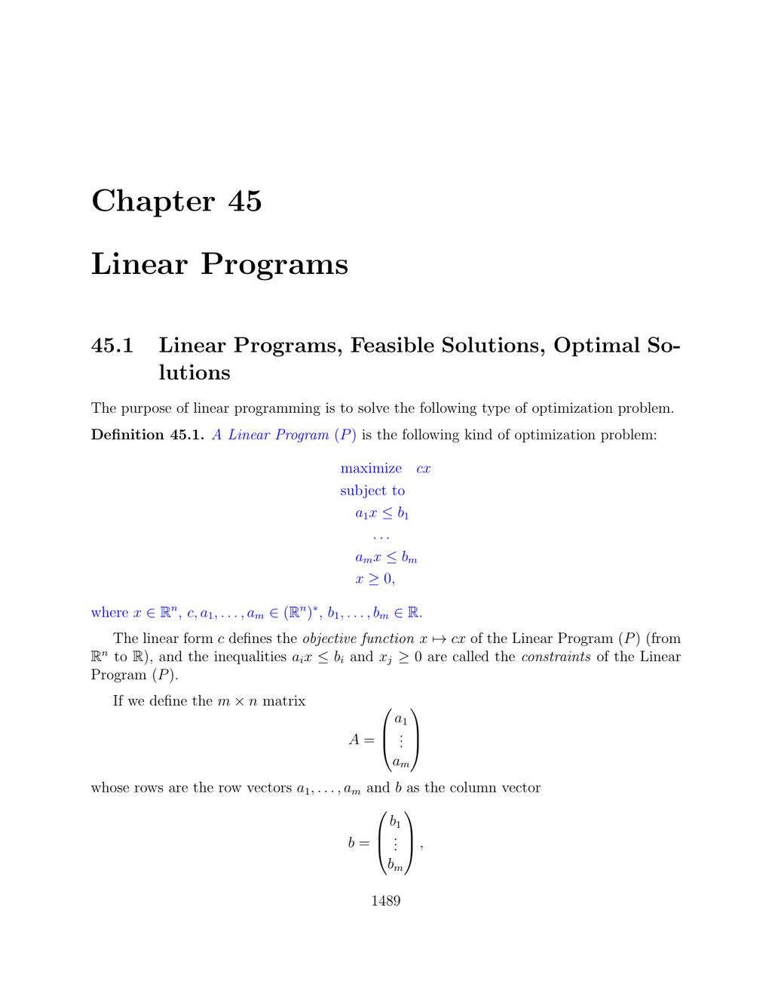

- **45.1 Linear Programs, Feasible Solutions, Optimal Solutions**
  - Defines a Linear Program (P) as maximizing a linear form cx subject to inequalities Ax ≤ b and x ≥ 0.
  - Expresses constraints as half-spaces, whose intersection forms an H-polyhedron P(A, b).
  - Identifies feasible solutions as points in P(A, b) and notes conditions for infeasibility or unboundedness.
  - Introduces the existence of optimal solutions when the feasible region is nonempty and bounded.
  - Illustrates examples including unique and multiple optimal solutions.
  - Describes conversion to standard form using slack variables.
  - References proof that bounded linear programs have achieved maxima relying on closedness of polyhedral cones.
  - See also [Linear Programming on Wikipedia](https://en.wikipedia.org/wiki/Linear_programming)

- **45.2 Basic Feasible Solutions and Vertices**
  - Assumes matrix A of constraints has full row rank m ≤ n.
  - Defines a basic feasible solution as one with an invertible submatrix AK formed by m columns and zeros elsewhere.
  - Introduces terminology: basis (K), basic variables (indices in K), and nonbasic variables (indices not in K).
  - Provides an example illustrating basic feasible solutions for a simple equality-constrained LP.
  - Establishes foundational concepts for solution methods like the simplex algorithm.
  - Additional depth in [Basic Feasible Solution - MathWorld](https://mathworld.wolfram.com/BasicFeasibleSolution.html)
